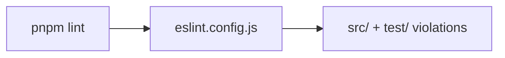

# eslint.config.js — AI component doc

> AI-facing sidecar for `eslint.config.js`. Created 2026-07-06. Keep this in sync with the code on every change.

## Purpose
Flat ESLint config for `@opencreate/api` exactly per plan Task 3: typescript-eslint recommended + `no-explicit-any` as error (workspace "zero any" rule).

## What it does (for an AI reader)
- Responsibilities: configure ESLint (flat config) for the api package's `src` and `test` TS sources.
- Public API / exports: default export — `tseslint.config(recommended, { rules })` array.
- Inputs → Outputs: lints `src/`+`test/` → violations reported by `pnpm --filter @opencreate/api lint`.
- Side effects: none (config only).

## Dependencies
- Imports / depends on: `typescript-eslint` (dev dep).
- Used by: package `lint` script (`eslint src test`); root `pnpm lint` (recursive).

## Diagram

## Key decisions / gotchas
- The web app copies this baseline and layers react-hooks rules on top (plan Task 3 note).

## Commits
- b2afdb4 chore: workspace scaffold + package skeletons and dependencies
