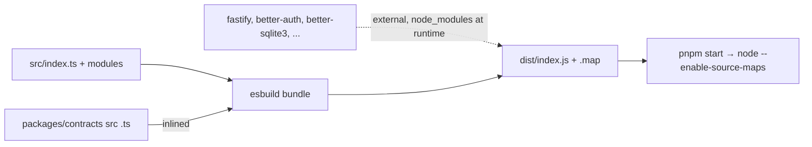

# build.mjs — AI component doc

> AI-facing sidecar for `scripts/build.mjs`. Created 2026-07-07. Keep this in sync with the code on every change.

## Purpose
Production build step: bundles the API into a single runnable `dist/index.js` with esbuild. Exists because plain tsc output is NOT runnable — `@opencreate/contracts` ships TypeScript source (`exports: ./src/index.ts` with extensionless relative imports) that plain `node` cannot load (Node 22 type stripping requires explicit extensions); bundling inlines the contracts source.

## What it does (for an AI reader)
- Responsibilities: wipe `dist/`, bundle `src/index.ts` → `dist/index.js` (ESM, node22 target, sourcemap), keep every runtime dependency external EXCEPT `@opencreate/contracts` (the one inlined workspace package).
- Public API / exports / props / endpoints: none — invoked by `pnpm --filter @opencreate/api build` (`tsc -p tsconfig.build.json && node scripts/build.mjs`; tsc is the type gate with `noEmit`, esbuild does the emit).
- Inputs → Outputs: `src/index.ts` + `package.json#dependencies` → `dist/index.js` + `dist/index.js.map`.
- Side effects (I/O, network, state): deletes and recreates `dist/`.

## Dependencies
- Imports / depends on: `esbuild` (devDependency), `node:fs`, `node:url`, `../package.json` (dependency list drives externals so a new dep can never be silently bundled).
- Used by: `package.json#build`; the output is run by `package.json#start` and the repo-root `start` (`node --enable-source-maps apps/api/dist/index.js`).

## Diagram

## Key decisions / gotchas
- `external` is DERIVED from `package.json#dependencies` minus `@opencreate/contracts` — never hardcode the list; native deps (better-sqlite3) must stay external.
- ESM output (`format: 'esm'`) matches `"type": "module"`; `--enable-source-maps` in the start scripts maps stack traces back to TS via the emitted sourcemap.
- Alternatives rejected: building contracts to its own dist + conditional exports would force every dev tool (vite in apps/web, vitest, tsx) onto a stale-able compiled artifact; `--experimental-strip-types` style execution fails on contracts' extensionless imports.
- `tsconfig.build.json` is now `noEmit: true` — it is the src-only type gate; esbuild owns the emit.

## Commits
- (pending) feat(api): production single-origin serving
