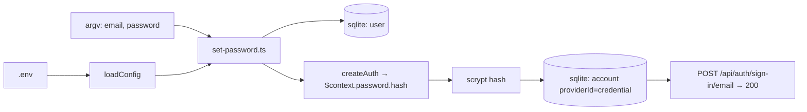

# set-password.ts — AI component doc

> AI-facing sidecar for `set-password.ts`. Created 2026-07-28. Keep this in sync with the code on every change.

## Purpose

Dev-only CLI that sets a user's password directly in the database. It exists
because the app ships **no forgot/reset-password flow** — there is no mail
infrastructure to send a reset link through — so a forgotten local password is
otherwise unrecoverable without hand-editing the sqlite file.

## What it does (for an AI reader)

- Responsibilities: resolve a user by email, hash the new password with
  better-auth's OWN hasher, then **upsert** the `credential` account row so the
  user can sign in through the normal `POST /api/auth/sign-in/email` endpoint.
- Public API / exports / endpoints: none — an executable script, not a module.
  Invoked as `pnpm --filter @opencreate/api exec tsx scripts/set-password.ts <email> <password>`.
- Inputs → Outputs: `argv[2]` = email, `argv[3]` = password → exit 0 with
  `password updated|created for <email>` on stdout; exit 1 with a usage line
  (missing args) or `no user with email <email>` (unknown user).
- Side effects (I/O, network, state): reads `.env` via `loadEnvFromFile()`,
  opens the sqlite file at `config.databasePath` (which runs `createDb`'s
  idempotent DDL bootstrap), and writes ONE `account` row (UPDATE if a
  `credential` row exists, INSERT otherwise). Existing `session` rows are NOT
  revoked — a signed-in session survives a password change.

## Dependencies

- Imports / depends on: `drizzle-orm` (`and`, `eq`), `../src/config`
  (`loadConfig`, `loadEnvFromFile`), `../src/db/client` (`createDb`),
  `../src/db/schema` (`user`, `account`), `../src/modules/auth/auth`
  (`createAuth` — solely for `auth.$context.password.hash`).
- Used by: humans, manually. Nothing imports it; it is not in the build
  (`scripts/build.mjs` bundles `src/`, not `scripts/`).

## Diagram

## Key decisions / gotchas

- **better-auth's hasher, not `node:crypto` scrypt.** Sign-in verifies with
  `auth.$context.password.verify`, whose salt/params encoding is better-auth's
  private format. Any other hasher writes a credential that can never sign in.
  Same call, same reasoning as the dev-admin seed (`modules/auth/dev-admin.ts`).
- **No minimum length is enforced here, on purpose.** better-auth applies its
  8-char minimum on the SIGN-UP path only; sign-in just verifies the hash. So
  this can set the short muscle-memory passwords dev accounts use without
  weakening the signup rule for real users.
- **Upsert, not update.** A Google-only user has no `credential` row; inserting
  one (with `accountId` = user id, mirroring better-auth's own adapter) is what
  gives that account a password login.
- Requires a valid env (`loadConfig` throws on a misconfigured `.env`) because
  `createAuth` needs `BETTER_AUTH_SECRET`/`BETTER_AUTH_URL` to build its context.

## Commits

- _no commit yet_
