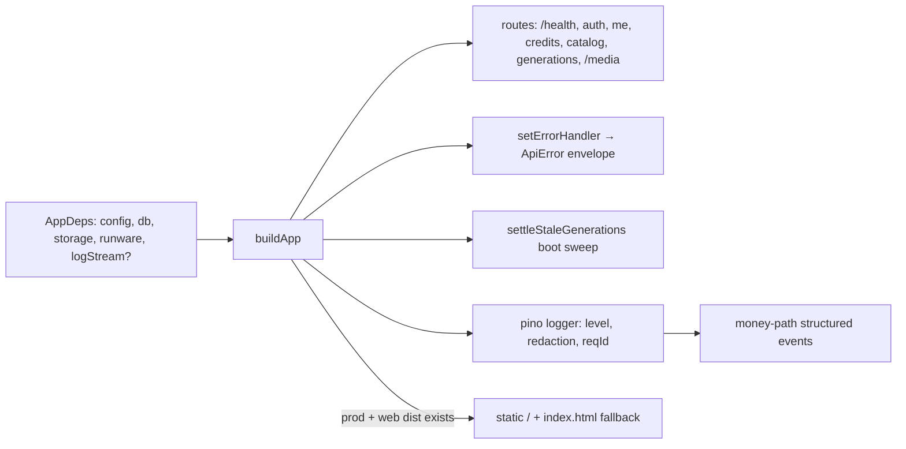

# app.ts — AI component doc

> AI-facing sidecar for `app.ts`. Created 2026-07-06. Keep this in sync with the code on every change.

## Purpose
DI composition root (plan Task 3): `buildApp(deps)` returns a configured Fastify instance as a pure function of its dependencies, so tests inject in-memory deps and `index.ts` injects real ones.

## What it does (for an AI reader)
- Responsibilities: create Fastify (pino logger: level from `config.logLevel`, authorization/cookie/set-cookie redaction, optional `logStream` destination override for tests; 15 MiB body limit for data-URI uploads), expose `GET /health`, own the single error→ApiError-envelope handler, and wire modules: `createAuth(db, config, app.log)` + `registerAuth` (decorates `requireUser`) first, then `registerUserRoutes` (`/api/me`), `registerCreditRoutes` (`/api/credits/transactions`), `registerCatalogRoutes` (`GET /api/catalog`, public — pricing renders before sign-in), `registerGenerationRoutes` (the Task 10 core, built from `createGenerationService({ db, runware, storage, log: app.log, pollMinIntervalMs? })` — the poll-throttle override is spread in only when set, so production keeps the service's 3s default), and `@fastify/static` serving `deps.storage.dir` at `/media/*`. Also runs the `settleStaleGenerations(db, Date.now(), app.log)` boot sweep so processing rows abandoned across restarts are failed + refunded (with money-path log lines).
- Public API / exports: `AppDeps` (type), `buildApp(deps): Promise<FastifyInstance>`.
- Inputs → Outputs: `AppDeps` (`config`, `db`, `storage`, `runware`, `logStream?`, `pollMinIntervalMs?` — test seam for the generation-service poll throttle) → ready Fastify app (not listening).
- Side effects: one DB sweep at build time (stale-generation settlement); otherwise route registration only until `listen()`. Emits pino NDJSON to stdout (or `logStream`).

## Dependencies
- Imports / depends on: `fastify`, `@fastify/rate-limit`, `@fastify/static`, `./config` (type), `./db/client` (`Db` type), `./storage/local` (`StorageProvider` type), `./integrations/runware/client` (`RunwareClient` type), `./modules/auth/auth`, `./modules/auth/plugin`, `./modules/users/routes`, `./modules/credits/routes`, `./modules/catalog/routes`, `./modules/generations/service` + `./modules/generations/routes`.
- Used by: `src/index.ts` (boot), `test/helpers/build-test-app.ts` (all HTTP tests).

## Diagram

## Key decisions / gotchas
- Error mapping: `err.apiCode` (set by domain errors like `InsufficientCreditsError` / `requireUser`) wins and keeps its client-facing message; otherwise 4xx→`validation_failed` with the message, and **unexpected 5xx are SANITIZED** — fixed `{ internal_error, 'Something went wrong' }` envelope, real message + stack logged via `req.log.error({ err, event: 'unhandled_error' })` (pinned by `test/errors-sanitized.test.ts`).
- Rate limiting: `@fastify/rate-limit` registered before any route (its onRoute hook must see every registration). Global 300/min per IP; strict per-route buckets via `config.rateLimit` — `/api/auth/*` 10/min (`modules/auth/plugin.ts`), `POST /api/generations` 20/min (`modules/generations/routes.ts`). `errorResponseBuilder` **must return an Error with `statusCode: 429` + `apiCode: 'rate_limited'`** — the plugin THROWS the builder result, so it flows through our central error handler which then emits the shared envelope (a plain object here would read as an unexpected 500 and get sanitized). Pinned by `test/rate-limit.test.ts`.
- `trustProxy: deps.config.trustProxy` on the Fastify constructor (review finding): the limiter keys buckets on `req.ip`, and production runs behind a reverse proxy forwarding everyone from loopback (PROD.md) — without trust, EVERY user shares one bucket per limit (10 cheap auth requests/min = auth-lockout DoS; per-client attribution impossible). Default `false` (client-forged `X-Forwarded-For` ignored on direct exposure); operators opt in via `TRUST_PROXY` (`true` or address/CIDR list — see `config.ts.md` and PROD.md). Pinned by `test/rate-limit.test.ts` ("behind a reverse proxy").
- **`setErrorHandler` is FIRST, before any `await app.register(...)`**: awaiting a register boots the avvio plugin tree, and an error handler set after boot never binds (Task 9 regression: 401s fell back to Fastify's default `{statusCode,error,message}` shape). Keep it at the top when adding plugins.
- `AppDeps` intentionally grows per plan tasks; keep the exact shape so `build-test-app.ts` stays the one place tests configure it.
- `/media/*` is public by design for the MVP: keys are unguessable UUIDs minted by us, and `/<video>` tags need plain GETs without auth headers. `index: false, list: false` — asset files only, no listings.
- **Production single-origin serving**: when `nodeEnv === 'production'` AND `webDistPath/index.html` exists, a second `@fastify/static` serves the built SPA at `/` (`decorateReply: false` — the /media registration already added `sendFile`), and a `setNotFoundHandler` answers `index.html` for non-`/api`, non-`/media` GETs (SPA deep links) while API/media misses return the JSON `not_found` envelope. Gated on the file existing so an api-only prod deploy boots clean. Pinned by `test/static-web.test.ts`.
- Logging: session cookies ARE the credential — `redact` covers `req.headers.cookie`/`authorization` and `res.headers["set-cookie"]` (plus bare `headers.*` for hand-rolled objects) so no serializer can leak them. `app.log` is handed to the auth factory (signup bonus) and the generation service as the non-request fallback; routes pass `req.log` per call for reqId correlation. Tests keep `logLevel: 'silent'` via `build-test-app.ts`.

- 2026-07-09: registerCatalogRoutes now receives `comfyBaseUrl !== null` so the route can hide self-host models when self-host is off.

## Commits
- eb91028 feat(api): fastify skeleton with typed config and health route
- 273e3f4 feat(api): drizzle schema + sqlite bootstrap DDL — `db` added to `AppDeps`
- 808e8e7 feat(api): better-auth (email+google) with signup bonus + /api/me — auth + user routes wired
- f6f9734 feat(api): transactional credit ledger with charge/refund invariants — credits routes wired
- bdc4175 feat(api): curated model catalog with credit pricing — catalog route wired
- 6c4e94f feat(api): local media storage with /media serving — `storage` added to `AppDeps`, static /media/*, error handler moved before plugin boot
- 681e20f feat(api): generation lifecycle — `runware` added to `AppDeps` (now complete), generation service + routes wired
- 5d16801 fix(api): settle stuck processing generations — boot sweep `settleStaleGenerations(db)` wired after route registration
- 5e8de3d feat(api): native env loading + structured logging — pino logger, redaction, logStream dep, log wiring
- cdd94a3 feat(api): sanitized errors + rate limits — sanitized 5xx envelope, @fastify/rate-limit global 300/min
- b21a116 feat(api): production single-origin serving — prod SPA static + index.html fallback
- a7e4cd9 fix(api): ssrf allowlist, cursor tiebreaker, poll throttle — pollMinIntervalMs test seam on AppDeps
- eb17afd fix(api): trust proxy for per-client rate limits behind the documented reverse proxy — trustProxy on the Fastify constructor

## Key decisions (2026-07-09) — video provider registry
- `AppDeps.videoProviders?: Record<'runware'|'wan-runpod', VideoProvider>` (optional). When absent, buildApp DERIVES it: `{ runware: createRunwareVideoAdapter(deps.runware), 'wan-runpod': createComfyClient({ baseUrl: config.comfyBaseUrl }) }`. The comfy client is ALWAYS registered even when `COMFY_BASE_URL` is unset (submit then returns a clean provider_error), so `wan-2-2` is listable without a pod and boot never fails. The registry is passed to `createGenerationService`; `index.ts` is unchanged (relies on the derived default).

## Update 2026-07-09 — CinemaStudio
- Wires `createFilmService({ db, storage })` + `registerFilmRoutes(app, filmService, storyboardService)` (films/shots/audio + renders + storyboard). `createStoryboardService({ anthropicApiKey: config.anthropicApiKey, films })` gates on the optional key. Adds `settleStaleRenders(db, now, log)` to the boot sweep (render reaper; no refund).

## Update 2026-07-11 — template catalog (ADR: `docs/wiki/decisions/template-catalog.md`)
- Wires the template module right after the film routes:
  `assertTemplatesValid()` then `registerTemplateRoutes(app, createTemplateService({ films: filmService }))`
  (`GET /api/templates`, `POST /api/films/from-template`). It writes THROUGH the film service — same
  ownership rules, one transaction — and charges nothing: every shot lands as a draft.
- **`assertTemplatesValid()` runs FIRST and it THROWS — a bad template is a FAILED BOOT.** The invariant
  it guards: every tier model of every template must be a video model that natively supports that
  template's aspect ratio AND every one of its clips' durations. If it doesn't, `composeShotClipInput`
  silently snaps the duration to the nearest legal value at generate time — quietly changing both the
  cut the user was promised and the price they were quoted. That has to be a deploy failure, not a
  surprise on someone's invoice. The type system cannot see catalog data (templates pin model ids as
  strings), so this runtime assertion at boot is the only place the check can live. It takes no
  arguments here — it defaults to the whole `TEMPLATES` registry.
- Note the ordering dependency: it must run **after** the catalog module is importable (it calls
  `getModel`) and it is placed before `registerTemplateRoutes` so the process dies before it can serve a
  single mispriced template.

## Key decisions (2026-07-12) — Studio3D mesh provider
- **`AppDeps.meshProvider?: Mesh3dProvider`**, derived here when absent:
  `deps.meshProvider ?? createRunwareMeshAdapter(deps.runware)`, then passed into
  `createGenerationService({ ..., meshProvider })`.
- **A single adapter, not a registry** (contrast `videoProviders`, which fans out to runware /
  wan-runpod / bytedance). `'runware'` is the only 3D backend built; `'comfy-3d'` is a
  designed-but-unbuilt self-host seam (ADR D2 — hosted TRELLIS.2 pricing beats running our own GPU).
  If a second 3D backend ever ships, this becomes a registry shaped like `videoProviders` and the
  service's `row.type === 'model3d'` poll branch grows a `resolveMeshProvider(row.provider)` the same
  way video did.
- **No new env var and no on/off gate.** The video providers each light up from their own env
  (`COMFY_BASE_URL`, `ARK_API_KEY`) and `registerCatalogRoutes(app, configuredProviders)` HIDES the
  models of any backend that is off — a listed model whose backend is unconfigured is just a broken
  option. 3D needs none of that: it rides the same `RUNWARE_API_KEY` boot already requires, so the
  `model3d` catalog entries are always reachable and `configuredProviders` is untouched.

## Change log (behaviour)

### 2026-07-12 — error handler logs `providerDetail`
`HttpError` may now carry `providerDetail`: an upstream's own error code + text
(see `ArkError`). The handler logs it at `warn` (`event: 'provider_error'`) and
**never serializes it** — the envelope keeps sending `message`, and a provider
body can name internals (ModelArk's includes our BytePlus account id). Without
this, an upstream 502 reached an operator as an untraceable `ModelArk HTTP 404`.

### 2026-07-13 — Soul Studio: the generation service is hoisted, and a third service appears
`createGenerationService(...)` used to be constructed **inline** inside the
`registerGenerationRoutes(...)` call. It is now a `const generationService`,
because Soul Studio's portrait orchestrator needs *that* instance: it is the
single money path, and a second instance would also mean a second (useless)
poll-throttle map.

`createPortraitService({ entities, generations })` is then wired from both
existing services and handed to `registerEntityRoutes(app, entityService,
portraitService)`. It depends on both; **neither depends on it**, which is what
keeps the graph acyclic — the generation service already depends on the entity
service (it resolves `[[e1]]` mentions through `loadForMentions`), so the sheet
logic could not have lived inside either one without closing a cycle.

## Update 2026-07-16 — dev super-admin seed
- After `registerAuth`, gated on `nodeEnv === 'development'` EXACTLY: `await seedDevAdmin(db, auth, signupBonusCredits, app.log)`. The gate lives at the composition root (one auditable line answers "can this reach production?"); `test` builds opt in per-test via buildTestApp overrides, `production` can never match. See `modules/auth/dev-admin.ts(.md)`.

## Update 2026-07-18 — Modular 3D Assets (ADR: `docs/wiki/decisions/modular-3d-assets.md`)
- Wires the assets3d module right after `registerTemplateRoutes`, once `generationService` exists:
  `createAsset3dService({ db: deps.db, storage: deps.storage, generations: generationService })` (the
  generation service is passed WHOLE but the service TYPE narrows it to `Pick<…,'create'|'get'>`, so
  the module cannot grow its own money code), then
  `createAnalyzeService({ anthropicApiKey: config.anthropicApiKey, assets: asset3dService })` (gates on
  the optional key exactly like storyboard — unset → the `/analyze` route answers provider_error, boot
  stays healthy), then `registerAsset3dRoutes(app, asset3dService, analyzeService)`.
- No new env var, no new provider, no ledger: extract/mesh ride `generationService.create()` on the
  UNCHANGED money path; the concept image reaches the extractor via the server-only `referenceImages`
  channel added to `create()` in the same build (see `modules/generations/service.ts(.md)`).

## Update 2026-07-21 — shot reference images
- Wires `createShotReferenceService({ db, storage, generations: generationService })` next to the
  film service and passes it as the 4th arg to `registerFilmRoutes`. Same pattern as assets3d: it
  spends no credits of its own — the clip route reads a shot's stored images into the server-only
  `referenceImages` channel and calls the ONE `generationService.create()` money path. No new env,
  no new provider, no ledger.

## Update 2026-07-22 — split a shot at a point (the NLE)
- Wires `createShotSplitService({ db: deps.db, films: filmService })` next to the film/shot-reference
  services and passes it as the 5th arg to `registerFilmRoutes` (which registers
  `POST /api/films/:id/shots/:shotId/split`). The service TYPE narrows `filmService` to
  `Pick<FilmService, 'getFilm'>` — it needs the film service ONLY for the FilmDetail read shape it
  returns; it reimplements its own ownership gate and does the split in one transaction.
- No new env, no new provider, NO ledger: a split cites the SAME generation (it never creates one),
  so it structurally cannot charge — an HTTP test asserts the caller's credit balance is unchanged
  across a split. See `modules/films/shot-split.ts(.md)`.

## Update 2026-07-21 — prompt enhancer (POST /api/prompt/enhance)
- Wires `createPromptEnhanceService({ deepinfraToken: config.deepinfraToken })` after the assets3d
  routes, then `registerPromptRoutes(app, promptEnhanceService)`. A generic, FREE, stateless text
  transform: rough shot idea → one cinematic Wan prompt (DeepSeek-V3 via DeepInfra's OpenAI-compatible
  chat endpoint), plus a `soften` mode for `content_blocked` retries.
- Gated on the OPTIONAL `DEEPINFRA_TOKEN` exactly like storyboard gates on `ANTHROPIC_API_KEY`: unset →
  the endpoint answers `provider_error` (502), boot stays healthy. The route is ALWAYS registered (no
  `configuredProviders` gate) so the SPA gets one consistent message rather than a 404.
- It spends NO credits of its own — it only improves the text of a paid generation — so it takes neither
  the db nor the generation service and structurally cannot charge. An HTTP test asserts the caller's
  credit balance is unchanged after a call. Session-guarded (`requireUser`) but NOT film/ownership scoped.
  Strict per-route rate limit 20/min (a free endpoint that still spends LLM tokens). See
  `modules/prompt/enhance.ts(.md)` + `modules/prompt/routes.ts(.md)`.

## Update 2026-07-22 — prompt enhancer provider fallback (Groq)
- `createPromptEnhanceService(...)` now also receives `groqApiKey: config.groqApiKey` and `log: app.log`.
  The service runs an ORDERED provider chain: DeepInfra (DeepSeek-V3) primary → Groq (llama-3.3-70b) FREE
  fallback, failing over on any provider error (no-balance, 5xx, network, malformed answer). Motivation:
  DeepInfra ran out of balance ("You need positive balance to do inference") and the enhancer went dark.
- EITHER key alone makes the endpoint work; with NEITHER it still answers `provider_error` (boot healthy),
  so the wiring keeps the same optional-secret discipline — no new `configuredProviders` gate, route always
  registered. `app.log` now carries the per-provider failover warn lines (`event: prompt.provider_failed`),
  and the provider chain construction lives in `modules/prompt/enhance.ts` (`buildEnhanceChain`), not here.

## Update 2026-07-23 — public auth-provider flags (ADR: `docs/wiki/decisions/google-oauth.md`)
- Immediately after `registerAuth`, a PUBLIC `GET /api/auth/config` route returns
  `{ googleEnabled: config.googleClientId !== null && config.googleClientSecret !== null }` — the runtime
  source of truth the SPA reads to render the Google button, derived from the SAME creds pair that gates the
  better-auth Google provider (so no client/server drift; supersedes the old `VITE_GOOGLE_AUTH` build flag).
  No `requireUser` — it must render on the pre-sign-in screen. Registered as a STATIC route so find-my-way
  matches it ahead of better-auth's `/api/auth/*` wildcard. Pinned by `test/auth-config.test.ts`.
