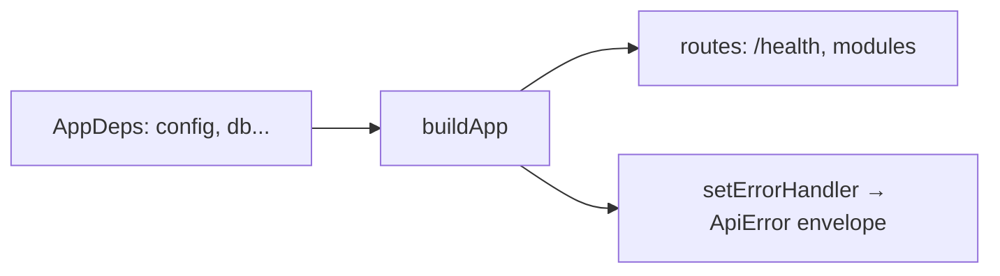

# app.ts — AI component doc

> AI-facing sidecar for `app.ts`. Created 2026-07-06. Keep this in sync with the code on every change.

## Purpose
DI composition root (plan Task 3): `buildApp(deps)` returns a configured Fastify instance as a pure function of its dependencies, so tests inject in-memory deps and `index.ts` injects real ones.

## What it does (for an AI reader)
- Responsibilities: create Fastify (logger off, 15 MiB body limit for data-URI uploads), expose `GET /health`, own the single error→ApiError-envelope handler, and wire modules: `createAuth` + `registerAuth` (decorates `requireUser`) first, then `registerUserRoutes` (`/api/me`), `registerCreditRoutes` (`/api/credits/transactions`) and `registerCatalogRoutes` (`GET /api/catalog`, public — pricing renders before sign-in); generations follow in Task 10.
- Public API / exports: `AppDeps` (type), `buildApp(deps): Promise<FastifyInstance>`.
- Inputs → Outputs: `AppDeps` (`config`, `db`; later `runware`, `storage`) → ready Fastify app (not listening).
- Side effects: none until `listen()`; route registration only.

## Dependencies
- Imports / depends on: `fastify`, `./config` (type), `./db/client` (`Db` type), `./modules/auth/auth`, `./modules/auth/plugin`, `./modules/users/routes`, `./modules/credits/routes`, `./modules/catalog/routes`.
- Used by: `src/index.ts` (boot), `test/helpers/build-test-app.ts` (all HTTP tests).

## Diagram

## Key decisions / gotchas
- Error mapping: `err.apiCode` (set by domain errors like `InsufficientCreditsError` / `requireUser`) wins; otherwise 500→`internal_error`, other statuses→`validation_failed` — unexpected errors never leak a non-envelope shape.
- `AppDeps` intentionally grows per plan tasks; keep the exact shape so `build-test-app.ts` stays the one place tests configure it.

## Commits
- eb91028 feat(api): fastify skeleton with typed config and health route
- 273e3f4 feat(api): drizzle schema + sqlite bootstrap DDL — `db` added to `AppDeps`
- 808e8e7 feat(api): better-auth (email+google) with signup bonus + /api/me — auth + user routes wired
- f6f9734 feat(api): transactional credit ledger with charge/refund invariants — credits routes wired
