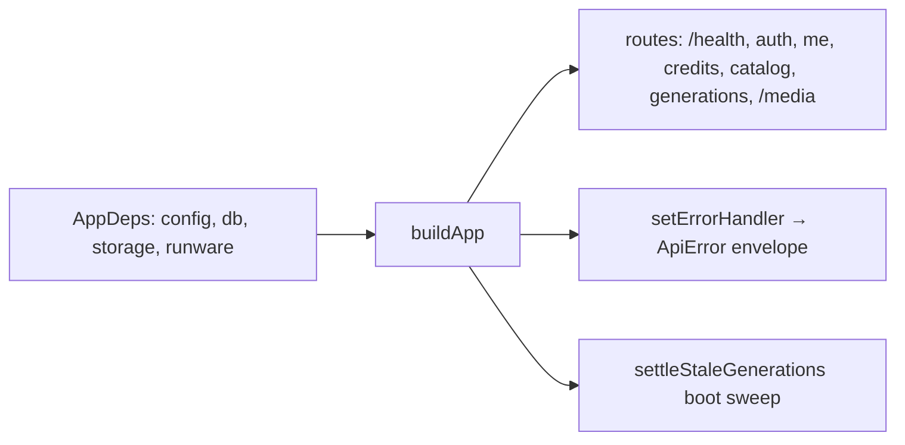

# app.ts — AI component doc

> AI-facing sidecar for `app.ts`. Created 2026-07-06. Keep this in sync with the code on every change.

## Purpose
DI composition root (plan Task 3): `buildApp(deps)` returns a configured Fastify instance as a pure function of its dependencies, so tests inject in-memory deps and `index.ts` injects real ones.

## What it does (for an AI reader)
- Responsibilities: create Fastify (logger off, 15 MiB body limit for data-URI uploads), expose `GET /health`, own the single error→ApiError-envelope handler, and wire modules: `createAuth` + `registerAuth` (decorates `requireUser`) first, then `registerUserRoutes` (`/api/me`), `registerCreditRoutes` (`/api/credits/transactions`), `registerCatalogRoutes` (`GET /api/catalog`, public — pricing renders before sign-in), `registerGenerationRoutes` (the Task 10 core, built from `createGenerationService({ db, runware, storage })`), and `@fastify/static` serving `deps.storage.dir` at `/media/*`. Also runs the `settleStaleGenerations(db)` boot sweep so processing rows abandoned across restarts are failed + refunded.
- Public API / exports: `AppDeps` (type), `buildApp(deps): Promise<FastifyInstance>`.
- Inputs → Outputs: `AppDeps` (`config`, `db`, `storage`, `runware`) → ready Fastify app (not listening). `AppDeps` is complete as of Task 10.
- Side effects: one DB sweep at build time (stale-generation settlement); otherwise route registration only until `listen()`.

## Dependencies
- Imports / depends on: `fastify`, `@fastify/static`, `./config` (type), `./db/client` (`Db` type), `./storage/local` (`StorageProvider` type), `./integrations/runware/client` (`RunwareClient` type), `./modules/auth/auth`, `./modules/auth/plugin`, `./modules/users/routes`, `./modules/credits/routes`, `./modules/catalog/routes`, `./modules/generations/service` + `./modules/generations/routes`.
- Used by: `src/index.ts` (boot), `test/helpers/build-test-app.ts` (all HTTP tests).

## Diagram

## Key decisions / gotchas
- Error mapping: `err.apiCode` (set by domain errors like `InsufficientCreditsError` / `requireUser`) wins; otherwise 500→`internal_error`, other statuses→`validation_failed` — unexpected errors never leak a non-envelope shape.
- **`setErrorHandler` is FIRST, before any `await app.register(...)`**: awaiting a register boots the avvio plugin tree, and an error handler set after boot never binds (Task 9 regression: 401s fell back to Fastify's default `{statusCode,error,message}` shape). Keep it at the top when adding plugins.
- `AppDeps` intentionally grows per plan tasks; keep the exact shape so `build-test-app.ts` stays the one place tests configure it.
- `/media/*` is public by design for the MVP: keys are unguessable UUIDs minted by us, and `/<video>` tags need plain GETs without auth headers. `index: false, list: false` — asset files only, no listings.

## Commits
- eb91028 feat(api): fastify skeleton with typed config and health route
- 273e3f4 feat(api): drizzle schema + sqlite bootstrap DDL — `db` added to `AppDeps`
- 808e8e7 feat(api): better-auth (email+google) with signup bonus + /api/me — auth + user routes wired
- f6f9734 feat(api): transactional credit ledger with charge/refund invariants — credits routes wired
- bdc4175 feat(api): curated model catalog with credit pricing — catalog route wired
- 6c4e94f feat(api): local media storage with /media serving — `storage` added to `AppDeps`, static /media/*, error handler moved before plugin boot
- 681e20f feat(api): generation lifecycle — `runware` added to `AppDeps` (now complete), generation service + routes wired
