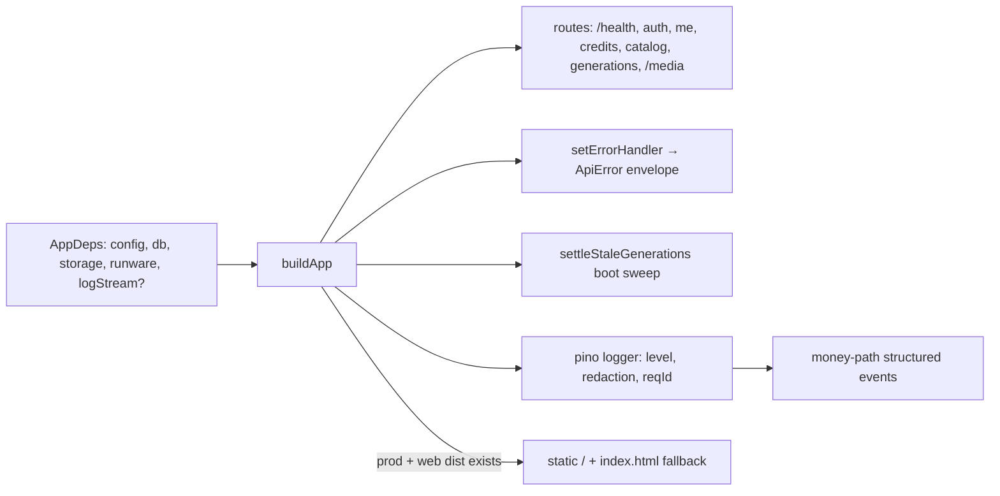

# app.ts — AI component doc

> AI-facing sidecar for `app.ts`. Created 2026-07-06. Keep this in sync with the code on every change.

## Purpose
DI composition root (plan Task 3): `buildApp(deps)` returns a configured Fastify instance as a pure function of its dependencies, so tests inject in-memory deps and `index.ts` injects real ones.

## What it does (for an AI reader)
- Responsibilities: create Fastify (pino logger: level from `config.logLevel`, authorization/cookie/set-cookie redaction, optional `logStream` destination override for tests; 15 MiB body limit for data-URI uploads), expose `GET /health`, own the single error→ApiError-envelope handler, and wire modules: `createAuth(db, config, app.log)` + `registerAuth` (decorates `requireUser`) first, then `registerUserRoutes` (`/api/me`), `registerCreditRoutes` (`/api/credits/transactions`), `registerCatalogRoutes` (`GET /api/catalog`, public — pricing renders before sign-in), `registerGenerationRoutes` (the Task 10 core, built from `createGenerationService({ db, runware, storage, log: app.log, pollMinIntervalMs? })` — the poll-throttle override is spread in only when set, so production keeps the service's 3s default), and `@fastify/static` serving `deps.storage.dir` at `/media/*`. Also runs the `settleStaleGenerations(db, Date.now(), app.log)` boot sweep so processing rows abandoned across restarts are failed + refunded (with money-path log lines).
- Public API / exports: `AppDeps` (type), `buildApp(deps): Promise<FastifyInstance>`.
- Inputs → Outputs: `AppDeps` (`config`, `db`, `storage`, `runware`, `logStream?`, `pollMinIntervalMs?` — test seam for the generation-service poll throttle) → ready Fastify app (not listening).
- Side effects: one DB sweep at build time (stale-generation settlement); otherwise route registration only until `listen()`. Emits pino NDJSON to stdout (or `logStream`).

## Dependencies
- Imports / depends on: `fastify`, `@fastify/rate-limit`, `@fastify/static`, `./config` (type), `./db/client` (`Db` type), `./storage/local` (`StorageProvider` type), `./integrations/runware/client` (`RunwareClient` type), `./modules/auth/auth`, `./modules/auth/plugin`, `./modules/users/routes`, `./modules/credits/routes`, `./modules/catalog/routes`, `./modules/generations/service` + `./modules/generations/routes`.
- Used by: `src/index.ts` (boot), `test/helpers/build-test-app.ts` (all HTTP tests).

## Diagram

## Key decisions / gotchas
- Error mapping: `err.apiCode` (set by domain errors like `InsufficientCreditsError` / `requireUser`) wins and keeps its client-facing message; otherwise 4xx→`validation_failed` with the message, and **unexpected 5xx are SANITIZED** — fixed `{ internal_error, 'Something went wrong' }` envelope, real message + stack logged via `req.log.error({ err, event: 'unhandled_error' })` (pinned by `test/errors-sanitized.test.ts`).
- Rate limiting: `@fastify/rate-limit` registered before any route (its onRoute hook must see every registration). Global 300/min per IP; strict per-route buckets via `config.rateLimit` — `/api/auth/*` 10/min (`modules/auth/plugin.ts`), `POST /api/generations` 20/min (`modules/generations/routes.ts`). `errorResponseBuilder` **must return an Error with `statusCode: 429` + `apiCode: 'rate_limited'`** — the plugin THROWS the builder result, so it flows through our central error handler which then emits the shared envelope (a plain object here would read as an unexpected 500 and get sanitized). Pinned by `test/rate-limit.test.ts`.
- `trustProxy: deps.config.trustProxy` on the Fastify constructor (review finding): the limiter keys buckets on `req.ip`, and production runs behind a reverse proxy forwarding everyone from loopback (PROD.md) — without trust, EVERY user shares one bucket per limit (10 cheap auth requests/min = auth-lockout DoS; per-client attribution impossible). Default `false` (client-forged `X-Forwarded-For` ignored on direct exposure); operators opt in via `TRUST_PROXY` (`true` or address/CIDR list — see `config.ts.md` and PROD.md). Pinned by `test/rate-limit.test.ts` ("behind a reverse proxy").
- **`setErrorHandler` is FIRST, before any `await app.register(...)`**: awaiting a register boots the avvio plugin tree, and an error handler set after boot never binds (Task 9 regression: 401s fell back to Fastify's default `{statusCode,error,message}` shape). Keep it at the top when adding plugins.
- `AppDeps` intentionally grows per plan tasks; keep the exact shape so `build-test-app.ts` stays the one place tests configure it.
- `/media/*` is public by design for the MVP: keys are unguessable UUIDs minted by us, and `/<video>` tags need plain GETs without auth headers. `index: false, list: false` — asset files only, no listings.
- **Production single-origin serving**: when `nodeEnv === 'production'` AND `webDistPath/index.html` exists, a second `@fastify/static` serves the built SPA at `/` (`decorateReply: false` — the /media registration already added `sendFile`), and a `setNotFoundHandler` answers `index.html` for non-`/api`, non-`/media` GETs (SPA deep links) while API/media misses return the JSON `not_found` envelope. Gated on the file existing so an api-only prod deploy boots clean. Pinned by `test/static-web.test.ts`.
- Logging: session cookies ARE the credential — `redact` covers `req.headers.cookie`/`authorization` and `res.headers["set-cookie"]` (plus bare `headers.*` for hand-rolled objects) so no serializer can leak them. `app.log` is handed to the auth factory (signup bonus) and the generation service as the non-request fallback; routes pass `req.log` per call for reqId correlation. Tests keep `logLevel: 'silent'` via `build-test-app.ts`.

## Commits
- eb91028 feat(api): fastify skeleton with typed config and health route
- 273e3f4 feat(api): drizzle schema + sqlite bootstrap DDL — `db` added to `AppDeps`
- 808e8e7 feat(api): better-auth (email+google) with signup bonus + /api/me — auth + user routes wired
- f6f9734 feat(api): transactional credit ledger with charge/refund invariants — credits routes wired
- bdc4175 feat(api): curated model catalog with credit pricing — catalog route wired
- 6c4e94f feat(api): local media storage with /media serving — `storage` added to `AppDeps`, static /media/*, error handler moved before plugin boot
- 681e20f feat(api): generation lifecycle — `runware` added to `AppDeps` (now complete), generation service + routes wired
- 5d16801 fix(api): settle stuck processing generations — boot sweep `settleStaleGenerations(db)` wired after route registration
- 5e8de3d feat(api): native env loading + structured logging — pino logger, redaction, logStream dep, log wiring
- cdd94a3 feat(api): sanitized errors + rate limits — sanitized 5xx envelope, @fastify/rate-limit global 300/min
- b21a116 feat(api): production single-origin serving — prod SPA static + index.html fallback
- a7e4cd9 fix(api): ssrf allowlist, cursor tiebreaker, poll throttle — pollMinIntervalMs test seam on AppDeps
