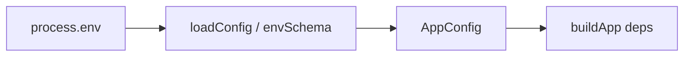

# config.ts — AI component doc

> AI-facing sidecar for `config.ts`. Created 2026-07-06. Keep this in sync with the code on every change.

## Purpose
Single source of typed configuration for the API (plan Task 3). Validates `process.env` with Zod at boot (fail fast on misconfiguration) and maps it to a camelCase `AppConfig`; no other file reads `process.env`.

## What it does (for an AI reader)
- Responsibilities: parse + default env vars; normalize empty Google OAuth creds to `null`.
- Public API / exports: `AppConfig` (type), `loadConfig(env?): AppConfig`.
- Inputs → Outputs: `NodeJS.ProcessEnv` → validated `AppConfig`; throws `ZodError` on invalid env.
- Side effects: none (pure).

## Dependencies
- Imports / depends on: `zod` (v4 — uses `z.url()`, the non-deprecated form of `z.string().url()`).
- Used by: `src/index.ts` (boot), `src/db/migrate.ts`; tests bypass it via `test/helpers/build-test-app.ts` which hand-builds an `AppConfig`.

## Diagram

## Key decisions / gotchas
- `GOOGLE_CLIENT_ID || null` (not `??`): empty string in `.env.example` means "not configured" → Google provider stays disabled.
- `BETTER_AUTH_SECRET` must be ≥32 chars; `API_PORT`/`SIGNUP_BONUS_CREDITS` use `z.coerce.number()` since env values are strings.

## Commits
- eb91028 feat(api): fastify skeleton with typed config and health route
