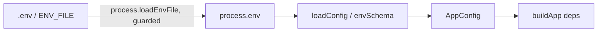

# config.ts — AI component doc

> AI-facing sidecar for `config.ts`. Created 2026-07-06. Keep this in sync with the code on every change.

## Purpose
Single source of typed configuration for the API (plan Task 3). Validates `process.env` with Zod at boot (fail fast on misconfiguration) and maps it to a camelCase `AppConfig`; no other file reads `process.env`. Ops hardening added native `.env` loading: `loadEnvFromFile()` wraps Node 22's `process.loadEnvFile` so `pnpm dev` / `db:migrate` work without manually sourcing the repo-root `.env`.

## What it does (for an AI reader)
- Responsibilities: parse + default env vars; normalize empty Google OAuth creds to `null`; hydrate `process.env` from the nearest `.env` file on the default boot path; resolve `WEB_DIST_PATH` to an absolute path anchored at the api package root; parse `TRUSTED_ORIGINS` (comma list, default `[WEB_ORIGIN]`), `ASSET_HOST_ALLOWLIST` (comma list, default `['runware.ai']`), `ASSET_FETCH_TIMEOUT_MS`/`ASSET_MAX_BYTES` (positive ints, defaults 120000 / 536870912) and `TRUST_PROXY` (tri-state → `trustProxy: boolean | string`, default `false`).
- Public API / exports: `AppConfig` (type — includes `nodeEnv`, `webDistPath`, `trustedOrigins`, `assetHostAllowlist`, `assetFetchTimeoutMs`, `assetMaxBytes`, `trustProxy`), `LogLevel` (type), `loadConfig(env?): AppConfig`, `loadEnvFromFile(path?): void`.
- Inputs → Outputs: `NodeJS.ProcessEnv` → validated `AppConfig`; throws `ZodError` on invalid env. `loadEnvFromFile`: explicit path → `ENV_FILE` env var → nearest `.env` walking up from cwd (repo root in this workspace).
- Side effects: `loadConfig()` with NO argument calls `loadEnvFromFile()` (mutates `process.env` via Node's loader); `loadConfig(env)` with an explicit env object stays pure — tests rely on that.

## Dependencies
- Imports / depends on: `zod` (v4 — uses `z.url()`), `node:fs` (`existsSync`), `node:path`.
- Used by: `src/index.ts` (boot), `src/db/migrate.ts`; tests bypass it via `test/helpers/build-test-app.ts` which hand-builds an `AppConfig`. `test/env-loading.test.ts` covers the loader contract.

## Diagram

## Key decisions / gotchas
- `GOOGLE_CLIENT_ID || null` (not `??`): empty string in `.env.example` means "not configured" → Google provider stays disabled.
- `BETTER_AUTH_SECRET` must be ≥32 chars; `API_PORT`/`PORT`/`SIGNUP_BONUS_CREDITS` use `z.coerce.number()` since env values are strings (the two port vars via `optionalPort` — see the 2026-08-02 section).
- `process.loadEnvFile` NEVER overrides already-set real env vars (verified empirically) — platform-injected env always wins over the file; a missing file is a silent no-op (`try/catch`), so production needs no `.env` at all.
- `LOG_LEVEL` is an allowlisted pino level enum (default `info`); tests build their config with `silent` so suites stay quiet.
- `webDistPath`: relative values resolve against the PACKAGE root (`fileURLToPath(new URL('..', import.meta.url))` — apps/api from both `src/` and the bundled `dist/`), NOT cwd: `pnpm start` runs from the repo root while `pnpm dev` runs from apps/api, and `../web/dist` must mean apps/web/dist in both.
- `trustedOrigins`: `TRUSTED_ORIGINS` comma list (trimmed, empties dropped) or `[WEB_ORIGIN]` — the allowlist for better-auth's CSRF origin check; single-origin deploys need no extra var.
- `NODE_ENV` stays a free string (default `development`); only the exact value `production` flips prod behaviors in `app.ts`.
- `assetHostAllowlist` (SSRF, review finding): host suffixes `storage.saveFromUrl` may fetch — provider asset URLs arrive in PROVIDER RESPONSES, so downloads are default-deny-locked to Runware's domain; a provider/CDN change is an env edit (`ASSET_HOST_ALLOWLIST`), not code. Consumed by `index.ts` → `createLocalStorage(dir, allowlist, limits)`.
- `assetFetchTimeoutMs` / `assetMaxBytes` (download limits, review finding): hard deadline for the WHOLE asset download and max bytes counted while streaming — a stalled provider stream must not hang a settlement forever, and an oversized body must not fill the disk that also holds the SQLite db. Defaults (120s / 512MB) mirror `storage/local.ts`'s exported constants so an unset env keeps behavior identical. Consumed by `index.ts` → `createLocalStorage(..., { fetchTimeoutMs, maxBytes })`. Pinned by `test/env-loading.test.ts` + `test/storage.test.ts`.
- `trustProxy` (rate-limit attribution, review finding): `parseTrustProxy(TRUST_PROXY)` — unset/empty/`'false'` → `false` (default-deny: direct-exposure deploys must never honor a client-forged `X-Forwarded-For`), `'true'` → `true` (trust the header from any peer — the proxy MUST then overwrite the inbound header), anything else passes through verbatim as fastify/proxy-addr address/CIDR/keyword list (e.g. `127.0.0.1`, `loopback,uniquelocal` — the safer shape: proxy-addr walks from the socket peer and stops at the first untrusted hop, so appended inbound XFF chains still resolve to the real client). Without it, PROD.md's reverse proxy makes `req.ip` always loopback → ALL users share one rate-limit bucket (auth-lockout DoS). Consumed by `app.ts` → Fastify `trustProxy`. Pinned by `test/env-loading.test.ts` + `test/rate-limit.test.ts`.

## Key decisions (2026-08-02) — managed-platform readiness (ADR `railway-deployment`)
- **`port` has two sources**: `API_PORT ?? PORT ?? 8787`. Managed platforms inject `PORT` and expect
  the process to listen on it; this app has always read `API_PORT`. Honoring only one turns a healthy
  container into a 502 behind the platform router with nothing in the logs. `API_PORT` wins when both
  are set — an operator who typed it meant it. Both go through the shared `optionalPort`
  preprocessor: **empty string counts as absent**, because `z.coerce.number()` turns `''` into `0`
  and binding port 0 picks a RANDOM free port — the process would look up and be unreachable.
  `int().positive()` makes a nonsense value fail at boot instead of at first request.
- **`trustProxy` gained a HOP-COUNT form** (`TRUST_PROXY=1` → `1`, a number). On a managed platform
  neither of the other two forms is safe: unset puts every user in ONE rate-limit bucket (the edge's
  address — the auth-lockout DoS), and `'true'` believes the LEFTMOST `X-Forwarded-For` entry, which
  is client-controlled whenever the edge APPENDS instead of overwriting — an attacker then picks a
  fresh bucket per request. There is no address to allowlist either: the edge's internal IP is
  neither knowable nor stable. A hop count is the form that fits — proxy-addr walks the chain from
  the socket peer inward, stops after N hops, and ignores anything the client prepended.
  Matched strictly on `/^\d+$/` so `'10.0.0.1'`, `'1.5'` and `'-1'` stay ADDRESS LISTS: proxy-addr
  reads the two forms completely differently, so a loose match would be a silent security change.
  `AppConfig.trustProxy` is now `boolean | number | string`. Pinned by `test/env-loading.test.ts`.

## Key decisions (2026-07-09)
- COMFY_BASE_URL accepts URL | empty-string | absent (`z.union([z.url(), z.literal("")]).optional()`): the shipped `.env`/.env.example set it empty (self-host off), and plain `z.url().optional()` rejected empty → boot crash. Empty is normalized to null (not configured) downstream.

## Commits
- eb91028 feat(api): fastify skeleton with typed config and health route
- 5e8de3d feat(api): native env loading + structured logging — loadEnvFromFile + LOG_LEVEL
- b21a116 feat(api): production single-origin serving — NODE_ENV/WEB_DIST_PATH/TRUSTED_ORIGINS added
- a7e4cd9 fix(api): ssrf allowlist, cursor tiebreaker, poll throttle — ASSET_HOST_ALLOWLIST → assetHostAllowlist
- eb17afd fix(api): trust proxy for per-client rate limits behind the documented reverse proxy — TRUST_PROXY → trustProxy (parseTrustProxy tri-state)
- de61e59 feat(api): db-level refund-once index + asset download limits — ASSET_FETCH_TIMEOUT_MS/ASSET_MAX_BYTES → assetFetchTimeoutMs/assetMaxBytes

## Key decisions (2026-07-09) — wan-runpod
- `COMFY_BASE_URL` (optional `z.url()`) → `config.comfyBaseUrl` (`string | null`, `|| null` so empty = unconfigured). `withComfyHost()` folds its hostname into `assetHostAllowlist` (de-duplicated) so `saveFromUrl` can pull the finished mp4 from the pod `/view` — env-driven, so pointing at a new pod is one edit and the SSRF surface stays closed by default.

## Key decisions (2026-07-09) — CinemaStudio
- `ANTHROPIC_API_KEY` (optional string) → `config.anthropicApiKey` (`string | null`, `|| null` so empty = unconfigured). Powers ONLY the CinemaStudio script→storyboard feature; unset keeps boot healthy and that endpoint returns a clean `provider_error`. Same optional-secret pattern as `COMFY_BASE_URL` and Google OAuth. Every other CinemaStudio feature (timeline, render, generate) works without it.

## Update 2026-07-22 — GROQ_API_KEY (prompt enhancer fallback)
- `GROQ_API_KEY` (optional string) → `config.groqApiKey` (`string | null`, `|| null` so empty = unconfigured). Same optional-secret pattern as the others. It is the FREE fallback LLM (`llama-3.3-70b-versatile`) for `POST /api/prompt/enhance`, tried after DeepInfra (`DEEPINFRA_TOKEN` → `deepinfraToken`, now ALSO the enhancer's primary LLM `deepseek-ai/DeepSeek-V3-0324`). EITHER key alone makes the endpoint work; NEITHER → it answers `provider_error` (boot healthy). No asset host to fold in (Groq is not an asset source), so `assetHostAllowlist` is untouched. Consumed by `app.ts` → `createPromptEnhanceService({ deepinfraToken, groqApiKey, log })`.

## 2026-08-19 — MEDIA_PUBLIC_BASE_URL (Seedream on kie.ai)

- `MEDIA_PUBLIC_BASE_URL` (optional `z.url()`) → `config.mediaPublicBaseUrl`
  (`string`, defaults to `BETTER_AUTH_URL`, one trailing slash stripped here so
  no caller has to think about it). It is the PUBLIC origin our own `/media/*`
  is reachable at, and it exists for exactly one reason: kie.ai takes reference
  images as URLs and rejects data URIs, which is the opposite of what Runware
  wants. The generation service carries BOTH forms per reference and each
  adapter takes the one it can use.
- It is the first config value whose DEFAULT is knowingly non-functional in
  dev: kie.ai cannot fetch `localhost`. That is not papered over — the kie
  adapter refuses a reference job with no reachable URL, and the image failover
  chain runs it on Runware instead. The alternative (send the localhost URL
  anyway) fails at the vendor, after the charge, with a message nobody can act
  on.
- No new asset host to fold into `assetHostAllowlist`: kie serves finished
  assets from `tempfile.aiquickdraw.com`, which `withKieHost()` already adds
  whenever `KIE_API_KEY` is set. That path was written for video and now
  carries images too — worth knowing, because an image download from an
  unlisted host fails AFTER the user is charged.
