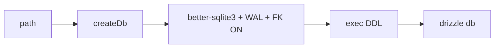

# client.ts — AI component doc

> AI-facing sidecar for `client.ts`. Created 2026-07-06. Keep this in sync with the code on every change.

## Purpose
Single factory for the SQLite connection + drizzle instance (plan Task 4), so prod (file db) and tests (`:memory:`) get identical pragmas and bootstrap DDL.

## What it does (for an AI reader)
- Responsibilities: mkdir the db's parent dir (file dbs only), open better-sqlite3, set `journal_mode=WAL` + `foreign_keys=ON`, run the idempotent `DDL`, wrap in `drizzle(sqlite, { schema })`.
- Public API / exports: `createDb(path): { db, sqlite }`, `Db` (type — used everywhere as the db dependency type).
- Inputs → Outputs: db path (or `':memory:'`) → connected, schema-ready `{ db, sqlite }`.
- Side effects: filesystem mkdir + db file creation (file path), DDL execution.

## Dependencies
- Imports / depends on: `better-sqlite3`, `drizzle-orm/better-sqlite3`, `node:fs`, `node:path`, `./schema`, `./ddl`.
- Used by: `app.ts` (`AppDeps.db` type), `db/migrate.ts`, `test/helpers/build-test-app.ts`, ledger/route modules via the `Db` type.

## Diagram

## Key decisions / gotchas
- `foreign_keys=ON` must be set per-connection (SQLite default is OFF) — cascades depend on it.
- better-sqlite3 is synchronous: `db.transaction((tx) => …)` with `.run()/.get()/.all()` — no `await` inside transactions.

## Commits
- 273e3f4 feat(api): drizzle schema + sqlite bootstrap DDL
