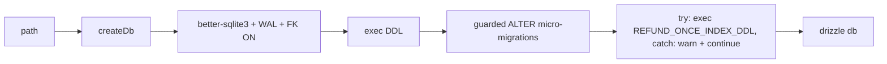

# client.ts — AI component doc

> AI-facing sidecar for `client.ts`. Created 2026-07-06. Keep this in sync with the code on every change.

## Purpose
Single factory for the SQLite connection + drizzle instance (plan Task 4), so prod (file db) and tests (`:memory:`) get identical pragmas and bootstrap DDL.

## What it does (for an AI reader)
- Responsibilities: mkdir the db's parent dir (file dbs only), open better-sqlite3, set `journal_mode=WAL` + `foreign_keys=ON`, run the idempotent `DDL`, apply guarded micro-migrations (`pragma table_info` checks → `ALTER TABLE` for columns added post-ship, currently `generation.error_code`), exec the refund-once unique index (`REFUND_ONCE_INDEX_DDL`) inside try/catch + `console.warn`, wrap in `drizzle(sqlite, { schema })`.
- Public API / exports: `createDb(path): { db, sqlite }`, `Db` (type — used everywhere as the db dependency type).
- Inputs → Outputs: db path (or `':memory:'`) → connected, schema-ready `{ db, sqlite }`.
- Side effects: filesystem mkdir + db file creation (file path), DDL execution.

## Dependencies
- Imports / depends on: `better-sqlite3`, `drizzle-orm/better-sqlite3`, `node:fs`, `node:path`, `./schema`, `./ddl`.
- Used by: `app.ts` (`AppDeps.db` type), `db/migrate.ts`, `test/helpers/build-test-app.ts`, ledger/route modules via the `Db` type.

## Diagram

## Key decisions / gotchas
- `STYLE_DDL` is exec'd with the rest (2026-07-31). ONE brand-new table for the user half of the
  style registry — builtins stay in code — so the idempotent `CREATE TABLE IF NOT EXISTS` is the
  whole story: no micro-migration guard needed.
- `foreign_keys=ON` must be set per-connection (SQLite default is OFF) — cascades depend on it.
- better-sqlite3 is synchronous: `db.transaction((tx) => …)` with `.run()/.get()/.all()` — no `await` inside transactions.
- **Refund-once unique index (review finding)**: `REFUND_ONCE_INDEX_DDL` (UNIQUE on `credit_transaction(generation_id, kind)`) is exec'd SEPARATELY from `DDL` and wrapped in try/catch: a legacy db that already contains duplicate rows would make `CREATE UNIQUE INDEX` throw, and bricking the boot over a backstop is worse than running on the ledger's app-level guard alone — the skip is `console.warn`ed so the operator knows the ledger needs manual repair. Pinned by `test/ledger.test.ts` (fresh dbs get the index + boot survives legacy dupes).

## Update 2026-07-15 — shot.audio micro-migration
- pragma-guarded `ALTER TABLE shot ADD COLUMN audio INTEGER NOT NULL DEFAULT 0`
  joins the shot column back-fills (model_id / voiceover_json / entity_refs_json).

## Update 2026-07-21 — shot.reference_images_json micro-migration
- pragma-guarded `ALTER TABLE shot ADD COLUMN reference_images_json TEXT` joins the same
  shot column back-fills — a JSON array of `{ id, path }` for images attached to a shot.
  Nullable/additive: an existing shot reads NULL (nothing attached), no backfill needed.

## Commits
- 273e3f4 feat(api): drizzle schema + sqlite bootstrap DDL
- 3b96d8c fix(api,web,contracts): respect the NSFW flag — content_blocked failure with refund, never store flagged assets, localized safety copy
- de61e59 feat(api): db-level refund-once index + asset download limits — guarded exec of REFUND_ONCE_INDEX_DDL (try/catch + warn, legacy dupes never brick the boot)
- 81c26c8 feat(canvas): canvas/canvas_node/canvas_edge tables

## Key decisions (2026-07-09) — wan-runpod
- Added a guarded micro-migration: `if (!generationColumns.includes('provider')) ALTER TABLE generation ADD COLUMN provider TEXT NOT NULL DEFAULT 'runware'`. Legacy/image rows backfill to `runware` in one statement — the whole additive DB change for the video-provider seam.

## Key decisions (2026-07-09) — CinemaStudio
- Now execs `FILM_DDL` alongside `DDL`/`ENTITY_DDL` (film/shot/film_audio/film_render tables).
- Two more guarded micro-migrations on `generation`: `composed_prompt TEXT` and `prompt_preset_json TEXT` (nullable, additive — legacy rows read NULL → fall back to `prompt`).

## Key decisions (2026-07-11) — template catalog
Four more guarded micro-migrations, each preceded by its own `pragma table_info(...)` read (the
`generation` column list can't answer for `shot`/`film`/`film_audio`, so there are now four separate
column-name arrays: `generationColumns`, `shotColumns`, `filmColumns`, `filmAudioColumns`).

- `shot.model_id TEXT` — the model this shot generates with; was transient inspector state (defaulted
  to `videoModels[0]` on every mount). Persisting it is what lets a template pin a tier.
- `shot.voiceover_json TEXT` — `{ text, voice }`, the spoken line as authored copy. A draft slot:
  `film_audio` needs a `generation_id`, so a template previously could not ship a script without first
  charging for the TTS.
- `film.template_id TEXT` — provenance, so the audio panel can offer the template's music prompt and so
  we can ask which templates convert.
- `film_audio.shot_id TEXT` — which shot a voiceover track belongs to. Without it the editor cannot tell
  whether a shot is already voiced, so a second click on "Voice this shot" would append a second
  overlapping track AND charge for it again.

All four are nullable and additive: every pre-existing film/shot reads NULL and behaves exactly as
before. Same guarded pattern as `error_code`/`provider` — SQLite has no `ADD COLUMN IF NOT EXISTS`, so
the `pragma table_info` check makes a re-run a no-op.

## Key decisions (2026-07-13) — Studio3D
`createDb` now also execs `MODEL3D_DDL` (after `FILM_DDL`), which creates `model_render` and
`model_share`. No micro-migration accompanies it: both are new tables, so `CREATE TABLE IF NOT EXISTS`
covers a fresh db and a legacy file alike. Adding `'model3d'` as a generation type needed no DDL and no
`ALTER` either — `generation.type` is plain TEXT and the enum is a TypeScript-level refinement.

## Key decisions (2026-07-13) — AI Soul Studio
Two more guarded micro-migrations, each with its own `pragma table_info(...)` read (`entityColumns`,
`entityImageColumns`):

- `entity.soul TEXT` — the structured character spec as JSON.
- `entity_image.view TEXT` — which slot of the reference sheet a photo fills.

Both nullable, both additive, and **neither is backfilled** — because NULL already carries the right
meaning on every pre-existing row: a soul-less entity is one built from free prose, and a view-less
image is an ordinary upload. That makes the expand step the *whole* migration: there is no dual-write
phase and no contract phase, and rolling the code back simply leaves two columns nobody reads.

`entity_image.source` gaining `'generated'` needed **no** statement here at all — the column is plain
TEXT and the enum lives only in TypeScript, exactly as `generation.type` did when Studio3D added
`'model3d'`.

## Update 2026-07-16 — user.role micro-migration
- Guarded `ALTER TABLE user ADD COLUMN role TEXT NOT NULL DEFAULT 'user'` (pragma table_info check, same pattern as every other micro-migration here). DEFAULT backfills all pre-existing accounts as plain users; the only `super_admin` is written by the dev-only seed in `modules/auth/dev-admin.ts`.

## Key decisions (2026-07-18) — Modular 3D Assets
`createDb` now also execs `ASSET3D_DDL` (imported from `./ddl`, exec'd right after `MODEL3D_DDL`),
creating `asset3d` and `asset3d_part`. Like the Studio3D tables these are brand-new, so a single
`CREATE TABLE IF NOT EXISTS` covers a fresh db and a legacy file alike — **no** micro-migration guard
accompanies it (there are no columns being added to a pre-existing table). The part's
`image_generation_id` / `mesh_generation_id` are plain TEXT CITATIONS with no `REFERENCES` clause, so
deleting a generation from the library never cascades a part away; only `asset3d.user_id` and
`asset3d_part.asset_id` cascade. See ADR `docs/wiki/decisions/modular-3d-assets.md`.

## Key decisions (2026-07-30) — Canvas Mode
`createDb` now also execs `CANVAS_DDL` (imported from `./ddl`, exec'd right after `ASSET3D_DDL`),
creating `canvas`, `canvas_node` and `canvas_edge`. Like the Studio3D and Assets3D tables these are
brand-new, so a single `CREATE TABLE IF NOT EXISTS` covers a fresh db and a legacy file alike — **no**
micro-migration guard accompanies it, because no column is being added to a pre-existing table.

The node's `generation_ids_json` holds plain TEXT citations inside a JSON array (no `REFERENCES`
clause is even possible there), so deleting a generation from the library never cascades a node away;
only `canvas.user_id`, `canvas_node.canvas_id` and `canvas_edge.canvas_id` cascade. See ADR
`docs/wiki/decisions/canvas-mode.md`.

## Key decisions (2026-07-30) — openCreator agent
`createDb` now also execs `CREATOR_DDL` (imported from `./ddl`, exec'd right after `CANVAS_DDL`),
creating `creator_session` and `creator_message`. Brand-new tables again, so a single
`CREATE TABLE IF NOT EXISTS` covers a fresh db and a legacy file alike — **no** micro-migration guard,
because no column is being added to a pre-existing table.

It runs unconditionally (not lazily on first `/creator` request) for two reasons: a deployment that
never opens the page still gets a consistent schema, and the boot-time
`settleStaleCreatorSessions` sweep in `app.ts` needs the table to exist before any request arrives.

`creator_message.content_json` holds the agent's citations (`canvasId`/`entityId`/`generationId`) as
plain strings inside JSON, so no `REFERENCES` clause is possible or wanted there: deleting a
generation leaves a stale citation on an old chat card instead of erasing the conversation. Only
`creator_session.user_id` and `creator_message.session_id` cascade. See ADR
`docs/wiki/decisions/opencreator-agent.md`.

## Update 2026-07-31 — style.reference_images_json micro-migration
Pragma-guarded `ALTER TABLE style ADD COLUMN reference_images_json TEXT`, reading its own
`pragma table_info(style)` (`styleColumns`) exactly like the `shot` block above it. The style package
(ADR `style-studio` amendment A1) stores its images as JSON `[{ id, path }]`.

NULL is not a gap here, it is the meaning: "this style has nothing attached", which is every row
written before the amendment. So the EXPAND step is the whole migration — nothing to backfill, no
contract step, and rolling the code back leaves a column no writer reads.

## Update 2026-07-31 — film.cover_image_path micro-migration
Pragma-guarded `ALTER TABLE film ADD COLUMN cover_image_path TEXT`, **reusing the `filmColumns` read
already taken** for `template_id` rather than issuing a second `pragma table_info(film)`.

The film's cover picture (owner request 2026-07-31), stored as the `/media/…` path `saveDataUri`
returned. NULL is not a gap — it is what every film written before this has: no cover. Expand is the
whole migration; rolling the code back leaves a column no writer reads.

## Update 2026-08-20 - `film.batch_id` micro-migration + its index

- `if (!filmColumns.includes('batch_id')) ALTER TABLE film ADD COLUMN batch_id TEXT`,
  reusing the `filmColumns` pragma read already done for `template_id`/`cover_image_path`.
- Additive and nullable, and **NULL is not a gap** - it is the truth about every film
  ever made one at a time, which is all of them so far. The expand step IS the whole
  migration: nothing to backfill, no contract step, and rolling the code back leaves a
  column no writer touches.
- **`sqlite.exec(FILM_BATCH_INDEX_DDL)` runs on the line after the guard, and the
  ORDER is the point.** On an existing volume the column was created one statement ago;
  `FILM_DDL` ran long before it and would have indexed a column that did not yet exist.
  Both paths - fresh file and existing file - reach that exec with `batch_id` present.
- Covered by `test/db-ddl.test.ts` > "film.batch_id on an existing volume", which boots
  the real `createDb` against a file holding the PRE-FEATURE `film` schema.
