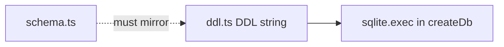

# ddl.ts — AI component doc

> AI-facing sidecar for `ddl.ts`. Created 2026-07-06. Keep this in sync with the code on every change.

## Purpose
Literal, idempotent `CREATE TABLE IF NOT EXISTS` SQL for all six tables + two hot-path indexes (plan Task 4). Replaces drizzle-kit migrations for the MVP so `:memory:` test databases bootstrap identically to the file db.

## What it does (for an AI reader)
- Responsibilities: hold the exact SQL mirror of `schema.ts` (snake_case columns, INTEGER epoch-ms timestamps, INTEGER 0/1 booleans, FK cascades) plus the separately-exec'd refund-once unique index.
- Public API / exports: `DDL` (string), `REFUND_ONCE_INDEX_DDL` (string — `CREATE UNIQUE INDEX IF NOT EXISTS idx_credit_tx_generation_kind ON credit_transaction(generation_id, kind)`).
- Inputs → Outputs: none → executed once per `createDb()` call via `sqlite.exec(DDL)`; `REFUND_ONCE_INDEX_DDL` is exec'd separately inside a try/catch there.
- Side effects: none by itself (execution happens in `client.ts`).

## Dependencies
- Imports / depends on: nothing.
- Used by: `db/client.ts`.

## Diagram

## Key decisions / gotchas
- Indexes: `idx_generation_user_created(user_id, created_at DESC)` and `idx_credit_tx_user(user_id, created_at DESC)` back the library list and transactions endpoints.
- Idempotent by construction — safe to run on every boot; adding a column later requires a guarded `ALTER TABLE` micro-migration in `client.ts` (CREATE IF NOT EXISTS never alters existing tables).
- `generation.error_code` (nullable TEXT) mirrors `schema.ts` — machine-readable failure reason (`content_blocked` for NSFW safety blocks); back-filled for older db files by `client.ts`.
- **Refund-once unique index (review finding)**: `REFUND_ONCE_INDEX_DDL` is a DB-level backstop for the ledger's app-level refund-once guard — UNIQUE `(generation_id, kind)` makes a duplicate refund/charge row physically impossible; NULL generation_ids (signup bonuses) stay unconstrained (SQLite treats NULLs as distinct). Kept OUT of the main `DDL` string on purpose: it is exec'd separately in `client.ts` under try/catch, because legacy data with duplicates would otherwise abort the whole bootstrap exec and brick the boot. Pinned by `test/ledger.test.ts` ("refund-once unique index").

## Commits
- 273e3f4 feat(api): drizzle schema + sqlite bootstrap DDL
- 3b96d8c fix(api,web,contracts): respect the NSFW flag — content_blocked failure with refund, never store flagged assets, localized safety copy
- de61e59 feat(api): db-level refund-once index + asset download limits — REFUND_ONCE_INDEX_DDL exported separately from the main DDL string

## Key decisions (2026-07-09) — wan-runpod
- Added `provider TEXT NOT NULL DEFAULT 'runware'` to the `generation` CREATE TABLE (mirrors `schema.ts`). Additive; the `client.ts` guarded micro-migration ALTERs it onto pre-existing db files (SQLite has no ADD COLUMN IF NOT EXISTS).

## Key decisions (2026-07-09) — CinemaStudio
- `generation` gains `composed_prompt TEXT` (what the model saw) and `prompt_preset_json TEXT` (structured preset echoed back). Both nullable, additive; `client.ts` micro-migration ALTERs them onto legacy db files.
- New `FILM_DDL` export (exec'd with the main DDL in `client.ts`): tables `film`, `shot`, `film_audio`, `film_render`. `shot.order_index` is REAL (spaced reorder, no whole-list renumber). `shot.generation_id` / `film_audio.generation_id` carry NO FK — a gallery-deleted generation must leave an empty ref, not cascade the film away. `film_render` has NO cost/refund column — it spends CPU, not a provider invoice (ADR §2).

## Key decisions (2026-07-11) — template catalog
`FILM_DDL` gains four nullable columns (mirroring `schema.ts`); no new tables — a template is CODE, not
a row. All four are additive, so a fresh db gets them from the CREATE TABLE and an existing db gets them
from the guarded `ALTER TABLE` micro-migrations in `client.ts`.

- `film.template_id TEXT` — provenance; **no FK**, because templates are code: retiring one must leave
  old films intact rather than cascading them away.
- `shot.model_id TEXT` — the model this shot generates with. Persisting it is what lets a template pin
  its price/quality tier onto every shot.
- `shot.voiceover_json TEXT` — `{ text, voice }`, the spoken line as authored copy. Costs nothing to
  hold; becomes an audio generation + a `film_audio` track only when the user asks for it.
- `film_audio.shot_id TEXT` — the shot this track voices; NULL = a film-wide bed. Makes "voice this
  shot" a replace rather than an append (no duplicate track, no duplicate charge).

## Key decisions (2026-07-13) — Studio3D renders + shares
New `MODEL3D_DDL` export, exec'd with the main DDL in `client.ts` (same idempotent
`CREATE ... IF NOT EXISTS` contract). Two tables, and **no change to `generation`** — a 3D model IS a
generation (`type = 'model3d'`, a TEXT column with a TS-level enum, so it needs no DDL at all). These
tables only add what a generation cannot express: how a model was PRESENTED, and whether it was PUBLISHED.

- **`model_render`** — a turntable video of a model, shot through a named scene preset. Same status
  machine as `film_render` (`processing → succeeded/failed`, poll-driven, stale-reaped) and the same
  bargain: **NO cost/credit column**, because a render spends our compute, not a provider invoice
  (ADR §D3). The absence is the guard, and `test/db-ddl.test.ts` asserts on it — a cost column here is
  precisely what would tempt a later change to wire this table to the credit ledger.
  - `generation_id` carries **no FK** (matching `shot.generation_id`): a gallery-deleted generation must
    leave the render readable as an orphan, not cascade it away.
  - `engine TEXT DEFAULT 'browser'` — which renderer produced it. `'browser'` is the built path (client
    WebCodecs); `'chromium'`/`'blender'` are designed-but-unbuilt server paths. Persisting it makes a
    later engine swap a query rather than archaeology.
- **`model_share`** — a public link. **The id IS the token** (an unguessable UUID), so revoking a share
  is a DELETE and no `is_public` flag has to appear on `generation`. `idx_model_share_gen` is UNIQUE on
  `generation_id`, which is what makes "Share" idempotent: without it a second click mints a second live
  token and a revoke (one DELETE) kills only one of them, leaving the model quietly public.
