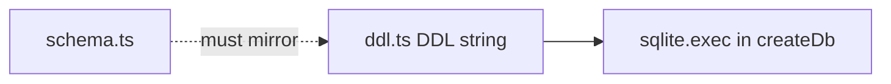

# ddl.ts — AI component doc

> AI-facing sidecar for `ddl.ts`. Created 2026-07-06. Keep this in sync with the code on every change.

## Purpose
Literal, idempotent `CREATE TABLE IF NOT EXISTS` SQL for all six tables + two hot-path indexes (plan Task 4). Replaces drizzle-kit migrations for the MVP so `:memory:` test databases bootstrap identically to the file db.

## What it does (for an AI reader)
- Responsibilities: hold the exact SQL mirror of `schema.ts` (snake_case columns, INTEGER epoch-ms timestamps, INTEGER 0/1 booleans, FK cascades) plus the separately-exec'd refund-once unique index.
- Public API / exports: `DDL` (string), `REFUND_ONCE_INDEX_DDL` (string — `CREATE UNIQUE INDEX IF NOT EXISTS idx_credit_tx_generation_kind ON credit_transaction(generation_id, kind)`).
- Inputs → Outputs: none → executed once per `createDb()` call via `sqlite.exec(DDL)`; `REFUND_ONCE_INDEX_DDL` is exec'd separately inside a try/catch there.
- Side effects: none by itself (execution happens in `client.ts`).

## Dependencies
- Imports / depends on: nothing.
- Used by: `db/client.ts`.

## Diagram

## Key decisions / gotchas
- **`STYLE_DDL`** (ADR style-studio D2, 2026-07-31): ONE table, `style`, for the USER half of the
  style registry only — the seven builtins stay code (`STYLE_PRESETS`), like the model catalog, so
  templates and film defaults never depend on the db and their ids cannot be edited out from under an
  existing film. `kind` + `config_json` are the extension seam ('lora'/'reference' arrive as a new
  kind value plus keys in the JSON, with no migration and no wire change).
  `preview_generation_id` has **no FK on purpose** — "cite, never own", the same rule as
  `shot.generation_id` and `canvas_node.generation_ids_json`: deleting the generation must leave a
  style with an empty preview, never cascade the style away.
- Indexes: `idx_generation_user_created(user_id, created_at DESC)` and `idx_credit_tx_user(user_id, created_at DESC)` back the library list and transactions endpoints.
- Idempotent by construction — safe to run on every boot; adding a column later requires a guarded `ALTER TABLE` micro-migration in `client.ts` (CREATE IF NOT EXISTS never alters existing tables).
- `generation.error_code` (nullable TEXT) mirrors `schema.ts` — machine-readable failure reason (`content_blocked` for NSFW safety blocks); back-filled for older db files by `client.ts`.
- **Refund-once unique index (review finding)**: `REFUND_ONCE_INDEX_DDL` is a DB-level backstop for the ledger's app-level refund-once guard — UNIQUE `(generation_id, kind)` makes a duplicate refund/charge row physically impossible; NULL generation_ids (signup bonuses) stay unconstrained (SQLite treats NULLs as distinct). Kept OUT of the main `DDL` string on purpose: it is exec'd separately in `client.ts` under try/catch, because legacy data with duplicates would otherwise abort the whole bootstrap exec and brick the boot. Pinned by `test/ledger.test.ts` ("refund-once unique index").

## Update 2026-07-15 — shot.audio
- FILM_DDL `shot` table += `audio INTEGER NOT NULL DEFAULT 0` (native generation
  audio; default keeps legacy rows silent).

## Key decisions (2026-07-16) — user.role (dev super-admin)
- `user` CREATE TABLE gains `role TEXT NOT NULL DEFAULT 'user'` (mirrors `schema.ts`; `client.ts`
  carries the guarded ALTER for existing db files). Added for the dev-only seeded super-admin
  (`modules/auth/dev-admin.ts`); `'user'` is the default so every existing and future signup is a
  plain user — only the dev seed writes `'super_admin'`, and better-auth exposes the field
  `input:false` so a client can never self-assign a role at signup.

## Key decisions (2026-07-18) — Modular 3D Assets (ADR modular-3d-assets)
New `ASSET3D_DDL` export (to be exec'd with the main DDL in `client.ts`, same idempotent
`CREATE ... IF NOT EXISTS` contract). Two brand-new tables, `asset3d` + `asset3d_part`, mirroring
`schema.ts` column-for-column. Because both tables are NEW, only the `CREATE TABLE IF NOT EXISTS`
exec is needed — there is **no `client.ts` ALTER micro-migration** (that guard exists only to add a
column to a table an older db already has).

- **`asset3d`** — `id`, `user_id` (REFERENCES `user`, cascade), `title`, `concept_image_path`,
  `created_at`. `concept_image_path` holds the full `/media/<uuid>.<ext>` path `saveDataUri` returns,
  verbatim — the extension is load-bearing for `readAsDataUri`'s mime resolution. Backed by
  `idx_asset3d_user_created(user_id, created_at DESC)` for the asset-list endpoint.
- **`asset3d_part`** — `id`, `asset_id` (REFERENCES `asset3d`, cascade), `name`,
  `description NOT NULL DEFAULT ''`, `sort_order REAL` (spaced reorder, the `shot.order_index`
  precedent), `image_generation_id`, `mesh_generation_id`, `transform_json`, `created_at`. Backed by
  `idx_asset3d_part_asset(asset_id, sort_order)` for the ordered per-asset read.
- **`image_generation_id` / `mesh_generation_id` are CITATIONS: plain TEXT, NO `REFERENCES` clause.**
  Same rule as `shot.generation_id` — a gallery-deleted generation must leave an orphaned ref, never
  cascade the part away. The ONLY cascading edges are `asset3d.user_id` and `asset3d_part.asset_id`.
- **No status column** — part state (`draft|extracting|extracted|meshing|ready`) is DERIVED at read
  time from the cited generations' statuses (the films/shots two-sources-of-truth lesson). Nothing in
  this DDL persists it.
- `test/db-ddl.test.ts` pins the column shape AND asserts the citation-not-FK rule
  (`foreign_key_list(asset3d_part)` contains `asset3d`, not `generation`).

## Update 2026-07-21 — shot.reference_images_json
- `FILM_DDL` shot table += `reference_images_json TEXT` (nullable) — arbitrary images attached
  to a shot as references, a JSON array of `{ id, path }`, parallel to `entity_refs_json`.
  Needs the matching guarded `ALTER TABLE shot ADD COLUMN` micro-migration in `client.ts`
  (CREATE IF NOT EXISTS never alters an existing shot table).

## Commits
- 273e3f4 feat(api): drizzle schema + sqlite bootstrap DDL
- 3b96d8c fix(api,web,contracts): respect the NSFW flag — content_blocked failure with refund, never store flagged assets, localized safety copy
- de61e59 feat(api): db-level refund-once index + asset download limits — REFUND_ONCE_INDEX_DDL exported separately from the main DDL string
- 81c26c8 feat(canvas): canvas/canvas_node/canvas_edge tables
- fe8fdba feat(creator): session/message tables

## Key decisions (2026-07-09) — wan-runpod
- Added `provider TEXT NOT NULL DEFAULT 'runware'` to the `generation` CREATE TABLE (mirrors `schema.ts`). Additive; the `client.ts` guarded micro-migration ALTERs it onto pre-existing db files (SQLite has no ADD COLUMN IF NOT EXISTS).

## Key decisions (2026-07-09) — CinemaStudio
- `generation` gains `composed_prompt TEXT` (what the model saw) and `prompt_preset_json TEXT` (structured preset echoed back). Both nullable, additive; `client.ts` micro-migration ALTERs them onto legacy db files.
- New `FILM_DDL` export (exec'd with the main DDL in `client.ts`): tables `film`, `shot`, `film_audio`, `film_render`. `shot.order_index` is REAL (spaced reorder, no whole-list renumber). `shot.generation_id` / `film_audio.generation_id` carry NO FK — a gallery-deleted generation must leave an empty ref, not cascade the film away. `film_render` has NO cost/refund column — it spends CPU, not a provider invoice (ADR §2).

## Key decisions (2026-07-11) — template catalog
`FILM_DDL` gains four nullable columns (mirroring `schema.ts`); no new tables — a template is CODE, not
a row. All four are additive, so a fresh db gets them from the CREATE TABLE and an existing db gets them
from the guarded `ALTER TABLE` micro-migrations in `client.ts`.

- `film.template_id TEXT` — provenance; **no FK**, because templates are code: retiring one must leave
  old films intact rather than cascading them away.
- `shot.model_id TEXT` — the model this shot generates with. Persisting it is what lets a template pin
  its price/quality tier onto every shot.
- `shot.voiceover_json TEXT` — `{ text, voice }`, the spoken line as authored copy. Costs nothing to
  hold; becomes an audio generation + a `film_audio` track only when the user asks for it.
- `film_audio.shot_id TEXT` — the shot this track voices; NULL = a film-wide bed. Makes "voice this
  shot" a replace rather than an append (no duplicate track, no duplicate charge).

## Key decisions (2026-07-13) — Studio3D renders + shares
New `MODEL3D_DDL` export, exec'd with the main DDL in `client.ts` (same idempotent
`CREATE ... IF NOT EXISTS` contract). Two tables, and **no change to `generation`** — a 3D model IS a
generation (`type = 'model3d'`, a TEXT column with a TS-level enum, so it needs no DDL at all). These
tables only add what a generation cannot express: how a model was PRESENTED, and whether it was PUBLISHED.

- **`model_render`** — a turntable video of a model, shot through a named scene preset. Same status
  machine as `film_render` (`processing → succeeded/failed`, poll-driven, stale-reaped) and the same
  bargain: **NO cost/credit column**, because a render spends our compute, not a provider invoice
  (ADR §D3). The absence is the guard, and `test/db-ddl.test.ts` asserts on it — a cost column here is
  precisely what would tempt a later change to wire this table to the credit ledger.
  - `generation_id` carries **no FK** (matching `shot.generation_id`): a gallery-deleted generation must
    leave the render readable as an orphan, not cascade it away.
  - `engine TEXT DEFAULT 'browser'` — which renderer produced it. `'browser'` is the built path (client
    WebCodecs); `'chromium'`/`'blender'` are designed-but-unbuilt server paths. Persisting it makes a
    later engine swap a query rather than archaeology.
- **`model_share`** — a public link. **The id IS the token** (an unguessable UUID), so revoking a share
  is a DELETE and no `is_public` flag has to appear on `generation`. `idx_model_share_gen` is UNIQUE on
  `generation_id`, which is what makes "Share" idempotent: without it a second click mints a second live
  token and a revoke (one DELETE) kills only one of them, leaving the model quietly public.

## Key decisions (2026-07-13) — AI Soul Studio
`ENTITY_DDL` gained two columns so a **fresh** database is born with them (`db/client.ts` carries the
matching guarded `ALTER`s for databases that already exist — the two must stay in lockstep, which is
what `test/db-ddl.test.ts` exists to catch):

- `entity.soul TEXT` — the JSON `Soul`. NULL = a legacy/hand-made entity on free prose.
- `entity_image.view TEXT` — `front | three-quarter | profile | full-body`, NULL = an ordinary upload.

Both nullable and additive, so no backfill exists or is needed: NULL already means the right thing on
every row that predates the feature. `entity_image.source` widening to admit `'generated'` needed no
change here — it is plain TEXT and the enum is TypeScript-level.

## Key decisions (2026-07-30) — Canvas Mode
`CANVAS_DDL` (a fifth constant, exec'd after `ASSET3D_DDL`) creates the node-graph aggregate — the
composition layer OVER generations, exactly like `FILM_DDL`. See ADR `docs/wiki/decisions/canvas-mode.md`.

- **`canvas`** — `id`, `user_id` (→ `user`, cascade), `title`, `viewport_json`, `created_at`,
  `updated_at`. `viewport_json` (`{"x":0,"y":0,"zoom":1}` by DEFAULT) is the owner's last camera,
  stored on the CANVAS rather than per-client: these are single-owner documents, so reopening where
  you left off is the correct behavior and needs no client-side storage.
  `idx_canvas_user_updated (user_id, updated_at DESC)` serves the only list query there is.
- **`canvas_node`** — `id`, `canvas_id` (→ `canvas`, cascade), `kind`, `position_json`,
  `config_json` (DEFAULT `'{}'`), `generation_ids_json` (DEFAULT `'[]'`), `upload_url`.
  `kind` is plain TEXT with the enum living in TypeScript/zod — the `generation.type` precedent, so
  adding an eighth node kind later needs no DDL.
  `config_json` is deliberately **opaque to the server**: a node RUN goes through
  `POST /api/generations`, which re-validates strictly against the catalog model. This column only
  holds saved editor state, so the server never has to understand a field the editor just added.
- **`canvas_edge`** — `id`, `canvas_id` (→ `canvas`, cascade), `source_node_id`, `target_node_id`.
  The endpoint columns are **bare TEXT, not FKs**: the document is rewritten whole on every autosave
  (delete + reinsert), so a mid-transaction FK on a node being replaced would fight the write for no
  integrity gain — the client owns edge/node consistency and the whole replace is atomic.
- **`generation_ids_json` carries no FK** — the same "cite, never own" rule as `shot.generation_id`
  and `asset3d_part.image_generation_id`. Deleting a generation from the gallery must leave an empty
  version on the node, never cascade the canvas away. The ONLY cascading edges are the owner edges
  (`canvas.user_id`, `canvas_node.canvas_id`, `canvas_edge.canvas_id`).
- **No cost/credit column anywhere.** A canvas composes generations; the money lives in the ledger
  the generation system already owns. Zero new money code is the ADR's D1 constraint.

## Key decisions (2026-07-30) — openCreator agent
`CREATOR_DDL` (a sixth constant, exec'd after `CANVAS_DDL`) creates the agent chat. See ADR
`docs/wiki/decisions/opencreator-agent.md`.

- **`creator_session`** — `id`, `user_id` (→ `user`, cascade), `title`, `status`, `confirmed`,
  `created_at`, `updated_at`. `idx_creator_session_user (user_id, updated_at DESC)` serves the only
  list query (the left rail, most-recent-first).
- **`confirmed INTEGER NOT NULL DEFAULT 0` is the budget gate (ADR D2), and the DEFAULT is
  load-bearing.** `tools.ts` refuses `start_generation` outright — no service call, no charge — while
  this flag is 0, so the column's default is what guarantees a brand-new (or freshly re-planned)
  session cannot spend a credit. `POST /confirm` sets it to 1; every new `propose_plan` resets it to 0.
  A nullable column would be read as falsy and *work*, but NOT NULL states the invariant where the
  database can enforce it. Pinned by `test/db-ddl.test.ts`.
- **`status` is plain TEXT** with the union (`idle|running|awaiting_confirm|failed`) in TypeScript —
  the `generation.status` precedent, so a new state is not a migration. `updated_at` doubles as the
  staleness clock: in-flight agent loops live in process memory (like DeepInfra jobs), so a restart
  leaves `running` rows that only the boot-time reaper can settle.
- **`creator_message`** — `id`, `session_id` (→ `creator_session`, cascade), `role`, `content_json`,
  `created_at`. `idx_creator_message_session (session_id, created_at)` serves the transcript read,
  which is always the whole conversation in order.
- **`content_json` is JSON, not columns.** The four card kinds (`text`/`step`/`plan`/`result`) share
  almost no fields, and nothing ever queries INTO a message — the service reads a session's messages
  whole. Validated on the way out by `creatorMessageContentSchema`.
- **A message cites artifacts with NO FK.** `canvasId`/`entityId`/`generationId` live inside
  `content_json`, so deleting a generation from the gallery leaves a stale citation on an old card
  rather than erasing the conversation — the same "cite, never own" rule as `shot.generation_id`.
  The ONLY cascading edges are the owner edges (`creator_session.user_id`, `creator_message.session_id`).
- **No cost/credit column.** The agent spends only through `generationService.create()`; `costCredits`
  on a step card is a copy of what that call already charged, for display. Zero new money code (D1).

## Update 2026-07-31 — style.reference_images_json
- `STYLE_DDL` `style` table += `reference_images_json TEXT` (nullable) — JSON `[{ id, path }]`, the
  image half of the style package (ADR `style-studio` amendment A1) and the same shape as
  `shot.reference_images_json`.
- A column rather than a key inside `config_json` because these are stored FILES with a lifetime: an
  orphan sweep must see them without parsing an open-ended blob.
- Additive and nullable, so a legacy db file is covered by the pragma-guarded `ALTER TABLE` in
  `client.ts` and a fresh one by this DDL — no backfill, no contract step.
