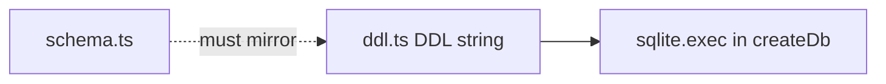

# ddl.ts — AI component doc

> AI-facing sidecar for `ddl.ts`. Created 2026-07-06. Keep this in sync with the code on every change.

## Purpose
Literal, idempotent `CREATE TABLE IF NOT EXISTS` SQL for all six tables + two hot-path indexes (plan Task 4). Replaces drizzle-kit migrations for the MVP so `:memory:` test databases bootstrap identically to the file db.

## What it does (for an AI reader)
- Responsibilities: hold the exact SQL mirror of `schema.ts` (snake_case columns, INTEGER epoch-ms timestamps, INTEGER 0/1 booleans, FK cascades).
- Public API / exports: `DDL` (string).
- Inputs → Outputs: none → executed once per `createDb()` call via `sqlite.exec(DDL)`.
- Side effects: none by itself (execution happens in `client.ts`).

## Dependencies
- Imports / depends on: nothing.
- Used by: `db/client.ts`.

## Diagram

## Key decisions / gotchas
- Indexes: `idx_generation_user_created(user_id, created_at DESC)` and `idx_credit_tx_user(user_id, created_at DESC)` back the library list and transactions endpoints.
- Idempotent by construction — safe to run on every boot; adding a column later requires an explicit `ALTER TABLE` block here (expand → backfill → contract).

## Commits
- (pending) feat(api): drizzle schema + sqlite bootstrap DDL
