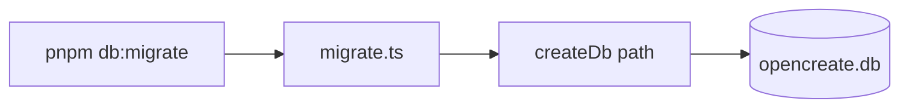

# migrate.ts — AI component doc

> AI-facing sidecar for `migrate.ts`. Created 2026-07-06. Keep this in sync with the code on every change.

## Purpose
Entry for `pnpm --filter @opencreate/api db:migrate` (plan Task 4). Because the DDL bootstrap is idempotent and runs inside `createDb()`, migrating is just opening the configured database once.

## What it does (for an AI reader)
- Responsibilities: `loadConfig()` → `createDb(databasePath)` → log `db ready`.
- Public API / exports: none (side-effect script run via tsx).
- Inputs → Outputs: `DATABASE_PATH` env (default `./data/opencreate.db`) → created/verified db file with all tables.
- Side effects: creates `./data/` dir + SQLite file; executes DDL.

## Dependencies
- Imports / depends on: `../config`, `./client`.
- Used by: `db:migrate` script (README quickstart step).

## Diagram

## Key decisions / gotchas
- Requires a valid env (`RUNWARE_API_KEY`, `BETTER_AUTH_SECRET` ≥32 chars) since it goes through `loadConfig()` — copy `.env.example` first.

## Commits
- (pending) feat(api): drizzle schema + sqlite bootstrap DDL
