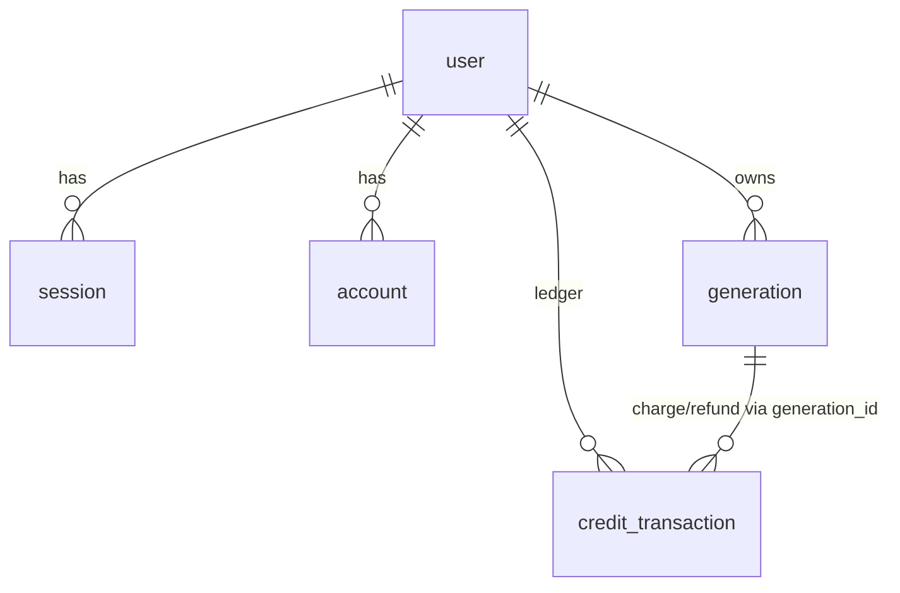

# schema.ts — AI component doc

> AI-facing sidecar for `schema.ts`. Created 2026-07-06. Keep this in sync with the code on every change.

## Purpose
Drizzle table definitions (plan Task 4): better-auth's four default tables (`user`, `session`, `account`, `verification` — singular names so the drizzle adapter maps 1:1) plus domain tables `generation` and `credit_transaction`.

## What it does (for an AI reader)
- Responsibilities: define column types/constraints; snake_case on disk ↔ camelCase in TS; `timestamp_ms` mode for all dates; `user.creditsBalance` is the denormalized balance.
- Public API / exports: `user`, `session`, `account`, `verification`, `generation`, `creditTransaction` table objects.
- Inputs → Outputs: none (declarative) → typed query builders via `drizzle(sqlite, { schema })`.
- Side effects: none — DDL execution lives in `ddl.ts`/`client.ts`.

## Dependencies
- Imports / depends on: `drizzle-orm/sqlite-core`.
- Used by: `db/client.ts`, `modules/auth/auth.ts` (adapter schema), `modules/credits/ledger.ts`, `modules/users/routes.ts`, `modules/credits/routes.ts`, later `modules/generations/*`; mirrored by `db/ddl.ts`.

## Diagram

## Key decisions / gotchas
- ANY change here MUST be mirrored in `ddl.ts` (idempotent SQL bootstrap) — there are no drizzle-kit migrations in MVP.
- `creditsBalance` is mutated ONLY inside the same transaction as a `credit_transaction` row (ledger invariant).
- `credit_transaction.amount` is signed: negative for `charge`, positive for `signup_bonus`/`refund`.

## Commits
- 273e3f4 feat(api): drizzle schema + sqlite bootstrap DDL
