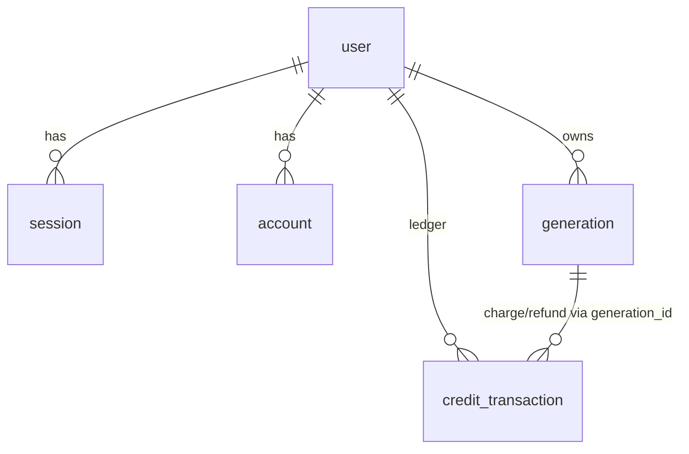

# schema.ts — AI component doc

> AI-facing sidecar for `schema.ts`. Created 2026-07-06. Keep this in sync with the code on every change.

## Purpose
Drizzle table definitions (plan Task 4): better-auth's four default tables (`user`, `session`, `account`, `verification` — singular names so the drizzle adapter maps 1:1) plus domain tables `generation` and `credit_transaction`.

## What it does (for an AI reader)
- Responsibilities: define column types/constraints; snake_case on disk ↔ camelCase in TS; `timestamp_ms` mode for all dates; `user.creditsBalance` is the denormalized balance.
- Public API / exports: `user`, `session`, `account`, `verification`, `generation`, `creditTransaction` table objects.
- Inputs → Outputs: none (declarative) → typed query builders via `drizzle(sqlite, { schema })`.
- Side effects: none — DDL execution lives in `ddl.ts`/`client.ts`.

## Dependencies
- Imports / depends on: `drizzle-orm/sqlite-core`.
- Used by: `db/client.ts`, `modules/auth/auth.ts` (adapter schema), `modules/credits/ledger.ts`, `modules/users/routes.ts`, `modules/credits/routes.ts`, later `modules/generations/*`; mirrored by `db/ddl.ts`.

## Diagram

## Key decisions / gotchas
- ANY change here MUST be mirrored in `ddl.ts` (idempotent SQL bootstrap) — there are no drizzle-kit migrations in MVP. Columns added AFTER first ship also need a guarded `ALTER TABLE` micro-migration in `client.ts` (CREATE IF NOT EXISTS never alters existing tables).
- `generation.errorCode` (`error_code`, nullable) is the machine-readable failure reason — today only `'content_blocked'` for NSFW safety blocks, so the SPA can localize the message instead of echoing raw provider text.
- `creditsBalance` is mutated ONLY inside the same transaction as a `credit_transaction` row (ledger invariant).
- `credit_transaction.amount` is signed: negative for `charge`, positive for `signup_bonus`/`refund`.

## Commits
- 273e3f4 feat(api): drizzle schema + sqlite bootstrap DDL
- 3b96d8c fix(api,web,contracts): respect the NSFW flag — content_blocked failure with refund, never store flagged assets, localized safety copy

## Key decisions (2026-07-09) — wan-runpod
- Added `provider: text(provider).notNull().default(runware)` to `generation` (VideoProvider seam). `.default()` makes it optional in `$inferInsert` (SQLite applies the default for image/legacy rows). The neutral provider job id / cost REUSE `runwareTaskUuid` / `runwareCostUsd` (no rename — keeps money-path code byte-for-byte, instant rollback). Mirror in `ddl.ts` + `client.ts` micro-migration.

## Key decisions (2026-07-09) — CinemaStudio
- `generation.type` enum gains `'audio'`; two nullable columns `composedPrompt` / `promptPresetJson` added (mirror `ddl.ts` + `client.ts` micro-migration).
- Four new tables: `film`, `shot`, `filmAudio`, `filmRender`. `shot.orderIndex` is `real()` (spaced reorder). `shot.generationId` / `filmAudio.generationId` have **no** `.references()` — a deleted generation leaves an empty ref, it does not cascade the film. `filmRender` has no cost/refund column (CPU, not a provider invoice); `mediaJson` mirrors `generation.mediaJson`'s `[url]` array shape so the same serve path is reused. `real` added to the drizzle-orm import.

## Key decisions (2026-07-11) — template catalog
Three tables gain one nullable column each. All additive: every pre-existing row reads NULL and
behaves exactly as before. Mirrored in `ddl.ts` (`FILM_DDL`) **and** guarded by `client.ts`
micro-migrations, because `CREATE TABLE IF NOT EXISTS` never alters a table that already exists.

- **`shot.modelId`** (`model_id TEXT`) — the catalog model this shot generates with; NULL = no opinion
  (fall back to the style's recommendation, then the first video model). Before this column the model
  was transient inspector state: re-selecting a shot forgot which model made its clip, and a template
  had nowhere to pin its price/quality tier.
- **`shot.voiceoverJson`** (`voiceover_json TEXT`) — `{ text, voice }`, the line this shot's character
  speaks, as authored copy. A DRAFT SLOT, not an asset: `film_audio` requires a `generation_id`, so
  before this column there was no way to hand a user a script without first generating (and charging
  for) the TTS. Generating it produces an audio generation and files a `film_audio` track at this
  shot's timeline offset.
- **`film.templateId`** (`template_id TEXT`) — which template this film was instantiated from; NULL for
  a hand-made film. **Deliberately NOT an FK**: templates are code, not rows — retiring one from the
  catalog must leave old films intact, just unlinked.
- **`filmAudio.shotId`** (`shot_id TEXT`) — the shot a voiceover track belongs to; NULL = a film-wide
  bed. It is what makes "voice this shot" a REPLACE rather than an append (without it, a second click
  adds a second overlapping track and charges again). **No FK on purpose**: the film cascade already
  removes these rows, and a stale link should read as an unattached track, not delete someone's audio.

## Key decisions (2026-07-12) — Studio3D
- **`generation.type` enum widens to `['image','video','audio','model3d']`.** This is a **TYPE-LEVEL
  change only — there is NO DDL change and NO migration.** SQLite has no `ENUM` type: the column is and
  always was plain `TEXT`, and the drizzle `{ enum: [...] }` list is a compile-time refinement drizzle
  applies to `$inferSelect`/`$inferInsert`, not a database constraint. Widening it is therefore purely
  additive and instantly reversible — every existing row keeps its exact value, and nothing in `ddl.ts`
  moves.
- It is what closes the deliberate typecheck gap left by the contracts task: `generationTypeSchema`
  already admitted `'model3d'`, so `service.ts`'s `type: model.type` in the charge+insert transaction
  could not assign until this enum admitted it too.
- The reused neutral columns carry 3D unchanged: `runwareTaskUuid` holds the Runware `3dInference`
  taskUUID (as it holds a ComfyUI `prompt_id` for wan-runpod), `runwareCostUsd` holds the mesh's actual
  invoiced cost — which SCALES with the pbr/faceLimit knobs, which is why a settled 3D row bills from
  the poll response and never from a catalog list price. `provider` stays `'runware'` on a 3D row; the
  poll path branches on `type`, not on it (see `service.ts.md`).
