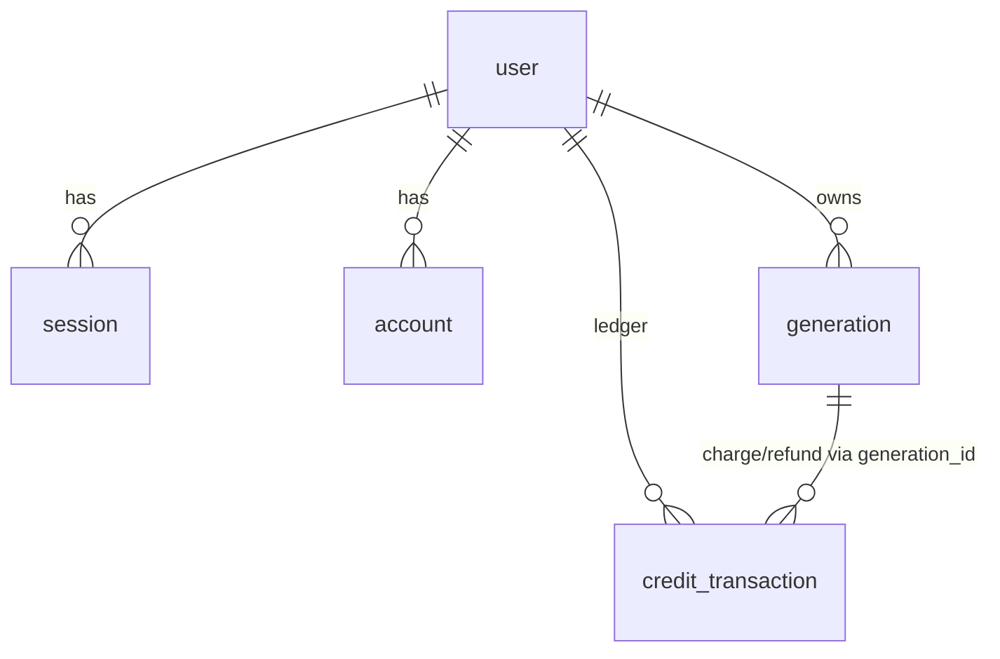

# schema.ts — AI component doc

> AI-facing sidecar for `schema.ts`. Created 2026-07-06. Keep this in sync with the code on every change.

## Purpose
Drizzle table definitions (plan Task 4): better-auth's four default tables (`user`, `session`, `account`, `verification` — singular names so the drizzle adapter maps 1:1) plus domain tables `generation` and `credit_transaction`.

## What it does (for an AI reader)
- Responsibilities: define column types/constraints; snake_case on disk ↔ camelCase in TS; `timestamp_ms` mode for all dates; `user.creditsBalance` is the denormalized balance.
- Public API / exports: `user`, `session`, `account`, `verification`, `generation`, `creditTransaction` table objects.
- Inputs → Outputs: none (declarative) → typed query builders via `drizzle(sqlite, { schema })`.
- Side effects: none — DDL execution lives in `ddl.ts`/`client.ts`.

## Dependencies
- Imports / depends on: `drizzle-orm/sqlite-core`.
- Used by: `db/client.ts`, `modules/auth/auth.ts` (adapter schema), `modules/credits/ledger.ts`, `modules/users/routes.ts`, `modules/credits/routes.ts`, later `modules/generations/*`; mirrored by `db/ddl.ts`.

## Diagram

## Key decisions / gotchas
- ANY change here MUST be mirrored in `ddl.ts` (idempotent SQL bootstrap) — there are no drizzle-kit migrations in MVP. Columns added AFTER first ship also need a guarded `ALTER TABLE` micro-migration in `client.ts` (CREATE IF NOT EXISTS never alters existing tables).
- `generation.errorCode` (`error_code`, nullable) is the machine-readable failure reason — today only `'content_blocked'` for NSFW safety blocks, so the SPA can localize the message instead of echoing raw provider text.
- `creditsBalance` is mutated ONLY inside the same transaction as a `credit_transaction` row (ledger invariant).
- `credit_transaction.amount` is signed: negative for `charge`, positive for `signup_bonus`/`refund`.

## Update 2026-07-15 — shot.audio
- `shot` += `audio integer(boolean) NOT NULL DEFAULT false` — native generation
  audio intent. DEFAULT 0 backfills legacy rows silent (what those clips are).

## Update 2026-07-21 — shot.referenceImagesJson
- `shot` += `referenceImagesJson text('reference_images_json')` (nullable) — arbitrary
  images ATTACHED to a shot as generation references, stored as a JSON array of
  `{ id, path }`, parallel to `entity_refs_json`. On the shot (not the generation) so an
  attachment survives a re-generate. Mirror in `ddl.ts` + a guarded `ALTER TABLE shot ADD
  COLUMN reference_images_json TEXT` micro-migration in `client.ts` (post-ship column).

## Commits
- 273e3f4 feat(api): drizzle schema + sqlite bootstrap DDL
- 3b96d8c fix(api,web,contracts): respect the NSFW flag — content_blocked failure with refund, never store flagged assets, localized safety copy
- 81c26c8 feat(canvas): canvas/canvas_node/canvas_edge tables

## Key decisions (2026-07-09) — wan-runpod
- Added `provider: text(provider).notNull().default(runware)` to `generation` (VideoProvider seam). `.default()` makes it optional in `$inferInsert` (SQLite applies the default for image/legacy rows). The neutral provider job id / cost REUSE `runwareTaskUuid` / `runwareCostUsd` (no rename — keeps money-path code byte-for-byte, instant rollback). Mirror in `ddl.ts` + `client.ts` micro-migration.

## Key decisions (2026-07-09) — CinemaStudio
- `generation.type` enum gains `'audio'`; two nullable columns `composedPrompt` / `promptPresetJson` added (mirror `ddl.ts` + `client.ts` micro-migration).
- Four new tables: `film`, `shot`, `filmAudio`, `filmRender`. `shot.orderIndex` is `real()` (spaced reorder). `shot.generationId` / `filmAudio.generationId` have **no** `.references()` — a deleted generation leaves an empty ref, it does not cascade the film. `filmRender` has no cost/refund column (CPU, not a provider invoice); `mediaJson` mirrors `generation.mediaJson`'s `[url]` array shape so the same serve path is reused. `real` added to the drizzle-orm import.

## Key decisions (2026-07-11) — template catalog
Three tables gain one nullable column each. All additive: every pre-existing row reads NULL and
behaves exactly as before. Mirrored in `ddl.ts` (`FILM_DDL`) **and** guarded by `client.ts`
micro-migrations, because `CREATE TABLE IF NOT EXISTS` never alters a table that already exists.

- **`shot.modelId`** (`model_id TEXT`) — the catalog model this shot generates with; NULL = no opinion
  (fall back to the style's recommendation, then the first video model). Before this column the model
  was transient inspector state: re-selecting a shot forgot which model made its clip, and a template
  had nowhere to pin its price/quality tier.
- **`shot.voiceoverJson`** (`voiceover_json TEXT`) — `{ text, voice }`, the line this shot's character
  speaks, as authored copy. A DRAFT SLOT, not an asset: `film_audio` requires a `generation_id`, so
  before this column there was no way to hand a user a script without first generating (and charging
  for) the TTS. Generating it produces an audio generation and files a `film_audio` track at this
  shot's timeline offset.
- **`film.templateId`** (`template_id TEXT`) — which template this film was instantiated from; NULL for
  a hand-made film. **Deliberately NOT an FK**: templates are code, not rows — retiring one from the
  catalog must leave old films intact, just unlinked.
- **`filmAudio.shotId`** (`shot_id TEXT`) — the shot a voiceover track belongs to; NULL = a film-wide
  bed. It is what makes "voice this shot" a REPLACE rather than an append (without it, a second click
  adds a second overlapping track and charges again). **No FK on purpose**: the film cascade already
  removes these rows, and a stale link should read as an unattached track, not delete someone's audio.

## Key decisions (2026-07-12) — Studio3D
- **`generation.type` enum widens to `['image','video','audio','model3d']`.** This is a **TYPE-LEVEL
  change only — there is NO DDL change and NO migration.** SQLite has no `ENUM` type: the column is and
  always was plain `TEXT`, and the drizzle `{ enum: [...] }` list is a compile-time refinement drizzle
  applies to `$inferSelect`/`$inferInsert`, not a database constraint. Widening it is therefore purely
  additive and instantly reversible — every existing row keeps its exact value, and nothing in `ddl.ts`
  moves.
- It is what closes the deliberate typecheck gap left by the contracts task: `generationTypeSchema`
  already admitted `'model3d'`, so `service.ts`'s `type: model.type` in the charge+insert transaction
  could not assign until this enum admitted it too.
- The reused neutral columns carry 3D unchanged: `runwareTaskUuid` holds the Runware `3dInference`
  taskUUID (as it holds a ComfyUI `prompt_id` for wan-runpod), `runwareCostUsd` holds the mesh's actual
  invoiced cost — which SCALES with the pbr/faceLimit knobs, which is why a settled 3D row bills from
  the poll response and never from a catalog list price. `provider` stays `'runware'` on a 3D row; the
  poll path branches on `type`, not on it (see `service.ts.md`).

## Key decisions (2026-07-13) — Studio3D renders + shares
Two new tables mirroring `MODEL3D_DDL` column-for-column. Both hang off `user` with a cascade and both
reference `generation` **only by loose id**, never by FK.

- **`modelRender`** — the `filmRender` bargain applied to 3D: identical status machine, and **no
  `costCredits`, no refund, no ledger link**. A render spends our compute, not a provider invoice
  (ADR §D3). `mediaJson` keeps the array shape of `generation.mediaJson` so the existing serve/download
  path is reused rather than duplicated. `engine` is a drizzle enum (`browser | chromium | blender`)
  defaulting to `'browser'`, the only built renderer.
- **`modelShare`** — id-as-token. The uniqueness that makes sharing idempotent lives in the DDL index
  (`idx_model_share_gen`), not here; drizzle's schema object does not express it, so **`ddl.ts` is the
  source of truth for that constraint** and `test/db-ddl.test.ts` pins it.

## Key decisions (2026-07-13) — AI Soul Studio
Two additive columns on the entity library, and one widened TS enum. No new table: a soul-built
character **is** an `entity`, so it inherits ownership, soft delete and `[[e1]]` tagging for free.

- **`entity.soul`** — `text('soul')`, nullable, holds a JSON `Soul`. A JSON column rather than ten
  typed ones because nothing queries *into* it: the server reads it whole, composes text from it, and
  writes it back whole. It carries an invariant the database cannot express and the service must:
  **`soul != null` ⟹ `description` is DERIVED** (`composeSoul(soul)`), and a client-sent description
  is ignored. One writer, no override flag.
- **`entityImage.view`** — nullable drizzle enum (`front | three-quarter | profile | full-body`). It is
  what makes the sheet render in a stable order AND what makes re-rolling one view *replace* that view
  rather than append a fifth image. Without it, "re-roll the profile" and "add another photo" are the
  same write.
- **`entityImage.source`** gained `'generated'` — a TS-level widening only. The column is plain TEXT, so
  there is no DDL to change, exactly as when `generation.type` gained `'model3d'`.

## Key decisions (2026-07-16) — user.role (dev super-admin)
- `user` gains `role: text NOT NULL DEFAULT 'user'` — TEXT with a TS-level enum (`user | super_admin`), the `generation.type` pattern: no CHECK constraint to migrate when roles grow. Mirrored in `ddl.ts` CREATE TABLE + a guarded ALTER micro-migration in `client.ts`. Written as `super_admin` ONLY by the dev-only seed (`modules/auth/dev-admin.ts`); better-auth exposes it `input:false` so clients cannot self-assign.

## Key decisions (2026-07-18) — Modular 3D Assets (ADR modular-3d-assets)
Two new tables, `asset3d` and `asset3dPart`. Like `film`/`shot`, an asset is an
aggregate that **cites generations by id** — it owns no media. Mirror both tables
into `ddl.ts` (`ASSET3D_DDL`); they are brand-new, so `CREATE TABLE IF NOT EXISTS`
alone suffices — **no `client.ts` ALTER micro-migration** (that guard is only for
adding a column to a table that already ships).

- **`asset3d`** — `id`, `userId` (→ `user`, cascade), `title`, `conceptImagePath`,
  `createdAt`. `conceptImagePath` stores the FULL public path `saveDataUri`
  returns (`/media/<uuid>.<ext>`) verbatim, NOT a bare key: `readAsDataUri` needs
  the extension to resolve the mime, and it cannot be rebuilt from a bare uuid.
  It is our stored path, never a provider URL (those expire after 7 days).
- **`asset3dPart`** — `id`, `assetId` (→ `asset3d`, cascade), `name`,
  `description` (default `''`), `sortOrder` (**`real()`**, the `shot.orderIndex`
  precedent: a reorder/midpoint-insert spaces values without a whole-list
  renumber), `imageGenerationId`, `meshGenerationId`, `transformJson`, `createdAt`.
- **Citations are BARE `text()` — NO `.references()`** on `imageGenerationId` /
  `meshGenerationId`, exactly like `shot.generationId`: deleting a generation from
  the library must leave an orphaned ref, never cascade the part away. The ONLY
  cascading edges are the owner edges (`asset3d.userId`, `asset3dPart.assetId`).
- **Part status is NOT a column.** The `draft|extracting|extracted|meshing|ready`
  state is DERIVED at read time from the cited generations' live statuses (the
  films/shots lesson: a persisted status is a second source of truth). Nothing
  here stores it.
- `test/db-ddl.test.ts` pins the shape AND the citation-not-FK rule
  (`foreign_key_list(asset3d_part)` contains `asset3d`, not `generation`).

## Key decisions (2026-07-30) — Canvas Mode
Three drizzle tables mirroring `CANVAS_DDL` column-for-column (ADR `docs/wiki/decisions/canvas-mode.md`):

- **`canvas`** — `id`, `userId` (→ `user`, cascade), `title`, `viewportJson` (default
  `'{"x":0,"y":0,"zoom":1}'`), `createdAt`/`updatedAt` (`timestamp_ms`). `updatedAt` exists because the
  list is ordered by it — a canvas is a document you return to, so "recently worked on" is the useful
  order, unlike `asset3d`/`film` list ordering by creation.
- **`canvasNode`** — `id`, `canvasId` (→ `canvas`, cascade), `kind` (drizzle `enum` over the 7 MVP
  kinds, TS-level only — the column is plain TEXT), `positionJson`, `configJson` (default `'{}'`),
  `generationIdsJson` (default `'[]'`), `uploadUrl` (nullable; upload nodes only).
- **`canvasEdge`** — `id`, `canvasId` (→ `canvas`, cascade), `sourceNodeId`, `targetNodeId`.
- **Citations are bare `text()` — NO `.references()`** on the ids inside `generationIdsJson` (they are
  a JSON array, not a column) and none on the edge endpoints. The only cascading edges are the owner
  edges. A gallery delete leaves an empty version on the node; it never removes the node or canvas.
- **No status/derived column.** A node's run state is DERIVED from the cited generations at read time
  in the SPA (the films/shots and asset3d lesson: a persisted status is a second source of truth).
- `test/db-ddl.test.ts` (fix-wave I2) pins the shape of all three tables, boot idempotence, and the
  citation-not-FK rule for both `canvas_node` (`foreign_key_list` contains `canvas`, not `generation`)
  and `canvas_edge` (contains `canvas`, not `canvas_node` or `generation` — edge endpoints are
  validated at the SERVICE layer, `service.ts` `validateGraph`, not by a SQLite FK).
