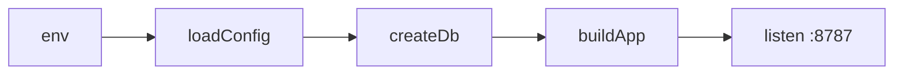

# index.ts — AI component doc

> AI-facing sidecar for `index.ts`. Created 2026-07-06. Keep this in sync with the code on every change.

## Purpose
Boot entry for the API (plan Task 3): load env config, build the app, listen on the configured port. Deliberately tiny — all wiring lives in `app.ts` so tests never import this file.

## What it does (for an AI reader)
- Responsibilities: `loadConfig()` → `createDb(config.databasePath)` (runs idempotent DDL bootstrap) → `createLocalStorage(config.storageDir, config.assetHostAllowlist, { fetchTimeoutMs, maxBytes })` (mkdir -p on boot; served at `/media/*`; the allowlist locks server-side asset fetches to the provider's domain — SSRF gate; the limits bound every download with a hard deadline + streaming byte cap) → `createRunwareClient({ apiKey })` (the only place the real key leaves config; it stays in the client's closure) → `buildApp({ config, db, storage, runware })` → `listen({ port, host: '0.0.0.0' })`.
- Public API / exports: none (top-level side-effect module; run via `pnpm dev` → `tsx watch src/index.ts`).
- Inputs → Outputs: env vars → a listening HTTP server on `API_PORT` (default 8787).
- Side effects: opens a TCP listener; logs the port.

## Dependencies
- Imports / depends on: `./app` (`buildApp`), `./config` (`loadConfig`), `./db/client` (`createDb`), `./storage/local` (`createLocalStorage`), `./integrations/runware/client` (`createRunwareClient`).
- Used by: `dev` script; production start.

## Diagram

## Key decisions / gotchas
- Uses top-level `await` (ESM, module ESNext) — no main() wrapper needed.
- `host: '0.0.0.0'` so the Vite dev proxy and containers can reach it.

## Commits
- eb91028 feat(api): fastify skeleton with typed config and health route
- 273e3f4 feat(api): drizzle schema + sqlite bootstrap DDL — real db wired into boot
- 6c4e94f feat(api): local media storage with /media serving — real storage wired into boot
- 03a8567 feat(api): assembled application entrypoint — real Runware client wired into boot (AppDeps complete)
- a7e4cd9 fix(api): ssrf allowlist, cursor tiebreaker, poll throttle — assetHostAllowlist passed to createLocalStorage
- de61e59 feat(api): db-level refund-once index + asset download limits — fetchTimeoutMs/maxBytes limits passed to createLocalStorage
