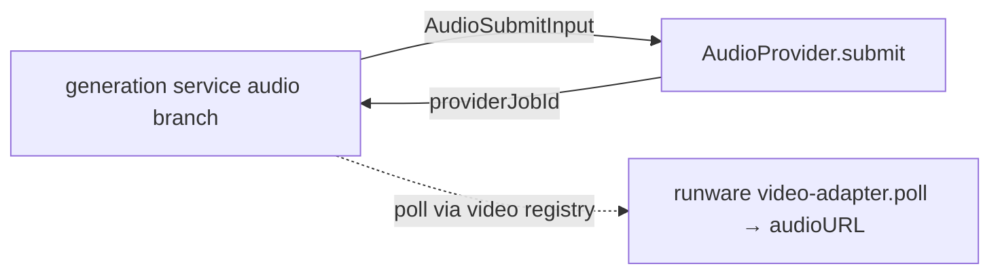

# audio-provider.ts — AI component doc

> AI-facing sidecar for `audio-provider.ts`. Created 2026-07-09. Keep this in sync with the code on every change.

## Purpose
The AudioProvider seam for CinemaStudio audio (music beds + voiceover). Audio rides the SAME async
generation lifecycle as video (charge/poll/refund/stale-reaper), so the seam is intentionally
minimal — one `submit` method. ADR: `docs/wiki/decisions/cinema-studio.md` §1.

## What it does (for an AI reader)
- Responsibilities: define the provider-neutral submit input + provider interface for audio jobs.
- Public API / exports: `AudioSubmitInput` (`prompt` = music positive prompt OR TTS text; `model`
  AIR id; `audioKind: 'music'|'tts'`; `voice?`), `AudioProvider` (`submit(input) → { providerJobId }`).
- Inputs → Outputs: type-only.
- Side effects: none.

## Dependencies
- Imports / depends on: nothing.
- Used by: `integrations/runware/audio-adapter.ts` (implements it), `modules/generations/service.ts`
  (audio submit branch). Polling is NOT here — an audio row is `provider: 'runware'` and is polled
  through the video provider registry (whose Runware adapter maps `audioURL` → `assetUrl`).

## Diagram

## Key decisions / gotchas
- No `poll` method on purpose: polling is byte-for-byte identical to video (getResponse), so it is
  reused via the video registry rather than duplicated. This is what makes audio "not a new
  subsystem" — a single submit shape, every money-path invariant reused.
- The provider job id is stored in the SAME `runwareTaskUuid` column video uses (neutral job handle).

## Commits
- _no commit yet_
