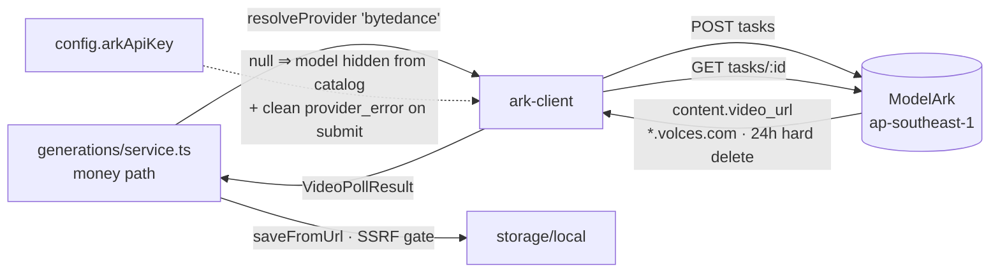

# ark-client.ts — AI component doc

> AI-facing sidecar for `ark-client.ts`. Created 2026-07-11. Keep this in sync with the code on every change.

## Purpose

The **third** `VideoProvider` implementation: Seedance 2.0 straight from ByteDance's ModelArk API, with **no Runware aggregator in the path**. Sibling of `runware/video-adapter.ts` (aggregator) and `runpod/comfy-client.ts` (self-hosted pod). ADR: [[seedance-direct-bytedance]].

## What it does (for an AI reader)

- **Responsibilities:** implements exactly the two operations the seam defines — nothing else. No storage, no DB, no retries, no poll cadence: the generation service owns the whole money path and is unchanged by this provider existing.

| Op | ModelArk call | Returns |
|---|---|---|
| `submit(VideoSubmitInput)` | `POST https://ark.ap-southeast.bytepluses.com/api/v3/contents/generations/tasks` | `{ providerJobId }` — ModelArk's `cgt-…` id |
| `poll(providerJobId)` | `GET …/contents/generations/tasks/{id}` | neutral `VideoPollResult` |

- **Public API / exports:**
  - `createArkClient({ apiKey?: string | null }): VideoProvider`
  - `class ArkError extends Error` — carries `statusCode` + `apiCode`, which `app.ts`'s central handler maps straight to the HTTP error envelope.
  - `ARK_ASSET_HOST` lives in `config.ts` (not here) because the SSRF allowlist is assembled there.

- **Inputs → Outputs:**
  - neutral `width`/`height` → ModelArk `resolution` (`720p`) + `ratio` (`16:9`). At 720p Seedance's own dimension table **is** our `hd` table (1280×720 / 960×960 / 720×1280), so the round-trip is lossless and the size the composer promised is the size that renders.
  - `inputImage` (data URI) → a second `content[]` element `{ type:'image_url', image_url:{ url } }`. i2v is "the same task with one more element" — hence no separate code path.
  - ModelArk's six-state status (`queued|running|succeeded|failed|cancelled|expired`) → the three-state neutral union. An **unknown** status maps to `processing` (never invent a terminal state and refund a job still rendering).
  - `usage.total_tokens` × the resolution's rate → `costUsd` — operator margin dashboards only, never credit correctness.

- **Side effects:** network only (two JSON round-trips, 30s hard timeout each).

## Failure model (mirrors the other two providers exactly)

| Failure | Shape | Service reaction |
|---|---|---|
| Unset key, 5xx, network, non-JSON | **throws** `ArkError` (502 `provider_error`) | row stays processing → next poll retries |
| Moderation refusal at **submit** | **throws** `ArkError` (400 `content_blocked`) | fail + **refund**; row explains itself |
| Moderation kill at **poll** | `{ status:'error', blocked:true }` | fail + **refund** as `content_blocked` |
| `failed` / `cancelled` / `expired` | `{ status:'error' }` | fail + refund |

## Dependencies

- **Imports / depends on:** `../video-provider` (types only).
- **Used by:** `app.ts` — registered in the video provider registry under the key `bytedance`, constructed from `config.arkApiKey`. Catalog entry `seedance-2-0` (`provider: 'bytedance'`, `air: 'bytedance:dreamina-seedance-2-0-260128'`) is what routes traffic here.
- **Tests:** `test/ark-client.test.ts` (21 cases), `test/generations-provider-routing.test.ts` (routing + money invariants), `test/catalog.test.ts` (gating + pricing floor), `test/env-loading.test.ts` (SSRF allowlist).

## Diagram

## Key decisions / gotchas

Every one of these breaks the integration **silently** if changed:

- **Model id must keep the `dreamina-` prefix.** 2.0 carries it, 1.x does not — do not "normalize". Without it: `404 InvalidEndpointOrModel.NotFound`.
- **Seedance 2.0 REJECTS `seed`, `camera_fixed`, `frames`, `service_tier`** under the strict parameter method. Never sent; a caller-supplied `seed` is **dropped on purpose**, not overlooked.
- **`generate_audio` defaults to TRUE** on ByteDance's side → pinned `false`, or we pay for and ship a soundtrack that collides with CinemaStudio's own audio tracks at render.
- **`ratio` defaults to `adaptive`** → always sent explicitly, or the model picks an aspect the user never chose.
- **`duration: -1` is legal** and means "model picks the length" — and duration drives billing. Never forwarded from user input.
- **The cost rate depends on VIDEO-INPUT PRESENCE.** We never send video, so we always pay `$0.0070/1k` (720p), not the widely-quoted `$0.0043` — using the latter understates true cost by ~63%.
- **Assets live on `*.volces.com`, NOT the API's `*.bytepluses.com`**, and are **hard-deleted at 24h**. Allowlisting the API domain would pass the SSRF gate for zero real downloads and fail every actual one.
- **`negativePrompt` is dropped.** Seedance has no negative-prompt field; appending it to the positive prompt would steer *toward* what the preset meant to push away from. Same documented gap as the wan-runpod adapter.
- **Real human faces are refused** on any input image (`InputImageSensitiveContentDetected.PrivacyInformation`) — a product-level constraint, surfaced as a refundable `content_blocked`. See the ADR.
- **`DELETE /tasks/{id}` is overloaded**: cancels a queued task, but **permanently destroys the record** of a finished one. We never call it.

## Commits

- _no commit yet_ — feat(api): Seedance 2.0 direct via ByteDance ModelArk as a third video provider

## Change log (behaviour)

### 2026-07-12 — ModelArk failures are diagnosable again
`request()` used to throw a bare `ModelArk HTTP 404` and DISCARD the response
body. 404 reads identically for "wrong host", "wrong model id", and the one that
actually happens in practice — `ModelNotOpen`, i.e. the BytePlus account never
activated (bought the resource package for) Dreamina-Seedance-2.0. Naming that
cost a live debugging session; the body had said it in plain English all along.

The provider's own `code: message` now rides on `ArkError.providerDetail`, which
the central error handler LOGS (`event: 'provider_error'`).

It is deliberately NOT folded into `message`: `app.ts` serializes `err.message`
verbatim to the browser for any error carrying an `apiCode`, and ModelArk's body
names our **BytePlus account id** ("Your account 3003474417 has not activated…").
Client copy stays the mapped `provider_error` string; operators get the detail.
