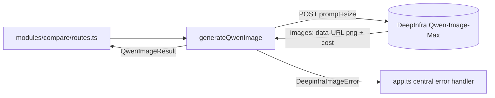

# deepinfra-image.ts — Qwen-Image-Max synchronous client

> AI-facing sidecar for `deepinfra-image.ts`. Created 2026-07-29. Keep this in sync with the code on every change.

## Purpose

The `/compare` utility's candidate-model channel: one synchronous DeepInfra
inference call that renders a Qwen-Image-Max image and returns it inline as a
data: URL, plus DeepInfra's own USD cost figure.

## What it does (for an AI reader)

- Responsibilities: build the request (prompt + pinned `size: "1280*1280"`,
  `watermark: false`), call `POST /v1/inference/Qwen/Qwen-Image-Max`, parse
  `{ images, inference_status }`, sanitize failures.
- Public API / exports:
  - `generateQwenImage(apiKey, prompt, fetchImpl?) → Promise<QwenImageResult>`
  - `QwenImageResult = { imageUrl: string; costUsd: number | null }`
  - `DeepinfraImageError` (statusCode 502 / apiCode `provider_error` default)
  - `QWEN_IMAGE_TIMEOUT_MS = 120_000` (also the UI countdown ceiling)
- Inputs → Outputs: `(apiKey, prompt)` → `{ imageUrl: data-URL png, costUsd }`.
  THROWS `DeepinfraImageError` on timeout / network / HTTP / empty reply.
- Side effects: one outbound HTTPS request; nothing persisted.

## Dependencies

- Imports / depends on: nothing project-internal (fetch injected for tests —
  same seam as `createGroqCompleter` in modules/prompt/enhance.ts).
- Used by: `apps/api/src/modules/compare/routes.ts`.
- Tested by: `apps/api/test/deepinfra-image.test.ts`.

## Diagram

## Key decisions / gotchas

- **Separate from deepinfra-client.ts on purpose**: that file implements the
  async VideoProvider seam (submit/poll + in-process job map) because the money
  path needs settlement. `/compare` charges nothing — a single blocking call is
  the honest shape here.
- **Contract verified live 2026-07-29** against the model's own metadata; the
  plan doc's guessed shape (`resolution`/`aspect_ratio` in, `image_url` out)
  does not exist. Real: `size "W*H"` in, `images: [data-URL]` out, 7.5¢/image.
- Errors THROW (unlike the video adapter's never-throw poll union) — the
  central handler in app.ts maps `statusCode`/`apiCode` to the envelope and
  logs `providerDetail` without serializing it to the browser.
- `AbortSignal.timeout` aborts with DOMException name `TimeoutError` (Node);
  both `TimeoutError` and `AbortError` map to the "timed out (120s)" message.
- `prompt_extend` left at their default (true): the page compares production
  behaviors, and that is how the model ships.

## Commits

- _no commit yet_
