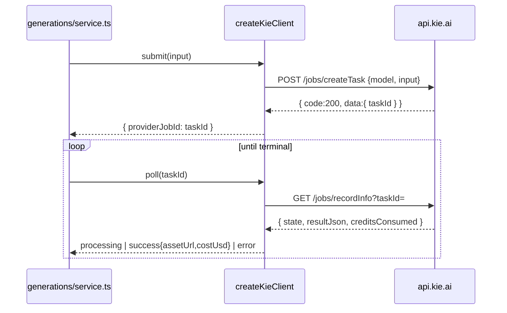

# kie-video.ts — kie.ai Seedance channel (real async task API)

> AI-facing sidecar for `kie-video.ts`. Created 2026-07-30. Keep this in sync with the code on every change.

## Purpose

A third Seedance channel behind the `VideoProvider` seam. Exists for two reasons:
a measured price win on **Seedance 1.5 Pro silent**, and — more importantly — a
**real polling endpoint**, which `deepinfra-client.ts` does not have.

## What it does (for an AI reader)

- Responsibilities: map `VideoSubmitInput` onto kie.ai's `createTask` body, mint
  nothing of its own (their `taskId` IS the provider job id), and fold
  `recordInfo` states into the neutral `VideoPollResult` union.
- Public API / exports:
  - `createKieClient({ apiKey }) → VideoProvider` (`submit` / `poll`)
  - `KieError` (statusCode 502 / apiCode `provider_error` default)
  - `KIE_CREDIT_USD = 0.005` — their fixed credit→USD rate
  - `toKieModelId(air)`, `resolutionFor(w, h)`, `firstResultUrl(resultJson)`
  - the asset host lives in `config.ts` as `KIE_ASSET_HOST` (single definition,
    next to the Ark/Dashscope/DeepInfra ones that gate the same allowlist)
- Inputs → Outputs: `submit(input)` → `{ providerJobId }` (THROWS `KieError`);
  `poll(id)` → `VideoPollResult` (NEVER throws).
- Side effects: one outbound HTTPS request per call; nothing persisted — the
  adapter is **stateless**, which is the whole point versus DeepInfra.

## Dependencies

- Imports / depends on: `../video-provider` types only.
- Used by: `app.ts` (video provider registry) — pending wiring.
- Tested by: `apps/api/test/kie-video.test.ts` — pending.

## Diagram

## Key decisions / gotchas

- **The two-column price trap.** Their table lists each resolution twice: "with
  video input" (cheaper unit, billed over input+output duration) and "no video
  input" (dearer unit, output only). We never send a video, so we are always on
  the "no video" row. Comparison blogs quote the cheap row and call kie.ai the
  cheapest — on our row it is not. Same trap as DeepInfra's $4.3-vs-$7 headline.
- **Seedance 2.0 must NOT move here**: $0.205/s at 720p versus a *measured*
  $0.1518/s on DeepInfra (`generation.runware_cost_usd`, 10s clip, $1.5183).
  The win is `bytedance/seedance-1.5-pro` without audio ($0.0175/s at 720p).
- **Verified live 2026-07-30**, not quoted: 5s / 720p / silent →
  `creditsConsumed: 17.5`, balance 80 → 62.5, wall time ~76s. Their published
  3.5 credits/second is accurate to the cent; no hidden fee.
- **Asset host is NOT the API host** — `tempfile.aiquickdraw.com`, and the URL
  expires after **24 hours**. Allowlisting `kie.ai` would pass the SSRF gate for
  zero real downloads. Same shape as `ARK_ASSET_HOST` / `DASHSCOPE_ASSET_HOST`.
- **HTTP 200 with a non-200 envelope `code`** is how they report business
  failures (insufficient credits above all), so the envelope code is checked as
  well as the status line.
- **A failed status call returns `processing`, not `error`.** The render is
  probably still running; settling here would refund a job that then succeeds
  and bills us anyway. The stale reaper is the backstop.
- **`state` can be absent** for a moment right after `createTask`; unknown maps
  to `processing` for the same money reason.
- **`input_urls` takes URLs, max 2 — not data URIs.** Our seam carries data
  URIs, so image→video needs an upload step first. Forwarded unchanged so their
  API rejects it loudly rather than silently rendering text→video.
- `nsfw` is reported as `false` because their `nsfw_checker` is left at its
  default (off) — a documented gap, not a verdict.

## Commits

- _no commit yet_
