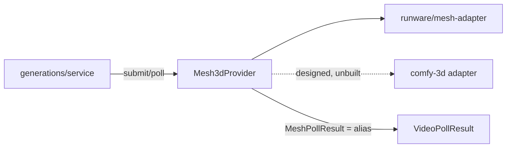

# mesh-provider.ts — AI component doc

> AI-facing sidecar for `mesh-provider.ts`. Created 2026-07-11. Keep this in sync with the code on every change.

## Purpose
The `Mesh3dProvider` seam (ADR: [[photo-to-3d-studio]] D2). Provider-neutral types for the two operations the generation lifecycle performs on a `model3d` job — `submit` then `poll` — so an image→3D model can run on Runware's `3dInference` today and on a self-hosted `comfy-3d` backend later without the money-path service knowing which. Deliberately the same shape as its sibling [[video-provider.ts]].

## What it does (for an AI reader)
- Responsibilities: define the neutral contract every 3D backend maps onto; keep Runware nouns out of the generation service.
- Public API / exports:
  - `type Mesh3dProvider = { submit(input): Promise<{ providerJobId }>; poll(providerJobId): Promise<MeshPollResult> }`
  - `type Mesh3dSubmitInput` = `{ taskUUID, model, inputImage, pbr?, faceLimit? }`
  - `type MeshPollResult` — **a type ALIAS of `VideoPollResult`, not a copy** (see gotchas)
  - re-exports `Mesh3dProviderId` (`'runware' | 'comfy-3d'`) from `@opencreate/contracts`
- Inputs → Outputs: neutral submit input → opaque `providerJobId`; job id → the neutral poll union.
- Side effects: none (pure types).

## Dependencies
- Imports / depends on: `@opencreate/contracts` (`Mesh3dProviderId`), `./video-provider` (`VideoPollResult`).
- Used by: `runware/mesh-adapter.ts` (implements it); `modules/generations/service.ts` + `app.ts` will consume the registry (Task 7 — not yet wired).

## Diagram

## Key decisions / gotchas
- **`MeshPollResult` is `VideoPollResult` verbatim — a type alias, never a duplicated union.** That is the entire point of the task: the service switches on the SAME neutral union it already switches on, so every money-path invariant (charge-at-submit, refund-once, the no-asset guard, the stale reaper, the poll throttle) applies to 3D with ZERO new money code. Redefining the union here would let the two drift and quietly fork the refund path.
- `taskUUID` is an **input**, not something the adapter mints. Runware requires the caller to supply the task id, and it doubles as the idempotency key for the client's single bounded retry. A `comfy-3d` adapter that mints its own handle ignores it and returns its own in `providerJobId`.
- No aspect ratio and no duration in the submit input — a mesh has neither. `pbr`/`faceLimit` are the only knobs, and Runware's returned cost SCALES WITH THEM, which is why the settled row must bill from the poll's `costUsd` and never from a catalog list price.
- `inputImage` is a data URI, never a URL: the API does not hand a provider a user-supplied host to fetch (SSRF).

## Commits
- `479cec0` feat(api): Mesh3dProvider seam + runware adapter
