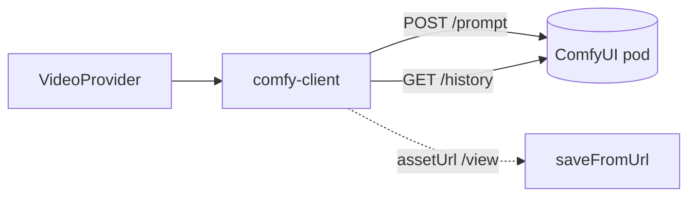

# comfy-client.ts — AI component doc

> AI-facing sidecar for `comfy-client.ts`. Created 2026-07-08. Keep this in sync with the code on every change.

## Purpose
The `wan-runpod` `VideoProvider`: talks to our self-hosted pod's **ComfyUI HTTP API** to run Wan 2.2 text→video. Templates the embedded workflow, submits it, and resolves the finished mp4 into a downloadable URL — mapped onto the neutral seam so the generation service treats it exactly like Runware.

## What it does (for an AI reader)
- Responsibilities: template + submit the workflow; poll history; resolve the output file; sanitize errors.
- Public API / exports: `createComfyClient({ baseUrl?, workflow? }): VideoProvider`, `class ComfyError` (statusCode 502, apiCode `provider_error`).
- Inputs → Outputs:
  - `submit(VideoSubmitInput)` — deep-clones the workflow, injects by `_meta.title` (PROMPT_POSITIVE.text, PROMPT_NEGATIVE.text='', LATENT_DIMS {width,height,length=dur×16+1}, every `noise_seed`, OUTPUT_VIDEO.filename_prefix=unique), `POST ${baseUrl}/prompt` `{ prompt, client_id }` → returns `{ providerJobId: prompt_id }`.
  - `poll(prompt_id)` — `GET ${baseUrl}/history/<id>`: empty/missing → `processing`; `status_str==='error'` → `error{message}`; SaveVideo output resolved → `success{ assetUrl: ${baseUrl}/view?filename&subfolder&type, nsfw:false }`.
- Side effects: HTTP to the pod (POST /prompt, GET /history). 30s per-request timeout.

## Dependencies
- Imports / depends on: `node:crypto` (randomUUID/randomInt, structuredClone via global), `./wan22-t2v-workflow`, `../video-provider`.
- Used by: `app.ts` (production registry, `baseUrl: config.comfyBaseUrl`).

## Diagram

## Key decisions / gotchas
- **Unset `baseUrl` is safe**: `submit` throws a clean `ComfyError` (provider_error) instead of crashing boot, so `wan-2-2` can be listed without a pod.
- **Error model mirrors Runware**: a TRANSPORT failure (non-2xx, network, unset config) THROWS (row stays processing / 502 envelope); a genuine ComfyUI EXECUTION error in history maps to the `error` STATE (service fails + refunds). Never leaks the response body.
- **Output resolver is key-agnostic**: scans history `outputs` for the first `{ filename, subfolder, type }` (works whether SaveVideo emits `images`/`videos`/`gifs`).
- **NSFW gap**: always returns `nsfw:false` — self-host has no moderation; the §9.4 gate never fires for wan-runpod until a worker classifier exists (ADR moderation-parity prerequisite).
- **Workflow is embedded** (`wan22-t2v-workflow.ts`) so it ships with the esbuild bundle; injection by node title tolerates upstream node-id churn. Keep in sync with `spikes/wan-runpod/worker/workflows/wan22_t2v.json` (pod owner's canonical copy).

## Key decisions (2026-07-09)
- `COMFY_USER_AGENT`: RunPod's proxy is behind Cloudflare, which 403s (CF 1010) non-browser User-Agents. A bare Node fetch is blocked on POST /prompt. Every request to the pod (postJson/getJson) sends a browser UA; the /view video download in storage.saveFromUrl needs it too. Verified live.

## Commits
- _no commit yet_
