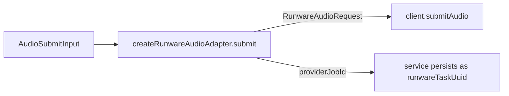

# audio-adapter.ts — AI component doc

> AI-facing sidecar for `audio-adapter.ts`. Created 2026-07-09. Keep this in sync with the code on every change.

## Purpose
Wraps the existing `RunwareClient` onto the neutral `AudioProvider` seam so the generation service
submits CinemaStudio audio (music/voiceover) without knowing Runware nouns. Mirrors the video adapter.

## What it does (for an AI reader)
- Responsibilities: mint a job id, map `AudioSubmitInput` → `RunwareAudioRequest`, submit.
- Public API / exports: `createRunwareAudioAdapter(client: RunwareClient): AudioProvider`.
- Inputs → Outputs: `AudioSubmitInput` → `{ providerJobId }` (the minted taskUUID).
- Side effects: one `client.submitAudio` HTTP call (async ack).

## Dependencies
- Imports / depends on: `node:crypto` (randomUUID), `./client` (RunwareClient), `../audio-provider`
  (AudioProvider, AudioSubmitInput).
- Used by: `app.ts` / `modules/generations/service.ts` (audio submit). Polling is via the video
  registry (getResponse → audioURL → assetUrl), not here.

## Diagram

## Key decisions / gotchas
- taskUUID minted HERE before the HTTP call and returned as the job id — Runware dedups a retried
  submit on it, and the service persists it only AFTER submit resolves (submit-window race closed,
  same as video).
- TTS → `{ text, voice }`; music → `{ positivePrompt }`. The client turns these into the audioInference
  task shape (`speech` vs `positivePrompt` + `settings.instrumental`).

## Commits
- _no commit yet_
