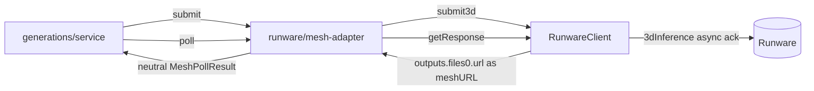

# mesh-adapter.ts — AI component doc

> AI-facing sidecar for `mesh-adapter.ts`. Created 2026-07-11. Keep this in sync with the code on every change.

## Purpose
Maps Runware's `3dInference` task onto the neutral [[mesh-provider.ts]] seam, so the generation service can settle a `model3d` row through the identical code path it already uses for video and audio. Mirrors [[video-adapter.ts]] one-for-one.

## What it does (for an AI reader)
- Responsibilities: rename Runware nouns onto the neutral union (`meshURL → assetUrl`, `cost → costUsd`); keep `client.ts` provider-shaped and unchanged.
- Public API / exports: `createRunwareMeshAdapter(client: RunwareClient): Mesh3dProvider`.
- Inputs → Outputs:
  - `submit(Mesh3dSubmitInput)` → calls `client.submit3d({ taskUUID, model, inputImage, pbr?, faceLimit? })` → `{ providerJobId: input.taskUUID }`.
  - `poll(providerJobId)` → `client.getResponse(id)` → `MeshPollResult` (`processing{progress}` | `success{assetUrl?, costUsd?, nsfw:false}` | `error{message}`).
- Side effects: none of its own — all network I/O is the injected `RunwareClient`'s.

## Dependencies
- Imports / depends on: `../mesh-provider` (types), `./client` (`RunwareClient`).
- Used by: `app.ts` will register it in the mesh provider registry (Task 7 — not yet wired). Tested by `mesh-adapter.test.ts`.

## Diagram

## Key decisions / gotchas
- **Success with no mesh passes through as success-with-no-`assetUrl`** — we never invent a URL and never throw. The service treats "success without an asset" as a failure and refunds; inventing a URL or throwing would bypass that guard.
- **`nsfw: false`, always.** `3dInference` exposes no moderation signal at all. Reporting `false` rather than `undefined` makes the gap explicit rather than accidental: the §9.4 NSFW gate never fires for 3D, exactly as it does not for the self-hosted `wan-runpod` video provider.
- **`providerJobId` is the caller's `taskUUID`** — Runware mints no id of its own, and `getResponse` is keyed on the one we supplied.
- `pbr` / `faceLimit` are spread-if-present, never passed as an explicit `undefined`: an explicit undefined key can still serialize as a param, and an unknown param is a hard 400 from Runware (exactly how ByteDance and Wan 2.7 broke).
- A provider error becomes a terminal **state**, not an exception — failing the row and refunding is control flow, not a 5xx of our own.

## Commits
- `479cec0` feat(api): Mesh3dProvider seam + runware adapter
