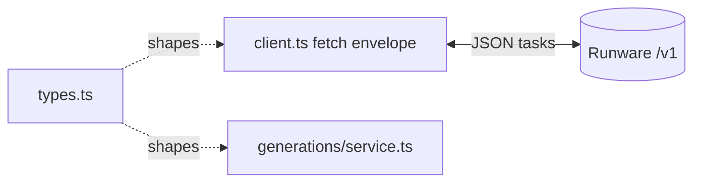

# types.ts — Runware wire types

> AI-facing sidecar for `types.ts`. Created 2026-07-06. Keep this in sync with the code on every change.

## Purpose
Type-only module describing the Runware REST wire shapes the client sends and receives, so `client.ts` and the generation service share one vocabulary with zero runtime cost.

## What it does (for an AI reader)
- Responsibilities: name the request/result shapes for image inference, video submission and polling.
- Public API / exports:
  - `RunwareImageRequest` / `RunwareImageResult` — sync image task input/output (`imageURL`, optional `seed`/`cost`/`NSFWContent`).
  - `RunwareVideoRequest` — async video task input; `frameImages` carries the image→video input frame(s), which Runware nests under `inputs`.
  - `Runware3dRequest` — async image→3D task input (`3dInference`): `{ taskUUID, model, inputImage, pbr?, faceLimit? }`. `inputImage` is a data URI; `pbr`/`faceLimit` are quality knobs the client nests under `settings`.
  - `RunwarePollResult` — discriminated union on `status` (`processing` | `success` | `error`) so callers must handle all three poll outcomes.
- Inputs → Outputs: types only; no values.
- Side effects: none (compiles away entirely under `verbatimModuleSyntax`).

## Dependencies
- Imports / depends on: nothing.
- Used by: `integrations/runware/client.ts`, `modules/generations/service.ts` (Task 10), `test/runware-client.test.ts`.

## Diagram

## Key decisions / gotchas
- Field names mirror the Runware task schema exactly (`positivePrompt`, `taskUUID`, `NSFWContent`) so requests can be spread straight into the task envelope without a mapping layer.
- Optional props are declared `?: T | undefined` (not just `?: T`): this repo compiles with `exactOptionalPropertyTypes`, and the client builds these objects from `unknown` JSON fields that legitimately produce `undefined`.

## Key decisions (2026-07-08)
- `RunwareVideoRequest.omitSafety?: boolean` — client-internal routing flag (NEVER serialized into the task): ByteDance/Seedance models reject Runware's `safety` param with `unsupportedParameter` (verified live). The client destructures it out and conditionally omits `safety`; source of truth is the catalog's `supportsSafetyParam`.

## Commits
- 46cf18d feat(api): runware REST client (imageInference, videoInference, getResponse)

## Key decisions (2026-07-09) — CinemaStudio audio
- `RunwareAudioRequest` added (audioInference: same envelope/taskUUID/getResponse polling as video). Neutral shape `{ taskUUID, model, audioKind, text?, voice?, positivePrompt? }` — the client builds the TTS (`speech.{text,voice}`) vs music (`positivePrompt` + `settings.instrumental`) task shape from `audioKind`.
- `RunwarePollResult` success variant gains `audioURL?` — the video adapter maps it into the neutral `assetUrl` exactly like `videoURL`/`imageURL`, so the generation service's settlement path is shared across image/video/audio.

## Key decisions (2026-07-11) — Studio3D
- `Runware3dRequest` added for the `3dInference` task type (TRELLIS.2 / Hunyuan3D / Tripo / Meshy). This is a NEW TASK TYPE on the EXISTING client, not a new provider — Runware ships image→3D first-class.
- `inputImage` is a single data URI (not an array): Runware takes `inputs.images[]`, but every Studio3D entry point is one photo → one mesh, so the wire type stays honest about the product and the client does the array wrapping. Data URI (not URL) for the same reason as `referenceImages`: the API never hands a provider a user-supplied URL to fetch.
- `pbr?` / `faceLimit?` are optional and `| undefined` (exactOptionalPropertyTypes): Runware's returned `cost` **scales with them**, which is why the settled row must bill from the poll response's `cost` and never from the catalog list price.
- **No `safety` field, deliberately.** `3dInference` documents no safety filter and Runware returns `400 unsupportedParameter` for params a model does not know — the exact failure that already bit ByteDance/Seedance and Wan 2.7. There is no `omitSafety` escape hatch here because `safety` is never sent at all.
- `RunwarePollResult` success variant gains `meshURL?`. A finished `3dInference` does **not** use the flat `imageURL`/`videoURL`/`audioURL` shape — it returns `outputs: { files: [{ uuid, url }] }`. The client normalizes `outputs.files[0].url` into `meshURL` so ONE place knows Runware's response envelope; if it did not, every 3D poll would read as "success with no asset" and the generation service would **refund a job that actually succeeded** while we still paid Runware for it.
