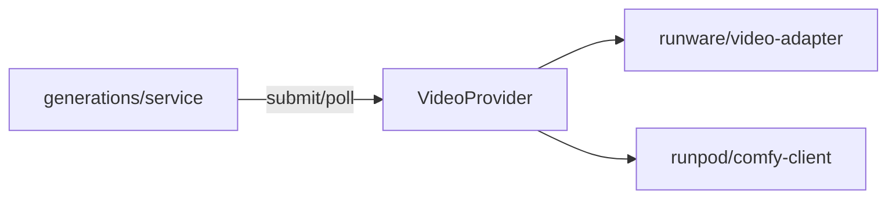

# video-provider.ts — AI component doc

> AI-facing sidecar for `video-provider.ts`. Created 2026-07-08. Keep this in sync with the code on every change.

## Purpose
The `VideoProvider` seam (ADR: [[wan-selfhost-video-provider]]). Provider-neutral types for the two operations the generation lifecycle performs on a video job — `submit` then `poll` — so a video model can run on Runware or our self-hosted wan-runpod backend without the money-path service knowing which.

## What it does (for an AI reader)
- Responsibilities: define the neutral contract every video backend maps onto; keep provider-specific nouns out of the service.
- Public API / exports:
  - `type VideoProvider = { submit(input): Promise<{ providerJobId }>; poll(providerJobId): Promise<VideoPollResult> }`
  - `type VideoSubmitInput` = `{ prompt, width, height, durationSeconds, model, inputImage?, seed?, omitSafety? }`
  - `type VideoPollResult` = `{ status: 'processing'; progress } | { status: 'success'; assetUrl?; costUsd?; nsfw? } | { status: 'error'; message }`
  - re-exports `VideoProviderId` (`'runware' | 'wan-runpod'`) from `@opencreate/contracts`
- Inputs → Outputs: neutral submit input → opaque `providerJobId`; job id → neutral poll union.
- Side effects: none (pure types).

## Dependencies
- Imports / depends on: `@opencreate/contracts` (`VideoProviderId`).
- Used by: `runware/video-adapter.ts`, `runpod/comfy-client.ts` (implement it); `modules/generations/service.ts` + `app.ts` (consume the registry).

## Diagram

## Key decisions / gotchas
- Nouns are renamed off Runware: `videoURL/imageURL → assetUrl`, `cost → costUsd`, `NSFWContent → nsfw`. The service switches on this union identically for every provider — that is what keeps the money path byte-for-byte unchanged.
- `submit` returns the job id (provider owns it); the service persists it and polls with it. This preserves the submit-window race guard (poll refuses until the id is set).

## Update 2026-07-15 — native generation audio
- `VideoSubmitInput` += `audio?: boolean`. Set ONLY after the service validated
  the catalog capability and charged the with-audio price; adapters merely
  translate it into their backend's spelling. Absent/false keeps the audio
  kill-switch — the money rule the adapters were built on.

## Commits
- _no commit yet_
