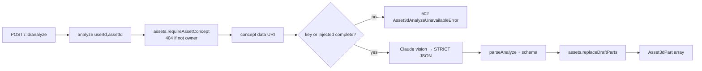

# analyze.ts — AI component doc

> AI-facing sidecar for `analyze.ts`. Created 2026-07-18. Keep this in sync with the code on every change.

## Purpose
FREE decomposition step for Modular 3D Assets (ADR modular-3d-assets D2): Claude
vision reads a concept image and returns its named, separable PARTS as draft rows.
Gated on `ANTHROPIC_API_KEY` exactly like CinemaStudio storyboard — unset → 502
`provider_error`, and the wizard still works because parts can be added by hand.

## What it does (for an AI reader)
- Responsibilities: build the Anthropic vision request (concept image as a base64
  block + STRICT-JSON system prompt), parse + validate the completion against
  `analyzeResponseSchema` (capped at `MAX_PARTS`), replace the asset's DRAFT parts
  atomically. CHARGES NOTHING and owns no table.
- Public API / exports: `createAnalyzeService({ anthropicApiKey, assets, complete? }) → { analyze(userId, assetId): Promise<Asset3dPart[]> }`, `AnalyzeService` (type), `Asset3dAnalyzeUnavailableError` (502 provider_error), `parseAnalyze(raw)` (exported for unit test).
- Inputs → Outputs: `(userId, assetId)` → the asset's parts after the draft set is
  replaced by the analyzed set. Ownership checked first (404 via injected
  `assets.requireAssetConcept`) BEFORE any model call.
- Side effects (I/O, network, state): one Anthropic `messages.create` call (unless
  `complete` is injected); a DB write via `assets.replaceDraftParts`.

## Dependencies
- Imports / depends on: `@anthropic-ai/sdk`, `@opencreate/contracts` (`analyzeResponseSchema`, `MAX_PARTS`, `Asset3dPart`).
- Used by: `app.ts` (`createAnalyzeService({ anthropicApiKey: config, assets: asset3dService })`), `assets3d/routes.ts` (the `/analyze` route), `test/assets3d.test.ts` (502-without-key path), `test/assets3d-analyze.test.ts` (service-level SUCCESS + `parseAnalyze` unit cases).

## Diagram


## Key decisions / gotchas
- Ownership BEFORE the model call: a foreign assetId fails 404 and never spends LLM tokens.
- Malformed/unreadable completion → 502 (not a broken write) — `parseAnalyze` strips a stray ```json fence then validates.
- Dependency surface is a NARROW structural slice (`requireAssetConcept` + `replaceDraftParts`), never the whole service, never a reach-in.
- SUCCESS is unit-tested by injecting `complete`; the HTTP suite only pins the 502-without-key path (there is no Anthropic HTTP fake).

## Commits
- (pending) feat(assets3d): free Claude-vision part analysis
