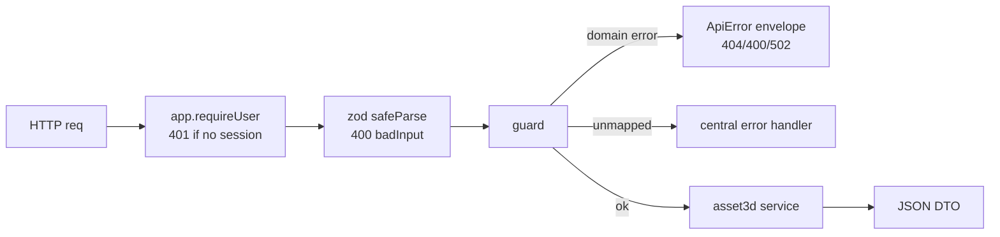

# routes.ts — AI component doc

> AI-facing sidecar for `routes.ts`. Created 2026-07-18. Keep this in sync with the code on every change.

## Purpose
Thin HTTP layer for Modular 3D Assets (ADR modular-3d-assets), mirroring
`films/routes.ts`: parse the body with the shared contracts schema, delegate to
the service, map domain errors to the ApiError envelope, rethrow the rest.

## What it does (for an AI reader)
- Responsibilities: register `/api/assets3d*` routes, require a session on every
  one (`app.requireUser`), zod-parse bodies (`safeParse` → `badInput`), run the
  service inside `guard` (maps domain errors, RETHROWS unmapped ones — e.g. a
  provider error from `generations.create()` — to the central handler), and apply
  strict rate-limit buckets to the paid + LLM routes.
- Public API / exports / endpoints: `registerAsset3dRoutes(app, service, analyze?)`.
  - `GET /api/assets3d` (list) · `POST /api/assets3d` (create → 201)
  - `GET /api/assets3d/:id` (asset + parts + derived statuses) · `PATCH` (rename) · `DELETE` (→ 204, rows only)
  - `POST /api/assets3d/:id/analyze` (FREE; registered only when `analyze` wired; self-gates to 502 without key)
  - `POST /api/assets3d/:id/parts` (→ 201) · `PATCH`/`DELETE /:id/parts/:pid` (→ 200 / 204)
  - `POST /api/assets3d/:id/parts/:pid/extract` (paid image → 200 sync)
  - `POST /api/assets3d/:id/parts/:pid/mesh { modelId }` (paid model3d → 202 async)
- Inputs → Outputs: HTTP request → JSON DTOs / envelopes. `mapDomainError`: `Asset3dNotFoundError`→404, `Asset3dValidationError`→400, `Asset3dAnalyzeUnavailableError`→502.
- Side effects (I/O, network, state): none of its own — all state/money effects are in the service + generation service.

## Dependencies
- Imports / depends on: `fastify` types, `@opencreate/contracts` (create/update/mesh schemas), `./service` (`Asset3dService`, error classes), `./analyze` (`AnalyzeService`, `Asset3dAnalyzeUnavailableError`).
- Used by: `app.ts` (`registerAsset3dRoutes(app, asset3dService, analyzeService)`), `test/assets3d.test.ts`.

## Diagram

## Key decisions / gotchas
- `guard` RETHROWS unmapped errors: a provider/content error thrown by `generations.create()` during extract/mesh reaches the central handler (sanitized 5xx / content_blocked / provider_error) — the money-path errors are never swallowed here.
- Extract=200 (sync image settle), Mesh=202 (async model3d, polled via GET /api/generations/:id). Create=201, delete=204.
- Rate limits: extract 20/min (cheap, iterated), mesh 10/min (heavier), analyze 10/min (LLM tokens).
- Analyze route registered only when an `AnalyzeService` is passed (always is in buildApp; it self-gates to 502 without the key).

## Commits
- (pending) feat(assets3d): thin HTTP routes
