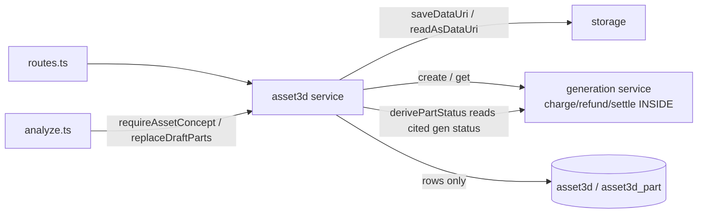

# service.ts — AI component doc

> AI-facing sidecar for `service.ts`. Created 2026-07-18. Keep this in sync with the code on every change.

## Purpose
Modular 3D Assets domain service (ADR modular-3d-assets): CRUD over the `asset3d`
aggregate and its `asset3d_part` children, plus the paid `extract` (image) and
`mesh` (model3d) steps. The aggregate CITES generations by id and owns no media;
part status is DERIVED from the cited generations, never stored.

## What it does (for an AI reader)
- Responsibilities: asset CRUD (create with concept-image save, list, get-with-
  parts, rename, delete), part CRUD (add, patch name/description/transform, delete),
  the analyze seam (`requireAssetConcept`, `replaceDraftParts`), and the two paid
  steps (`extract`, `mesh`) that ride `generations.create()`. Ownership is the type
  signature (every method takes `userId` first, one 404 for missing-or-foreign).
- Public API / exports: `createAsset3dService({ db, storage, generations }) → { createAsset, listAssets, getAsset, updateAsset, deleteAsset, addPart, updatePart, deletePart, extract, mesh, requireAssetConcept, replaceDraftParts }`; `Asset3dService` (type); `Asset3dNotFoundError` (404), `Asset3dValidationError` (400).
- Inputs → Outputs: contracts inputs (`CreateAsset3dInput`, `UpdateAsset3dPartInput`, `MeshPartInput`, …) → `Asset3d` / `Asset3dDetail` / `Asset3dPart` DTOs. The part DTO's `status` is computed by `derivePartStatus` at read time.
- Side effects (I/O, network, state): SQLite reads/writes (asset3d + asset3d_part); `storage.saveDataUri`/`readAsDataUri` for the concept + part images; `generations.create()`/`get()` on the money path (charges/refunds happen INSIDE those, never here).

## Dependencies
- Imports / depends on: `node:crypto`, `drizzle-orm` (`and/asc/count/desc/eq/isNotNull/isNull/or`), `@opencreate/contracts` (`MAX_PARTS` value + DTO/input types), `../../db/client` (`Db`), `../../storage/local` (`StorageProvider`), `../../db/schema` (`asset3d`, `asset3dPart`), `../catalog/catalog` (`CATALOG`, for `pickExtractionModel`), `../generations/service` (TYPE-only `GenerationService`, narrowed to `Pick<…,'create'|'get'>`).
- Used by: `app.ts` (`createAsset3dService(...)` → `registerAsset3dRoutes` + `createAnalyzeService`), `assets3d/routes.ts`, `assets3d/analyze.ts` (via the narrow seam), `test/assets3d.test.ts`, `test/assets3d-mesh.test.ts` (service-level mesh precondition guard), `test/assets3d-analyze.test.ts` (via `replaceDraftParts`).

## Diagram

## Key decisions / gotchas
- NO LEDGER: no `chargeCredits`/`refundCredits` import; extract/mesh cite generations via `generations.create()`. A failed extraction is refunded INSIDE create() and the error propagates — the part stays draft/retryable, this file never refunds.
- STATUS DERIVED, NEVER STORED: no status column; `derivePartStatus` computes `draft|extracting|extracted|meshing|ready` from the cited generations' live statuses (get() doubles as the poll, so reading status drives an in-flight mesh forward). Serialized on the part DTO per the ADR read surface. A FAILED mesh derives back to `extracted` (retryable, ADR D4) — NOT a stuck `meshing` over a terminal, already-refunded job; only a still-processing or momentarily-unreadable mesh reads `meshing`.
- CITATION, NOT OWNERSHIP: `deleteAsset` removes rows only (FK cascade drops parts); cited generations are never touched (bare-text FKs, no cascade).
- SERVER MODEL RULE: `pickExtractionModel()` selects the first `type:'image' && referenceMode` catalog model (today flux-kontext-pro, 8cr) — never hardcoded; `composeExtractPrompt` is server-fixed. The client sends neither a prompt nor an extraction model id.
- `mesh` validates the cited image gen three ways (owned, `type==='image'`, `status==='succeeded'`) BEFORE charging — a still-processing or foreign citation is a 400, provider never called. It ALSO in-flight-guards the mesh: if the current `meshGenerationId` points to a still-`processing` mesh it 400s BEFORE create() (no double-spend); a `succeeded`/`failed` mesh stays a legal re-roll (ADR D3).
- `extract` writes `{ imageGenerationId, meshGenerationId: null }` in one update — a NEW extraction invalidates any mesh built from the OLD image, so the part derives back to `extracted` and must be re-meshed (never a stale `ready`).
- MAX_PARTS CAP (12) enforced over the WHOLE asset: `addPart` 400s at/over the cap; `replaceDraftParts` bounds its insert to `MAX_PARTS - countNonDraftParts` so re-analyze never stacks drafts on paid parts past the cap. (Cap is also in the contract for the analyze array.)
- `replaceDraftParts` swaps ONLY parts with both citations null (drafts), in one transaction — re-running analyze never destroys extracted/meshed work.
- Concept round-trip is SETTLED: `conceptImagePath` stores the full `/media/<uuid>.<ext>` path `saveDataUri` returns; `createAsset`/`extract`/`requireAssetConcept` pass it to `readAsDataUri` verbatim — no bare-key reconstruction.

## Commits
- (pending) feat(assets3d): aggregate service — CRUD, extract, mesh, derived+serialized status
- (pending) fix(assets3d): re-extract nulls stale mesh; MAX_PARTS cap on add/analyze; mesh in-flight guard; failed mesh derives to extracted
