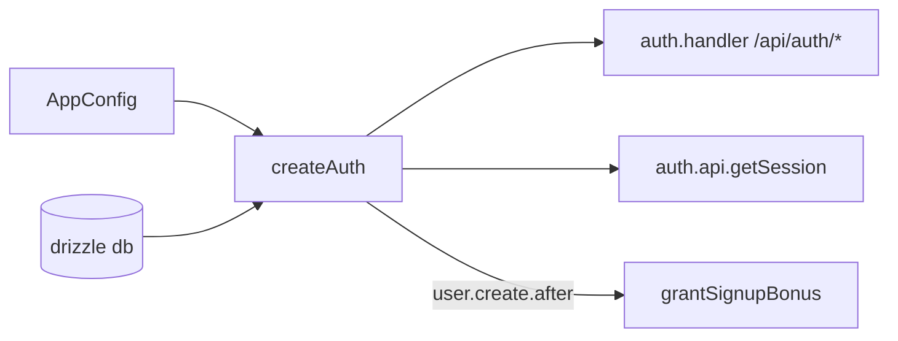

# auth.ts — AI component doc

> AI-facing sidecar for `auth.ts`. Created 2026-07-06. Keep this in sync with the code on every change.

## Purpose
better-auth instance factory (plan Task 5): email+password always enabled, Google only when both creds exist, drizzle adapter bound to our explicit schema, signup bonus granted via database hook.

## What it does (for an AI reader)
- Responsibilities: configure better-auth (secret, baseURL, `basePath: '/api/auth'`, trustedOrigins=web origin), map storage through `drizzleAdapter(db, { provider: 'sqlite', schema: { user, session, account, verification } })`, declare `creditsBalance` as a non-input additional user field, grant the signup bonus in `databaseHooks.user.create.after`.
- Public API / exports: `createAuth(db, config)`, `Auth` (type).
- Inputs → Outputs: `Db` + `AppConfig` → configured better-auth instance (`auth.handler`, `auth.api.getSession`).
- Side effects: none at construction; db writes happen through the adapter at request time.

## Dependencies
- Imports / depends on: `better-auth`, `better-auth/adapters/drizzle`, `db/client` (type), `db/schema`, `config` (type), `credits/ledger` (`grantSignupBonus`).
- Used by: `app.ts` (built once per app), `modules/auth/plugin.ts` (via the instance).

## Diagram

## Key decisions / gotchas
- Explicit adapter `schema` is REQUIRED (known pitfall): without it the adapter can't resolve our tables.
- `creditsBalance` uses `input: false` so clients can never set it at signup — only the ledger mutates it.
- The `user.create.after` hook fires for both email and Google sign-ups, exactly once per created user.
- Telemetry is off by default in better-auth 1.6 (verified in @better-auth/core types).

## Commits
- 808e8e7 feat(api): better-auth (email+google) with signup bonus + /api/me
