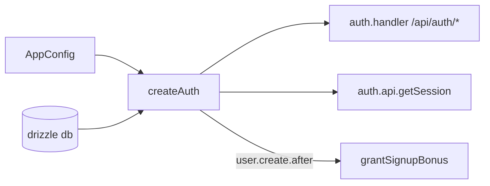

# auth.ts — AI component doc

> AI-facing sidecar for `auth.ts`. Created 2026-07-06. Keep this in sync with the code on every change.

## Purpose
better-auth instance factory (plan Task 5): email+password always enabled, Google only when both creds exist, drizzle adapter bound to our explicit schema, signup bonus granted via database hook.

## What it does (for an AI reader)
- Responsibilities: configure better-auth (secret, baseURL, `basePath: '/api/auth'`, `trustedOrigins: config.trustedOrigins` — TRUSTED_ORIGINS env comma list or `[WEB_ORIGIN]`), map storage through `drizzleAdapter(db, { provider: 'sqlite', schema: { user, session, account, verification } })`, declare `creditsBalance` as a non-input additional user field, grant the signup bonus in `databaseHooks.user.create.after`.
- Public API / exports: `createAuth(db, config, log?)`, `Auth` (type). `log` (base app logger) flows into `grantSignupBonus` so the signup bonus — a money-path event — leaves a structured `credits.signup_bonus` log line; the database hook has no request context, hence no reqId here.
- Inputs → Outputs: `Db` + `AppConfig` (+ optional `MoneyLog`) → configured better-auth instance (`auth.handler`, `auth.api.getSession`).
- Side effects: none at construction; db writes happen through the adapter at request time.

## Dependencies
- Imports / depends on: `better-auth`, `better-auth/adapters/drizzle`, `db/client` (type), `db/schema`, `config` (type), `credits/ledger` (`grantSignupBonus`, `MoneyLog` type).
- Used by: `app.ts` (built once per app), `modules/auth/plugin.ts` (via the instance).

## Diagram

## Key decisions / gotchas
- Explicit adapter `schema` is REQUIRED (known pitfall): without it the adapter can't resolve our tables.
- `creditsBalance` uses `input: false` so clients can never set it at signup — only the ledger mutates it.
- The `user.create.after` hook fires for both email and Google sign-ups, exactly once per created user.
- Telemetry is off by default in better-auth 1.6 (verified in @better-auth/core types).
- **`advanced.disableOriginCheck: false` is set EXPLICITLY**: better-auth defaults `skipOriginCheck` to `true` under NODE_ENV=test (`isTest()` in create-context), silently disabling the CSRF origin wall in vitest. Explicit `false` = the prod default in every env, so `test/trusted-origins.test.ts` pins real behavior. The check only fires for cookie-carrying non-GET requests (better-auth `validateOrigin`: `if (!(forceValidate || useCookies)) return`).
- In production `BETTER_AUTH_URL` must be the PUBLIC https origin of the deployment (cookies, OAuth callbacks and the origin check all derive from it) — documented in `.env.example`.

## Commits
- 808e8e7 feat(api): better-auth (email+google) with signup bonus + /api/me
- 5e8de3d feat(api): native env loading + structured logging — signup bonus log via base logger
- b21a116 feat(api): production single-origin serving — trustedOrigins from config, explicit disableOriginCheck: false

## Update 2026-07-16 — role additionalField
- `user.additionalFields.role` (`string`, default `'user'`, `input:false`): surfaces `role` on session/user objects for the SPA and future admin gates. `input:false` is the wall — a signup payload can never name its own role; the only `super_admin` writer is the dev-only seed `dev-admin.ts`.

## Update 2026-07-24 — Google links to existing password accounts (account.accountLinking)
- Live bug: Google sign-in with the email of an existing password account dead-ended on better-auth's `/api/auth/error` page with `account_not_linked`. Root cause (better-auth 1.6.23 `oauth2/link-account.mjs`): linking is refused when `requireLocalEmailVerified` (default **true**) meets a local user with `emailVerified=false` — and this app has NO email-verification flow, so EVERY password user is unverified forever; `trustedProviders` also defaults to `[]`.
- Fix: `account.accountLinking = { trustedProviders: ['google'], requireLocalEmailVerified: false }`. Google verifies its emails (trusted-provider pattern per better-auth docs); the local-verified wall is dropped because there is no email infra to ever satisfy it. After linking, better-auth flips the user's `emailVerified` to true when the provider email matches.
- Accepted tradeoff (documented in-code): with no local verification, someone who pre-registers a password account on an email they don't own could be linked to by that email's real Google owner. Revisit if an email-verification flow ever lands.
- Pinned by `test/auth.test.ts` ("Google may link to an existing email+password account").
