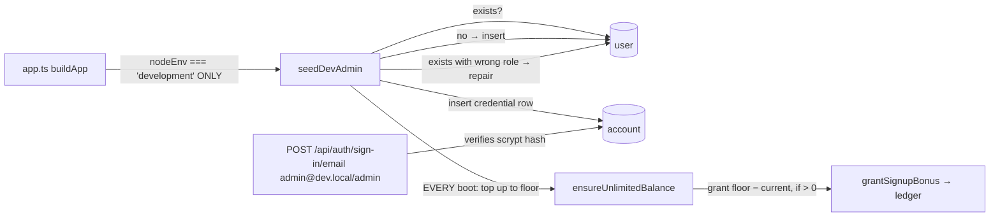

# dev-admin.ts — AI component doc

> AI-facing sidecar for `dev-admin.ts`. Created 2026-07-16. Keep this in sync with the code on every change.

## Purpose

Idempotent boot-time seed of the dev-only super-admin: `admin@dev.local` /
`admin`, `role = 'super_admin'`. Exists so a developer always has a known
privileged account in development — including right after a casual db wipe —
without a setup step. NEVER runs outside development: the env gate lives at the
call site in `app.ts` (`config.nodeEnv === 'development'`).

## What it does (for an AI reader)

- Responsibilities: check-then-create the admin `user` + credential `account`
  rows; repair the role to `super_admin` on an existing row (heals dbs that
  predate the role column); **top the admin's balance up to `DEV_ADMIN_CREDITS`
  on EVERY boot** (self-replenishing "infinite" credits, owner request
  2026-07-21) via `ensureUnlimitedBalance`.
- Public API / exports: `seedDevAdmin(db, auth, _signupBonusCredits, log?)`,
  `DEV_ADMIN_EMAIL` (`admin@dev.local`), `DEV_ADMIN_CREDITS` (`1_000_000_000`).
- Inputs → Outputs: drizzle `Db`, better-auth instance (for its scrypt hasher),
  the real-user bonus (IGNORED for the admin — see below), optional money log →
  at most one admin row, always at or above the credit floor; safe to call on
  every boot.
- Side effects: writes `user`, `account`, and (via `grantSignupBonus`)
  `credit_transaction` + `user.credits_balance`.

## Infinite credits (owner request 2026-07-21)

The dev admin must never run out of credits. Delivered as a **huge floor topped
up every boot**, NOT as a charge-path exemption. Rationale:

- `ensureUnlimitedBalance(db, userId, log)` reads the current balance and grants
  only `DEV_ADMIN_CREDITS − current` when positive — so an untouched admin sits
  exactly at the floor (no unbounded growth across boots) and a spent-down admin
  is refilled. Grants go through `grantSignupBonus`, so every mutation is still
  backed by a `credit_transaction` row — the ledger↔balance invariant holds.
- Why a floor, not a no-op in `chargeCredits`: a role-based charge exemption
  would live inside the money-path invariant code (`applyCharge`) and would
  silently free EVERY `super_admin` — a production footgun if that role ever
  exists for real users. The boot-time top-up touches nothing in charge/refund,
  cannot affect real users, and is trivially reversible.
- `_signupBonusCredits` (the real-user bonus from config) is intentionally
  ignored for the admin; the param stays in the signature only so the positional
  `app.ts` call site is untouched. Real sign-ups still get their configured bonus
  via the normal better-auth hook — unchanged.
- Trade-off (honest): the balance is effectively-infinite (1e9 ÷ ~135-credit
  priciest op ≈ 7.4M generations) and self-refills, but it DOES decrement within
  a session. If a literally-never-moving balance is ever wanted, the true no-op
  exemption is a separate, money-path-touching change.

## Dependencies

- Imports / depends on: `db/schema` (`user`, `account`), `db/client` (`Db`),
  `modules/credits/ledger` (`grantSignupBonus`, `MoneyLog`), `./auth` (`Auth` —
  `auth.$context.password.hash`), `drizzle-orm` (`eq`).
- Used by: `app.ts` (composition root, dev-gated call after `createAuth`).
  Tested by `test/dev-admin.test.ts`.

## Diagram

## Key decisions / gotchas

- DIRECT INSERT, NOT `auth.api.signUpEmail`: better-auth enforces the 8-char
  minimum on sign-UP; the whole point is the 5-char password. Sign-IN does no
  length check (verified against better-auth 1.6.23 source — only
  sign-up/update-user/reset-password read `minPasswordLength`), so the seed
  hashes with better-auth's OWN hasher (`auth.$context.password.hash`, scrypt)
  and writes the rows directly. Signup rules for real users stay untouched.
- The direct insert bypasses `databaseHooks.user.create.after`, so the signup
  bonus is granted explicitly — a 0-credit admin cannot test any money path.
- The account row mirrors better-auth's credential shape exactly:
  `providerId 'credential'`, `accountId = userId`, `password = hash`.
- The password is deliberately not a secret — a fixed, well-known dev
  credential. The production wall is the `nodeEnv` gate in `app.ts`, pinned by
  `test/dev-admin.test.ts` ('test' and 'production' envs must 401).
- Login is an EMAIL (`admin@dev.local`), not the bare word `admin` — better-auth
  email+password has no username concept, and the SPA form validates email
  format.

## Commits

- _no commit yet_
