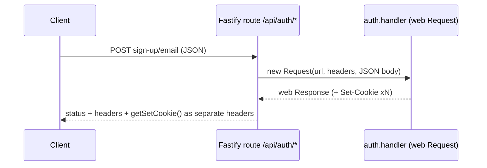

# plugin.ts — AI component doc

> AI-facing sidecar for `plugin.ts`. Created 2026-07-06. Keep this in sync with the code on every change.

## Purpose
Fastify ⇄ better-auth bridge (plan Task 5): mounts `auth.handler` on `GET|POST /api/auth/*` by translating Fastify requests to web `Request`s, and decorates `requireUser` for protected routes.

## What it does (for an AI reader)
- Responsibilities: rebuild a web `Request` from the (already-parsed) Fastify request; relay the web `Response` back preserving multiple `set-cookie` headers; expose `requireUser(req)` that resolves the session from the cookie or throws a 401 with `apiCode: 'unauthorized'`; declare the strict auth rate bucket (`config.rateLimit: 10/min per IP`) on the `/api/auth/*` route — credential stuffing / signup-spam surface (enforced by `@fastify/rate-limit` registered in `app.ts`, pinned by `test/rate-limit.test.ts`).
- Public API / exports: `registerAuth(app, auth)`, `SessionUser` type; module augmentation typing `app.requireUser`.
- Inputs → Outputs: HTTP requests under `/api/auth/*` → better-auth responses (sign-up/sign-in/sign-out/session, OAuth callbacks); `requireUser` → `{ id, email, name }`.
- Side effects: route + decorator registration.

## Dependencies
- Imports / depends on: `fastify` types, `./auth` (`Auth` type).
- Used by: `app.ts` (registration); every protected module (`users/routes.ts`, `credits/routes.ts`, later generations) via `app.requireUser`.

## Diagram

## Key decisions / gotchas
- Manual Request bridge instead of `better-auth/node` `toNodeHandler`: Fastify has already consumed the body stream (and light-my-request mocks break raw-stream reads in tests); this is also the integration better-auth documents for Fastify.
- `set-cookie` is copied via `response.headers.getSetCookie()` — `headers.forEach` would comma-fold multiple cookies into one broken header (known pitfall).
- `content-length` is dropped so Fastify recomputes it after the body is re-read via `response.text()`.
- GET/HEAD send `body: null` (fetch spec forbids bodies there).

## Commits
- 808e8e7 feat(api): better-auth (email+google) with signup bonus + /api/me
