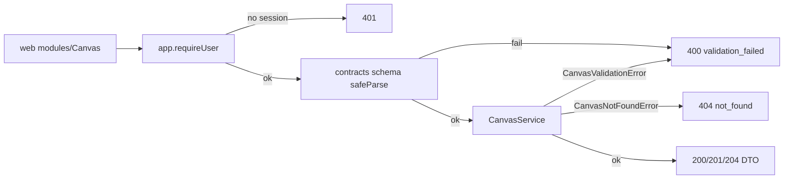

# routes.ts — Canvas HTTP layer

> AI-facing sidecar for `modules/canvas/routes.ts`. Created 2026-07-30. Keep this in sync with the code on every change.

## Purpose

The thin HTTP surface for the canvas aggregate (ADR `docs/wiki/decisions/canvas-mode.md`):
require a session, parse the body with the SHARED contracts schema, delegate to
`CanvasService`, map its two domain errors to status codes. Mirrors
`modules/films/routes.ts`.

## What it does (for an AI reader)

- Responsibilities: auth gate (`app.requireUser`), input validation, error → HTTP
  mapping. No domain logic and no DB access whatsoever.
- Endpoints (`registerCanvasRoutes(app, service)`):

  | Method | Path | Body schema | Success |
  |---|---|---|---|
  | GET | `/api/canvases` | — | 200 `{ items: Canvas[] }` |
  | POST | `/api/canvases` | `createCanvasInputSchema` | 201 `Canvas` |
  | GET | `/api/canvases/:id` | — | 200 `CanvasDetail` |
  | PATCH | `/api/canvases/:id` | `updateCanvasInputSchema` | 200 `CanvasDetail` |
  | DELETE | `/api/canvases/:id` | — | 204 |
  | POST | `/api/canvases/:id/uploads` | `canvasUploadInputSchema` | 201 `{ uploadUrl }` |

- Failure shapes: 401 (no session), 400 `{ error: { code: 'validation_failed', message } }`
  (zod parse failure or a rejected upload payload), 404
  `{ error: { code: 'not_found', message: 'Canvas not found' } }` (missing OR foreign).
- Side effects: none directly — every effect belongs to the service.

## Dependencies

- Imports / depends on: `fastify` types, `@opencreate/contracts`
  (`createCanvasInputSchema`, `updateCanvasInputSchema`, `canvasUploadInputSchema`),
  `./service` (`CanvasService`, `CanvasNotFoundError`, `CanvasValidationError`).
- Used by: `src/app.ts` — `registerCanvasRoutes(app, createCanvasService({ db, storage }))`,
  registered after `registerCompareRoutes`.

## Diagram

## Key decisions / gotchas

- **Node RUNS are not here.** Generating from a node is an ordinary
  `POST /api/generations` call the SPA makes directly (ADR D1). Adding a run
  endpoint here would duplicate the charge/refund path — the whole point of the
  aggregate design is that it has zero money code.
- **404, never 403, for a foreign canvas.** The service raises the same error for
  missing and not-yours; this layer maps it to one message, so id existence never
  leaks.
- **`guard()` maps only the two canvas domain errors and rethrows everything
  else** — an unexpected error must reach the app-level handler and be logged as a
  500, not be silently flattened into a 404.
- **Validation lives in the contracts package, not here.** The route parses with
  the same schema the web client's types come from, so client and server cannot
  disagree about the document shape or its bounds.
- **The upload route is `POST .../:id/uploads`, scoped under the canvas** — that
  path is what makes ownership checkable before any bytes hit the disk.

## Commits

- 4d074dd feat(canvas): aggregate CRUD — service, routes, ownership
