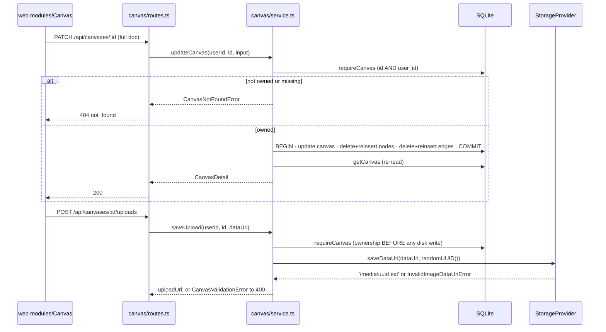

# service.ts — Canvas aggregate domain service

> AI-facing sidecar for `modules/canvas/service.ts`. Created 2026-07-30. Keep this in sync with the code on every change.

## Purpose

The domain service behind `/api/canvases` (ADR `docs/wiki/decisions/canvas-mode.md`, D1):
CRUD over the node-graph document plus the one byte-write the feature needs
(upload-node images). It is the composition layer OVER generations — it stores
which generations a node CITES and never touches money, providers, or the ledger.

## What it does (for an AI reader)

- Responsibilities: ownership-scoped read/write of `canvas` / `canvas_node` /
  `canvas_edge`; JSON ↔ DTO mapping; the full-document replace that implements
  autosave; storing an upload node's bytes.
- Public API (`createCanvasService({ db, storage })` → `CanvasService`):
  - `createCanvas(userId, { title })` → `Canvas`
  - `listCanvases(userId)` → `Canvas[]` (newest-touched first, `updatedAt DESC`)
  - `getCanvas(userId, canvasId)` → `CanvasDetail` (canvas + nodes + edges + viewport)
  - `updateCanvas(userId, canvasId, input)` → `CanvasDetail` (**full-document replace**)
  - `deleteCanvas(userId, canvasId)` → `void`
  - `saveUpload(userId, canvasId, dataUri)` → `{ uploadUrl: '/media/<uuid>.<ext>' }`
  - Errors: `CanvasNotFoundError` (→404), `CanvasValidationError` (→400)
- Inputs → Outputs: contract types from `@opencreate/contracts` in, DTOs out. The
  stored JSON columns (`position_json`, `config_json`, `generation_ids_json`,
  `viewport_json`) are parsed on read and stringified on write.
- Side effects: SQLite reads/writes (one transaction per update); one disk write
  per upload via `storage.saveDataUri`. No network, no provider calls, no ledger.

## Dependencies

- Imports / depends on: `node:crypto` (`randomUUID`), `drizzle-orm` (`and`/`desc`/`eq`),
  `@opencreate/contracts` (types only), `../../db/client` (`Db`), `../../db/schema`
  (`canvas`, `canvasNode`, `canvasEdge`), `../../storage/local` (`StorageProvider`),
  `../../storage/dataUri` (`InvalidImageDataUriError`).
- Used by: `modules/canvas/routes.ts`; constructed in `src/app.ts` with
  `{ db: deps.db, storage: deps.storage }`.

## Diagram

## Key decisions / gotchas

- **Ownership is the type signature.** Every method takes `userId` first and goes
  through `requireCanvas`, which filters on `id AND user_id`. A foreign canvas and
  a missing one raise the SAME `CanvasNotFoundError`, so an attacker cannot probe
  which ids exist (the films precedent).
- **PATCH replaces, it does not merge.** These are single-owner documents with
  debounced autosave and last-write-wins semantics, so the stored doc must become
  exactly what was sent. Merging would resurrect nodes the user deleted. The
  delete + reinsert of both collections runs in ONE `db.transaction`, so a crash
  can never leave nodes without their edges.
- **`undefined` vs empty array is load-bearing.** An absent `nodes`/`edges` means
  "not part of this save" (a title-only rename sends one key); an empty array
  means "the document has none". Hence `!== undefined` rather than a truthiness
  check — a truthiness check would make "delete every node" a silent no-op.
- **Bounds live in the contract, not here.** `updateCanvasInputSchema` caps the
  document at 200 nodes / 400 edges, which is what keeps this O(doc) write
  bounded. The service trusts its already-parsed input.
- **`saveUpload` checks ownership BEFORE writing bytes** — otherwise a stranger
  could fill our disk through someone else's canvas id. The media key is a fresh
  `randomUUID()`, independent of the node id, because the document is replaced
  whole on every save and a node id is therefore not a stable file name.
- **`InvalidImageDataUriError` → `CanvasValidationError`.** `parseImageDataUri`
  guards the DISK (raster mimes only, so no svg stored-XSS; cap on decoded bytes).
  Translating it here is what keeps a bad upload a 400 instead of a 500 leaking a
  storage-layer error (the shot-references precedent).
- **No money, no runs.** A node RUN is an ordinary `POST /api/generations` from
  the SPA. This service stores generation ids as citations only — no FK, so a
  gallery delete leaves an empty version rather than cascading the canvas away.

## Commits

- _pending — see the Task 4 commit for the canvas aggregate_
