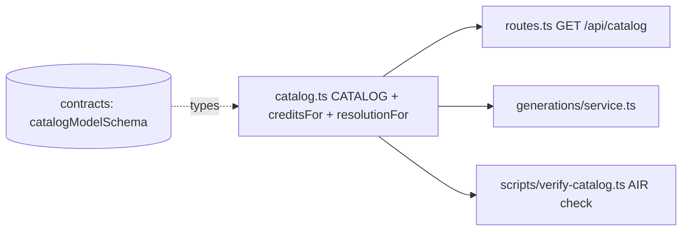

# catalog.ts — curated model catalog (single source of truth)

> AI-facing sidecar for `catalog.ts`. Created 2026-07-06. Keep this in sync with the code on every change.

## Purpose
The one place where openCreate's sellable models live: product ids, display names, Runware AIR ids, tiers, supported aspect ratios, duration options and **credit prices**. Routes, the generation service and SPA pricing all derive from this array — pricing is never duplicated elsewhere.

## What it does (for an AI reader)
- Responsibilities: hold the 2 image + 5 video model definitions and the pure pricing/resolution helpers.
- Public API / exports:
  - `CATALOG: CatalogModel[]` — every entry validated by the shared `catalogModelSchema` (see `test/catalog.test.ts`).
  - `getModel(id)` → `CatalogModel | undefined` — lookup by product id.
  - `creditsFor(model, duration)` → `number` — flat `credits` for images; `creditsByDuration[duration]` for video. Throws on missing/unsupported duration so a bad request can never be mischarged.
  - `resolutionFor(model, aspect)` → `{ width, height }` — images use `square1024`; plus/pro/premium video tiers FHD, other video tiers HD.
  - `RESOLUTIONS` — aspect-ratio → pixel tables.
- Inputs → Outputs: pure data + pure functions, no I/O, no state.
- Side effects: none.

## Dependencies
- Imports / depends on: `@opencreate/contracts` (types only: `AspectRatio`, `CatalogModel`).
- Used by: `modules/catalog/routes.ts` (GET /api/catalog), `modules/generations/service.ts` (Task 10: charge amount + Runware params), `scripts/verify-catalog.ts`.

## Diagram

## Key decisions / gotchas
- `RESOLUTIONS` is a literal object with `satisfies Record<string, Record<AspectRatio, Resolution>>` (NOT typed as `Record<string, …>`): under `noUncheckedIndexedAccess` this keeps `RESOLUTIONS.hd` and `table[aspect]` fully defined — the plan snippet's `Record<string, …>` shape would not typecheck.
- Prices are research 2026-07; re-verify quarterly. AIR ids `minimax:4@1` and `google:3@2` were flagged as needing verification — run `pnpm --filter @opencreate/api exec tsx src/scripts/verify-catalog.ts` with a real `RUNWARE_API_KEY` before launch.

## Commits
- _pending_ — feat(api): curated model catalog with credit pricing
