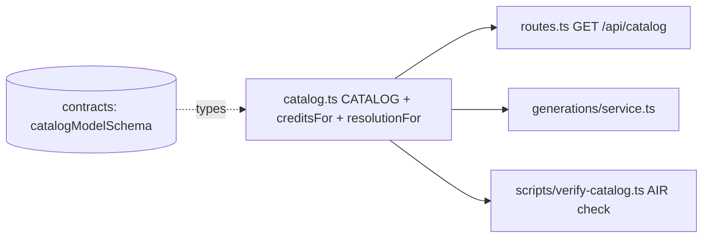

# catalog.ts — curated model catalog (single source of truth)

> AI-facing sidecar for `catalog.ts`. Created 2026-07-06. Keep this in sync with the code on every change.

## Purpose
The one place where openCreate's sellable models live: product ids, display names, Runware AIR ids, tiers, supported aspect ratios, duration options and **credit prices**. Routes, the generation service and SPA pricing all derive from this array — pricing is never duplicated elsewhere.

## What it does (for an AI reader)
- Responsibilities: hold the 2 image + 6 video + 2 audio + 3 model3d model definitions and the pure pricing/resolution helpers.
- Public API / exports:
  - `CATALOG: CatalogModel[]` — every entry validated by the shared `catalogModelSchema` (see `test/catalog.test.ts`).
  - `getModel(id)` → `CatalogModel | undefined` — lookup by product id.
  - `creditsFor(model, duration?)` → `number` — flat `credits` for image/audio/model3d (duration is optional and ignored for these); `creditsByDuration[duration]` for video (duration required, throws if missing/unsupported).
  - `resolutionFor(model, aspect)` → `{ width, height }` — images use `square1024`; plus/pro/premium video tiers FHD, other video tiers HD. Never called for audio or model3d (both skip resolution entirely).
  - `RESOLUTIONS` — aspect-ratio → pixel tables.
- Inputs → Outputs: pure data + pure functions, no I/O, no state.
- Side effects: none.

## Dependencies
- Imports / depends on: `@opencreate/contracts` (types only: `AspectRatio`, `CatalogModel`).
- Used by: `modules/catalog/routes.ts` (GET /api/catalog), `modules/generations/service.ts` (Task 10: charge amount + Runware params), `scripts/verify-catalog.ts`.

## Diagram

## Key decisions / gotchas
- `RESOLUTIONS` is a literal object with `satisfies Record<string, Record<AspectRatio, Resolution>>` (NOT typed as `Record<string, …>`): under `noUncheckedIndexedAccess` this keeps `RESOLUTIONS.hd` and `table[aspect]` fully defined — the plan snippet's `Record<string, …>` shape would not typecheck.
- Prices are research 2026-07; re-verify quarterly. AIR ids `minimax:4@1` and `google:3@2` were flagged as needing verification — run `pnpm --filter @opencreate/api exec tsx src/scripts/verify-catalog.ts` with a real `RUNWARE_API_KEY` before launch.
- `seedance-1-5-pro` ("Pulse", standard tier) added 2026-07-08 after the direct-vs-Runware cost analysis (`docs/research/2026-07-07-seedance-direct-vs-runware.md`): wholesale ≈$0.026/s 720p silent on Runware → 35 cr/5s retail keeps ~63% margin and puts a genuine Seedance in our catalog against Higgsfield's $0.83+. AIR id verified LIVE via `modelSearch` (t2v + i2v capabilities confirmed). Seedance 2.0 deliberately NOT added — doesn't fit any tier below ~90 cr (see research doc).
- `supportsSafetyParam: false` on seedance-1-5-pro (2026-07-08): live submit failed with `unsupportedParameter: safety` — ByteDance models on Runware reject the `safety` task param that our client sends by default. The flag flows catalog → generations service (`omitSafety`) → runware client (omits `safety` from the task). Moderation for these models relies on the `NSFWContent` result flag, which the service already enforces.
- `wan-2-2` ("Forge", `provider: 'wan-runpod'`) added 2026-07-09: self-hosted Wan 2.2 on our RunPod GPU via the ComfyUI seam. `air` is a SYNTHETIC tag (`wan-runpod:wan2.2-t2v-a14b`) that only satisfies the AIR regex — it is never sent to Runware, and `verify-catalog.ts` SKIPS any `provider !== 'runware'` model. Premium tier, t2v only (`supportsImageInput: false`), 5s → 60 credits. KNOWN GAP: self-host has no provider NSFW check (poll returns `nsfw:false`).

- `supportsSafetyParam: false` also on `wan-2-7` (2026-07-09): Alibaba/Wan models reject Runware's `safety` param exactly like ByteDance — verified live when a Wan 2.7 submit 400'd. Same omitSafety flow.

## Update 2026-07-15 — native generation audio
- `creditsFor(model, duration?, withAudio = false)`: audio-on reads
  `creditsByDurationWithAudio` on 'switchable' models (throws if the table is
  missing — config-drift backstop; the service 400s unsupported requests before
  pricing). Entries: seedance-1-5-pro switchable {5:70,10:140}, pixverse-v6
  switchable {5:70,8:112} (both ~2× — ByteDance's measured with-audio rate),
  wan-2-7 'always' (audio included in the base price, no switch exists).
  kling/veo/minimax/seedance-2-0 carry no `nativeAudio` (no verified switch).

## Commits
- bdc4175 feat(api): curated model catalog with credit pricing
- 45ce33e 2026-07-11 feat: design-system v4 (Card/surfaces) + Seedance direct via ByteDance ArkC

## Key decisions (2026-07-09) — CinemaStudio audio
- Two `type: 'audio'` models added: `voiceover` (Inworld TTS 2, `air: inworld:tts@2`, 8 cr, `audioKind: 'tts'`, Russian voices) and `music` (MiniMax Music 2.6, `air: minimax:music@2.6`, 20 cr, `audioKind: 'music'`). Both flat-priced per generation.
- `creditsFor` now returns the flat `credits` for BOTH image and audio (only video prices by duration). `resolutionFor` is never called for audio (the generation service's audio branch skips resolution — audio has no aspect ratio; the throwaway `aspectRatios: ['16:9']` only satisfies catalogBase's `min(1)`).

## Key decisions (2026-07-11) — Studio3D catalog tiers (Task 6)
- Three `type: 'model3d'` models added, ladder-priced ~2x provider cost like every other tier: `trellis-2` ("Sketch", `microsoft:trellis-2@4b`, fast, 6 cr, $0.0256 raw — MIT-licensed and an order of magnitude cheaper, the tier that makes 3D feel free to play with), `hunyuan-3d-rapid` ("Solid", `tencent:hunyuan-3d@3.1-rapid`, standard, 45 cr, $0.225 raw), `tripo-3d` ("Sculpt", `tripo:v3.1@0`, quality, 80 cr, $0.40 raw). All three: `supportsImageInput: true` (photo → mesh is the entire product), `pbr: true`, no `provider` field (implicitly Runware — routes.ts only gates on `type === 'video'`, so these are never hidden by the optional-backend filter), throwaway `aspectRatios: ['1:1']` since 3D has no aspect ratio and `resolutionFor` is never called for it.
- `creditsFor`'s signature changed from `(model, duration: number | undefined)` to `(model, duration?: number)` — model3d joined the flat-priced guard alongside image/audio, and made `duration` optional so callers pricing a flat model don't have to pass `undefined` explicitly. This also fixed the pre-existing typecheck error at the old line 299 (`model.creditsByDuration` didn't exist on the narrowed type once `model3d` fell through to the video branch).
- Prices are LIST prices seeding this credit table, not the ledger — Runware's 3dInference response `cost` field scales with quality settings and is what generations/service.ts will actually bill against (Task 7).

## Key decisions (2026-07-22) — video durations actualized to provider limits
- The old `[5,8]` / `[5,10]` `durationOptions` were OUR conservative config, NOT a
  provider limit. Verified against provider docs + the live Higgsfield model
  catalog: wan 2.7 (Alibaba) **2–15s**, Seedance 1.5 Pro (Runware) **4–12s**,
  Seedance 2.0 (DeepInfra) **4–15s**, Kling 3.0 (Runware) **up to 15s**, PixVerse V6
  (Runware) **1–15s**, Veo 3.1 (Runware) **4/6/8s** (8 is its real ceiling). The
  dashscope/Runware adapters pass `duration` straight through with no clamp — the
  only things that ever capped us at 10s were these tables and the web slider
  `SHOT_DURATIONS_SECONDS`.
- New `durationOptions` + `creditsByDuration` (each model keeps its measured
  per-second rate; existing entries UNCHANGED, longer ones ADDED so every prior
  price test still holds): wan `[5,8,10,15]` (17/s → 10:170, 15:255) · seedance-1-5
  `[5,8,10,12]` (7/s; with-audio 2×) · seedance-2-0 `[5,10,15]` (26/s → 15:390) ·
  kling-3-pro `[5,10,15]` (16/s → 15:240) · veo-3-1-fast `[4,6,8]` (17.5/s →
  4:70, 6:105) · pixverse-v6 `[5,8,10,15]` (7/s; with-audio 2×). MiniMax `[6,10]`
  and wan-2-2 `[5]` (self-host) left as-is.
- An over-long timeline strip snaps down to the model's own max at generation
  (`composeShotClipInput.nearestDuration`), so 15 on the slider is honest for every
  model. Exact per-channel max is re-verified live before it can 400.

## Update 2026-07-30 — pixverse-v6 rejects Runware `safety` (provider drift)

- `pixverse-v6` now carries `supportsSafetyParam: false`, same treatment (and
  comment style) as `seedance-1-5-pro`. Verified live on a canvas i2v run:
  Runware answered "Unsupported use of 'safety' parameter" and the error's
  allowed-params list has no `safety` — so EVERY pixverse submit (t2v and i2v,
  composer and canvas alike) had been failing at the provider and refunding.
  Provider drift: the param was accepted when the entry was added.
- Moderation still applies via the NSFWContent flag on results; the flag only
  controls whether the client SENDS the request-side `safety` object
  (runware/client.ts `omitSafety` plumbing, already tested).

## 2026-08-19 — every image model moved to Seedream 5 (kie.ai)

- The four image entries keep their ids (`flux-schnell`, `flux-dev`,
  `flux-kontext-pro`, `nano-banana-pro`) because the database is full of rows,
  shots, templates and canvas nodes that reference them. What changed is what
  runs behind each id: `kie: { model, quality }` names the Seedream handle and
  its 2K/3K/4K tier, while `air` stays the Runware handle and becomes the
  FAILOVER link. One entry, two backends.
- All four are priced at **7 credits** — Seedream 5 Lite charges one flat
  $0.035/image regardless of quality tier, so the old ladder (1 / 2 / 8 / 28)
  has no cost basis any more. The tiers are now a RESOLUTION ladder, not a
  price one. Restoring a price spread means wiring Seedream 5 Pro ($0.045 up
  to 2.36MP, $0.09 above), which is deliberately not done here: its kie.ai
  model id has not been verified against a real key.
- PRICES AND BOTH MODEL IDS ARE MEASURED (2026-08-19, three live generations on
  the operator's key): basic 2K, ultra 4K and image-to-image-with-a-reference all
  billed **5.5 kie credits = $0.0275**, against the $0.035 the price page
  advertises. So 7 credits is a 2.5× margin, the flat rate is a fact rather than
  an assumption, and `seedream/5-lite-image-to-image` resolves. Finished assets
  come from `tempfile.aiquickdraw.com`, which `withKieHost()` already allowlists.
- Falling back to Runware SELLS BELOW COST (Nano Banana Pro is $0.138 against
  7 credits of revenue). That is the accepted price of having a fallback at
  all, bounded by how rarely kie.ai refuses a job — and pinned by a test in
  `catalog.test.ts` so it is a decision rather than a discovery.

## 2026-08-19 — Pulse (Seedance 1.5 Pro) moved from Runware to kie.ai

- `air` is now `kie:bytedance/seedance-1.5-pro` and the entry carries
  `provider: 'kie'`. Same model, a third of the cost: kie bills a MEASURED
  3.5 credits/second on the silent 720p row ($0.0875 for 5s) against Runware’s
  $0.26136 for the identical clip.
- Everything we sell fits their schema (docs 2026-08-19): duration 4–12s covers
  our 5/8/10/12, resolutions 480p/720p/1080p, and every aspect ratio in our list.
  `generate_audio` is a real flag, so the switchable-audio pricing still holds.
- The entry is now GATED BY `KIE_API_KEY`, like every other optional backend:
  no key, no listing. `supportsSafetyParam: false` stays — it describes the
  model (ByteDance rejects Runware’s `safety`), not the channel.
- Their `input_urls` takes URLs only, max 2 — so the adapter refuses an
  image→video job with no public media URL AT SUBMIT rather than letting it
  queue and fail after the charge. Same rule Segmind needed the same day.
