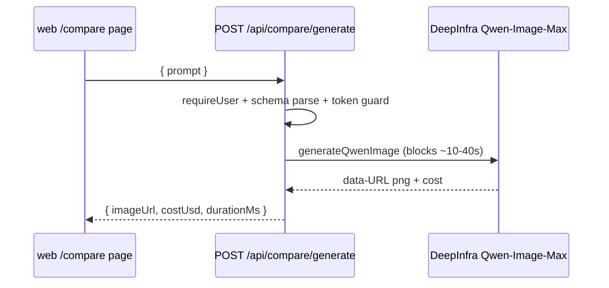
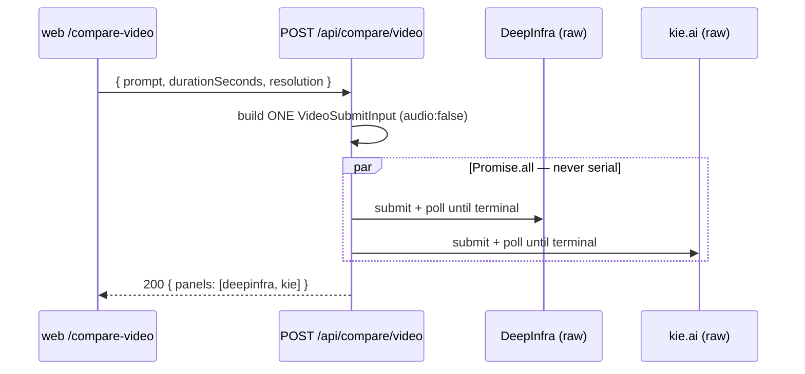

# routes.ts — /compare utility HTTP layer

> AI-facing sidecar for `routes.ts`. Created 2026-07-29. Keep this in sync with the code on every change.

## Purpose

Two endpoints behind the hidden operator pages, both bypassing the credit ledger
because they spend provider USD rather than user credits:

1. `POST /api/compare/generate` — the `/compare` image page. Proxies a single
   synchronous Qwen-Image-Max render so `DEEPINFRA_TOKEN` never reaches the browser.
2. `POST /api/compare/video` — the `/compare-video` cost page. Races ONE Seedance 2.0
   job through DeepInfra and kie.ai at byte-identical settings and reports each
   provider's OWN billed figure. A receipt, not a rate card.

## What it does (for an AI reader)

- Responsibilities: session guard (`app.requireUser`), boundary validation with
  the SHARED `compareGenerateInputSchema`, unconfigured-provider guard, wall-time
  measurement around the provider call only, result envelope.
- Public API / endpoints: `registerCompareRoutes(app, { deepinfraToken })` →
  `POST /api/compare/generate` `{ prompt }` → `{ imageUrl, costUsd, durationMs }`
  (`CompareGenerateResult`).
- Inputs → Outputs: prompt (2..2000) → data-URL png + USD cost + measured ms.
  Failures: 401 (no session), 400 validation envelope, 429 (10/min bucket),
  502 provider_error (unset token, provider failure, timeout) via the central
  handler.
- Side effects: one outbound DeepInfra call per request; spends operator USD
  (7.5¢/image); NO credit ledger involvement, nothing persisted.

## Dependencies

- Imports / depends on: `@opencreate/contracts` (compareGenerateInputSchema),
  `../../integrations/deepinfra/deepinfra-image` (generateQwenImage,
  DeepinfraImageError).
- Also imports `KIE_CREDIT_USD` from `../../integrations/kie/kie-video` and the
  `VideoProvider` / `VideoSubmitInput` seam types.
- Used by: `app.ts` — `registerCompareRoutes(app, { deepinfraToken,
  deepinfraProvider, kieProvider, videoPollIntervalMs?, videoDeadlineMs? })`.
- Tested by: `apps/api/test/compare.test.ts` (image),
  `apps/api/test/compare-video.test.ts` (video — money provenance, failure
  isolation, identical settings, timeout, concurrency, rate limit).

## Diagram

## Key decisions / gotchas

- **Synchronous by design** — no submit/poll seam because there is no charge to
  settle and the wall time IS the benchmark the page displays.
- Strict 10/min rate bucket: every call spends provider money on a
  ledger-bypassing endpoint (same reasoning as the prompt enhancer's bucket).
- Unset token THROWS DeepinfraImageError (not a local reply) so the central
  handler logs/shapes it exactly like every other unconfigured backend.
- `durationMs` is measured around the provider call ONLY — auth/parse time
  must not pollute the comparison metric.

## POST /api/compare/video — the two-channel receipt

- Signature: `{ prompt, durationSeconds?, resolution? }` → `{ prompt,
  durationSeconds, resolution, panels: CompareVideoPanel[] }`. Always **200** when
  the request itself is valid — a channel that dies becomes an error PANEL.
- Contenders (`VideoContender[]`, server-side array — adding a third is one entry):
  `deepinfra` → `deepinfra:ByteDance/Seedance-2.0`, `kie` → `kie:bytedance/seedance-2`.
  Both adapters strip their own synthetic prefix, so the prefix must be PASSED, not
  removed here.
- Rate bucket 3/min: a video render is minutes and two balances are on the line.

### Key decisions / gotchas (video)

- **One `VideoSubmitInput`, built once, spread per contender.** Building it twice
  is how a comparison quietly starts pricing two different jobs — a drifting
  duration or resolution moves the bill 2-3× and the receipt still looks valid.
  `compare-video.test.ts` asserts the two submits are deep-equal except `model`.
- **`audio: false` is explicit, not omitted.** ByteDance bills Seedance at exactly
  2× with audio, so an adapter default would double one side of the comparison.
- **`Promise.all`, never a serial loop.** Serial would report the SUM of two
  renders as each one's wall time, and wall time is the second axis (a channel
  that is cheaper but 4× slower is not cheaper).
- **`runVideoChannel` NEVER throws.** A rejection would take the sibling's receipt
  down with it via `Promise.all`.
- **The provider's own figure or NOTHING.** `costUsd` is forwarded verbatim;
  absent stays `null`. A guessed number is a lie that looks like a measurement.
- **`creditsConsumed` is derived back** from kie.ai's own USD at `KIE_CREDIT_USD`
  so the on-screen conversion is auditable. Rounded because `1.025 / 0.005` lands
  on `204.99999999999997`.
- **Timeout is worded as INCONCLUSIVE, not failure.** The render is probably still
  going and will still bill us; printing $0 next to a job that costs money is the
  worst possible error on a cost page.
- **`sanitizeChannelError` passes exactly one class through**: our own
  `is not configured (KEY unset)` string, because it is the realistic state (one
  key set, one not) and tells the operator what to fix. Everything else collapses —
  upstream prose can name an account or a balance, and this route embeds the text
  in a 200.
- **Channels are constructed RAW in `app.ts`**, never taken from `videoProviders`:
  the production registry wraps DeepInfra in a failover chain, and a measurement
  that silently ran on the FALLBACK would report the wrong provider's price.

## Commits

- c5fe185 feat(compare): скрытая страница /compare — FLUX dev vs Nano Banana Pro vs Qwen Image Max
