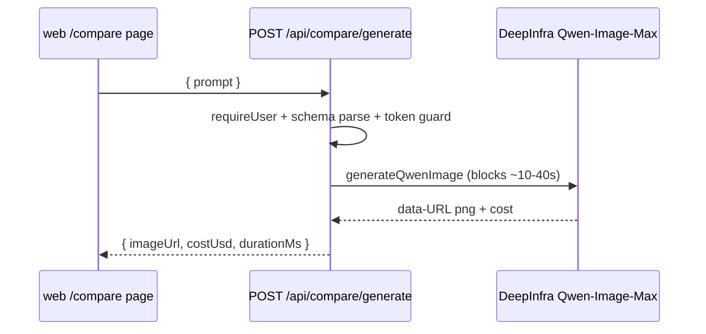

# routes.ts — /compare utility HTTP layer

> AI-facing sidecar for `routes.ts`. Created 2026-07-29. Keep this in sync with the code on every change.

## Purpose

The one endpoint behind the hidden `/compare` page: `POST /api/compare/generate`
proxies a single synchronous Qwen-Image-Max render through the server so the
`DEEPINFRA_TOKEN` secret never reaches the browser.

## What it does (for an AI reader)

- Responsibilities: session guard (`app.requireUser`), boundary validation with
  the SHARED `compareGenerateInputSchema`, unconfigured-provider guard, wall-time
  measurement around the provider call only, result envelope.
- Public API / endpoints: `registerCompareRoutes(app, { deepinfraToken })` →
  `POST /api/compare/generate` `{ prompt }` → `{ imageUrl, costUsd, durationMs }`
  (`CompareGenerateResult`).
- Inputs → Outputs: prompt (2..2000) → data-URL png + USD cost + measured ms.
  Failures: 401 (no session), 400 validation envelope, 429 (10/min bucket),
  502 provider_error (unset token, provider failure, timeout) via the central
  handler.
- Side effects: one outbound DeepInfra call per request; spends operator USD
  (7.5¢/image); NO credit ledger involvement, nothing persisted.

## Dependencies

- Imports / depends on: `@opencreate/contracts` (compareGenerateInputSchema),
  `../../integrations/deepinfra/deepinfra-image` (generateQwenImage,
  DeepinfraImageError).
- Used by: `app.ts` (`registerCompareRoutes(app, { deepinfraToken })`).
- Tested by: `apps/api/test/compare.test.ts`.

## Diagram

## Key decisions / gotchas

- **Synchronous by design** — no submit/poll seam because there is no charge to
  settle and the wall time IS the benchmark the page displays.
- Strict 10/min rate bucket: every call spends provider money on a
  ledger-bypassing endpoint (same reasoning as the prompt enhancer's bucket).
- Unset token THROWS DeepinfraImageError (not a local reply) so the central
  handler logs/shapes it exactly like every other unconfigured backend.
- `durationMs` is measured around the provider call ONLY — auth/parse time
  must not pollute the comparison metric.

## Commits

- _no commit yet_
