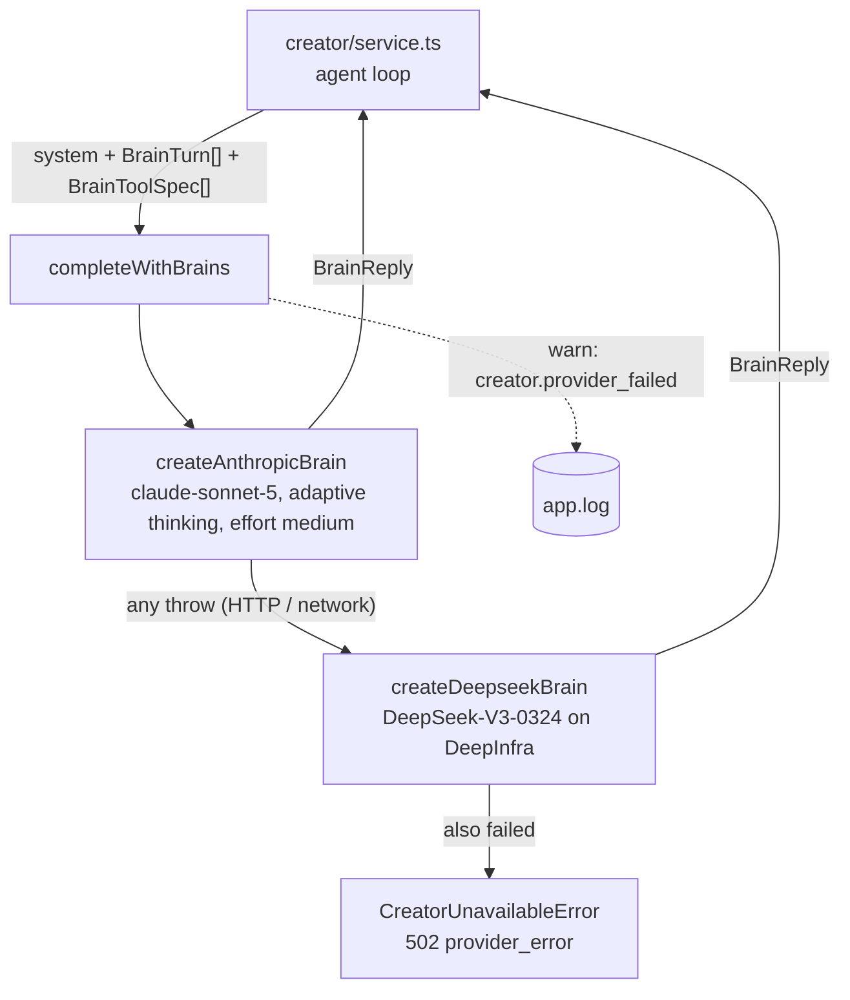

# brain.ts — openCreator's provider-neutral tool-calling brain

> AI-facing sidecar for `brain.ts`. Created 2026-07-30. Keep this in sync with the code on every change.

## Purpose

The LLM half of openCreator (ADR `docs/wiki/decisions/opencreator-agent.md` D3).
It turns "call a model, get back either prose or tool calls" into ONE neutral
interface, so the agent loop in `service.ts` never learns whose wire format is
under it. Two adapters ship: **Anthropic Messages tool-use** (primary — the key
already powers `films/storyboard.ts` and `assets3d/analyze.ts`) and **DeepSeek
function-calling on DeepInfra** (fallback — the token already powers
`prompt/enhance.ts`).

This file holds no product knowledge: no tools, no prompt, no DB, no money. It is
a translator with a failover chain.

## What it does (for an AI reader)

- Responsibilities: neutral types · Anthropic adapter · DeepSeek adapter · the
  ordered chain + its one error class. No I/O beyond the two provider calls.
- Public API:
  - Types: `BrainToolSpec` (`{ name, description, inputSchema }` — JSON Schema),
    `BrainToolCall` (`{ id, name, input }`), `BrainTurn`
    (`user` | `assistant` | `toolResults`), `BrainReply`
    (`{ text?, toolCalls, raw? }`), `Brain` (`{ id, complete(system, turns, tools) }`).
  - `CreatorUnavailableError` — 502 + `apiCode: 'provider_error'`.
  - `createAnthropicBrain(apiKey, createClient?)` — `createClient` is the test seam.
  - `createDeepseekBrain(token, fetchImpl?)` — `fetchImpl` is the test seam.
  - `buildBrainChain(anthropicApiKey, deepinfraToken)` → `Brain[]` in failover order.
  - `completeWithBrains(brains, system, turns, tools, log?)` → `BrainReply`.
- Inputs → Outputs: `(system prompt, transcript, tool specs)` → `{ text?, toolCalls }`.
  Zero or more tool calls is the loop's whole control signal: empty = the turn is
  done, non-empty = execute and come back.
- Side effects: one HTTPS call per `complete()`. One `warn` log line per failover
  hop. Nothing persisted.

## Dependencies

- Imports: `@anthropic-ai/sdk` (already a dependency), `fastify` (logger type only).
- Used by: `apps/api/src/modules/creator/service.ts` (the agent loop),
  `apps/api/src/app.ts` (builds the chain from config and injects it, with a
  `deps.creatorBrains` override for tests).
- Config it reads (indirectly, via app.ts): `ANTHROPIC_API_KEY`, `DEEPINFRA_TOKEN`.

## Diagram

## Key decisions / gotchas

- **`raw` exists because thinking blocks are signed.** Anthropic returns
  `thinking` blocks alongside `tool_use`, and the API REJECTS a follow-up turn
  whose assistant content was rebuilt without them ("a final assistant message
  must start with a thinking block"). Rebuilding the turn from `text + toolCalls`
  would therefore break the *second* step of every agent turn — it would pass
  against a fake and 400 in production. So each adapter hands its own content
  blocks back through `raw` and replays them verbatim; the DeepSeek adapter
  ignores the field. This is a documented deviation from the plan's contract, and
  it is load-bearing. Pinned by the "replays the provider content blocks VERBATIM"
  test.
- **Model: `claude-sonnet-5`, not the `claude-opus-4-8` storyboard uses.** This is
  a tool-SELECTION loop of up to 16 calls per user turn, so the per-step price is
  paid 16 times over; storyboard pays once for genuinely hard writing. Effort is
  `medium` and `max_tokens` 4096 for the same reason. (The plan names this model;
  the cheaper-per-step choice is deliberate, not an oversight.)
- **Adaptive thinking stays ON.** With thinking disabled, current models reach for
  tools noticeably less — the exact failure mode that would break an agent loop
  (the model answers with prose instead of acting). Cost is controlled with
  `effort`, not by disabling thinking.
- **Sanitize inside the adapter, not at the call site.** The Anthropic SDK's error
  message embeds the provider's JSON body, and DeepInfra's body can name our
  balance. Both adapters throw `HTTP <status>` / `network error` / `invalid answer`
  and nothing else, because this failure text ends up in the USER'S CHAT via the
  loop's sanitized-failure path.
- **Malformed DeepSeek `arguments` → `input: {}`,** never a throw. The tool's own
  zod schema then answers the model with an error string, so a truncated argument
  string is a failed call the model can retry rather than a dead turn.
- **A DeepSeek reply with neither text nor tool calls throws `empty answer`.** An
  empty bubble in the chat is worse than a clean 502.
- **`buildBrainChain` drops unconfigured providers**, so an empty array means
  "nothing configured" → `CreatorUnavailableError` at the first turn instead of a
  boot failure. Same optional-secret discipline as storyboard/enhance: the rest of
  the product keeps working without either key.
- **Two distinct 502 messages**: "is not configured" (operator must act) vs
  "temporarily unavailable" (transient). Both reach the user; neither names a
  provider.
- **The DeepSeek model id is duplicated, not imported** from `prompt/enhance.ts`
  on purpose: the enhancer is a text rewriter and may re-tune its model without
  dragging the agent's brain along. The test asserts the current value so the
  duplication is visible if either side moves.

## Commits

- 355b03e feat(creator): provider-neutral brain — anthropic tool-use + deepseek fallback
