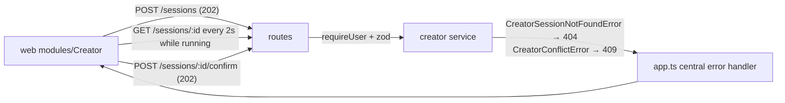

# routes.ts — the openCreator sessions API

> AI-facing sidecar for `routes.ts`. Created 2026-07-30. Keep this in sync with the code on every change.

## Purpose

The HTTP surface of openCreator (ADR `docs/wiki/decisions/opencreator-agent.md`
D4): five session-scoped endpoints the SPA drives. Thin by design, like
`canvas/routes.ts` — require a session, parse with the shared contracts schema,
delegate to the service. All rules (ownership, conflicts, the budget gate) live in
the service and its tools.

## What it does (for an AI reader)

- Responsibilities: auth gate (`app.requireUser`), input parsing, status codes,
  and the strict rate bucket. Nothing else.
- Endpoints (every one requires a session):
  | method + path | body | success | notable failures |
  | --- | --- | --- | --- |
  | `GET /api/creator/sessions` | — | `200 { items }` | `401` |
  | `POST /api/creator/sessions` | `{ message }` | `202 CreatorSessionDetail` | `400` validation, `429` |
  | `GET /api/creator/sessions/:id` | — | `200 CreatorSessionDetail` | `404` foreign/missing |
  | `POST /api/creator/sessions/:id/messages` | `{ message }` | `202 CreatorSessionDetail` | `409` running / awaiting_confirm, `404`, `429` |
  | `POST /api/creator/sessions/:id/confirm` | — | `202 CreatorSessionDetail` | `409` nothing to confirm, `404`, `429` |
- Inputs → Outputs: `createCreatorSessionInputSchema` in, `CreatorSessionDetail`
  out (the transcript so far — the agent's answer arrives on a later poll).
- Side effects: none directly; the service starts a detached turn.

## Dependencies

- Imports: `fastify` types, `@opencreate/contracts`
  (`createCreatorSessionInputSchema`), `./service` (`CreatorService`).
- Used by: `apps/api/src/app.ts` (`registerCreatorRoutes`, registered after the
  canvas routes and reusing the same service instances).

## Diagram

## Key decisions / gotchas

- **Every POST answers 202, never 200/201.** The turn is detached, so the body is
  the transcript SO FAR: the session and the user's message exist, the agent's
  answer does not yet. A 201 would imply a finished resource.
- **No error mapping in this file.** The service's errors already carry
  `statusCode` + `apiCode`, so the central handler in `app.ts` emits the standard
  envelope — unlike `canvas/routes.ts`, which needs a `guard()` because its
  service throws bare classes. Adding a guard here would be duplicate logic that
  can drift.
- **The confirm route takes NO body.** The plan being confirmed is the one in the
  transcript, so there is nothing for a client to choose — and nothing for it to
  tamper with (a client-supplied total would be a number the server would have to
  distrust anyway).
- **Strict rate bucket (10/min per IP) on the three POSTs**, for a different
  reason than `POST /api/generations`: a turn burns LLM TOKENS on every step, so a
  runaway client could spend real money without charging a single credit. Reads
  keep the global 300/min limit because the SPA polls a running session every 2s.
- **`409` on `awaiting_confirm` as well as `running`** — while a plan is on the
  table the only meaningful next action is confirming it; a fresh instruction
  would race the plan the user is looking at.

## Commits

- (pending) feat(creator): agent loop, budget gate, sessions API
