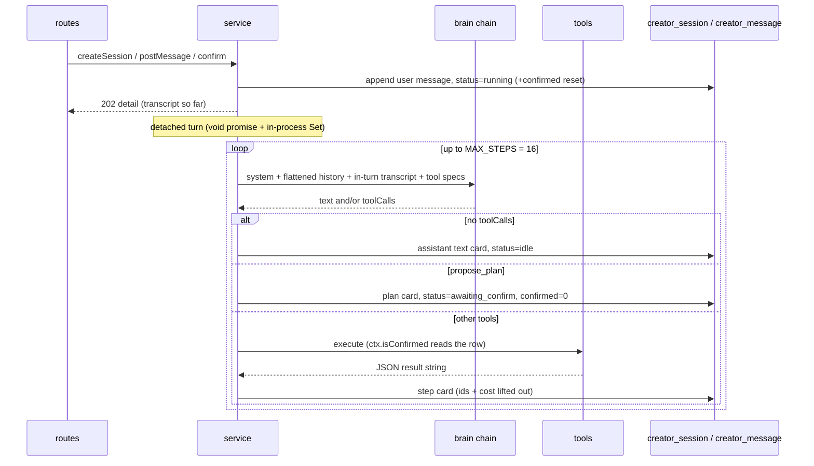

# service.ts — openCreator sessions, the agent loop and the confirm gate

> AI-facing sidecar for `service.ts`. Created 2026-07-30. Keep this in sync with the code on every change.

## Purpose

The control flow of openCreator (ADR `docs/wiki/decisions/opencreator-agent.md`
D2/D4): it owns the conversation (`creator_session` / `creator_message`), runs the
DETACHED agent turn that calls the brain and executes tools, and owns the two
state transitions the budget gate is built from — `propose_plan` →
`awaiting_confirm` (+ `confirmed = 0`) and `POST /confirm` → `confirmed = 1`.

It owns **no money code**. The only spend in the whole feature is
`generationService.create()` inside `tools.ts`, on the ordinary charge-at-submit
path, and only while `confirmed` is 1.

## What it does (for an AI reader)

- Responsibilities: session CRUD + ownership scoping · the turn loop (brain →
  tools → cards) · the confirm gate's server half · flattened cross-turn history ·
  the staleness reaper.
- Public API:
  - `createCreatorService({ db, brains, tools, log })` → `{ createSession,
    listSessions, getSession, postMessage, confirm }`. All methods take `userId`
    first and return a `CreatorSessionDetail` (or a `CreatorSession[]`).
  - `settleStaleCreatorSessions(db, now, log?)` — boot sweep.
  - `CreatorSessionNotFoundError` (404 `not_found`), `CreatorConflictError`
    (409 `conflict`).
- Inputs → Outputs: `(userId, message)` → a persisted transcript plus a detached
  turn; the SPA polls `getSession` for the rest.
- Side effects: DB writes (session + messages), LLM calls via the brain chain,
  and whatever the executed tools do (including a credit charge behind the gate).
  One `warn` line per failed turn / stale session.

## Dependencies

- Imports: `node:crypto`, `drizzle-orm`, `zod`, `@opencreate/contracts`
  (`creatorMessageContentSchema` + DTO types), `../../db/schema`, `./brain`
  (`completeWithBrains`, `CreatorUnavailableError`), `./tools` (`CreatorTool`).
- Used by: `apps/api/src/modules/creator/routes.ts`, `apps/api/src/app.ts`
  (construction + the boot sweep).

## Diagram

## Key decisions / gotchas

- **The turn is DETACHED and the DB is the truth.** POST answers 202 and the loop
  runs as a void promise (the DeepInfra-submit precedent) because a turn is
  minutes of LLM + provider latency. Two consequences are handled here: a second
  turn on the same session is refused (409, read from the row — the in-process
  `Set` only stops one process from starting two loops), and a restart leaves
  `running` rows that only `settleStaleCreatorSessions` can settle.
- **A NEW user message revokes the confirmation.** `postMessage` sets
  `confirmed = 0`. Without it the gate LEAKS: a session confirmed for plan A would
  let the agent spend on an unrelated follow-up without ever asking again. One
  confirm buys one plan. This is a hardening beyond the plan's text, and it has
  its own HTTP test ("a NEW user message revokes the confirmation").
- **`isConfirmed` re-reads the row on every tool call** rather than capturing a
  boolean: a user may confirm mid-turn (honoured) and a fresh plan may revoke it
  (also honoured).
- **`propose_plan` lives HERE, not in tools.ts.** It is not a wrapper over a
  service — it is a control signal to this loop (write the card, revoke the
  confirmation, stop the turn). If a reply contains it alongside other calls, the
  plan wins and the siblings are dropped: executing work after a full stop is
  exactly what the gate exists to prevent. A MALFORMED plan is fed back as a tool
  error instead of killing the turn.
- **History across turns is flattened text; tool fidelity lives only inside one
  turn.** Each card becomes one line (`[шаг] tool: title — done`). Replaying
  twenty raw tool payloads per step would be paid for on every step, and the
  step cards already say what happened.
- **Message order needs `rowid`.** `created_at` is milliseconds and one turn
  writes several messages inside the same millisecond, so the timestamp is not a
  total order — `ORDER BY created_at, rowid` (SQLite's insertion sequence) is what
  keeps a plan card from rendering before the step that produced it.
- **MAX_STEPS = 16 ends the turn as `idle`, not `failed`.** The work already done
  is real, so the user can just say «продолжай»; a `failed` status would imply the
  session is broken.
- **Failure text is sanitized.** `CreatorUnavailableError.message` was written to
  be shown; anything else becomes `'The agent turn failed'`, because this string
  lands in the user's chat. The log line carries only `err.name`.
- **The reaper refunds nothing, deliberately.** A turn spends LLM tokens, not
  credits; a generation the agent already started settles (and refunds) through
  its own poll path, independent of this conversation.
- **An unreadable `content_json` row is skipped, not fatal** (the `parseSoul`
  precedent): one bad row must not 500 an entire conversation.
- **The system prompt is Russian and lives in this file as a const.** It states
  the product map and the ORDER of work (free structure first, paid work only
  after a confirmed plan). The budget law is repeated there for the model's
  benefit only — enforcement is `tools.ts` + the `confirmed` flag, so a jailbroken
  prompt cannot spend.

## Commits

- bb92a60 feat(creator): agent loop, budget gate, sessions API

## Update 2026-07-30 — sanitizeAssistantText (degenerate-reply guard)

- New exported helper `sanitizeAssistantText(text)`: trims/clips the agent's
  final prose to 4000 chars and, when the reply is DEGENERATE (≥600 chars with
  unique-word ratio < 0.15), replaces it with the existing sanitized literal
  'The agent turn failed' (the SPA's agentCopy maps that closed set to RU).
- Why: seen live — the DeepSeek fallback, asked to execute a confirmed plan,
  produced no tool call and looped «of the 1 image of the …» to its token
  limit; 4000 chars of junk landed in the transcript as the agent's answer.
  Shape-based detection (tiny vocabulary at abnormal length): real prose stays
  above ~0.3 unique-ratio, the observed loop scored ~0.01, threshold 0.15.
- Wired at the single point where a no-tool-calls reply becomes a text message.
