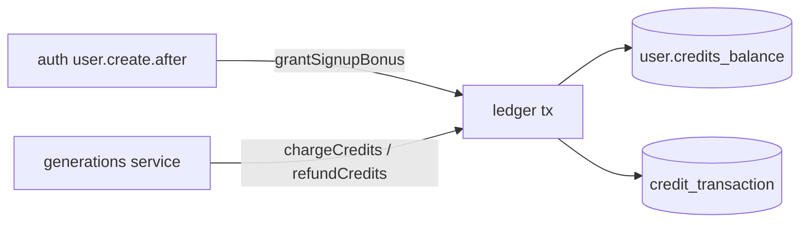

# ledger.ts — AI component doc

> AI-facing sidecar for `ledger.ts`. Created 2026-07-06. Keep this in sync with the code on every change.

## Purpose
Transactional credit ledger (plan Tasks 5–6). Every balance mutation happens inside the same synchronous better-sqlite3 transaction as its `credit_transaction` row, so the denormalized `user.creditsBalance` can never drift from ledger history. Implements the ADR's hold→settle/refund semantics as charge-at-submit + refund-on-failure.

## What it does (for an AI reader)
- Responsibilities: grant signup bonus; charge credits with balance check; refund a generation's charge exactly once; emit ONE structured money-path log entry per applied mutation; compose charge/refund into a caller-owned transaction for cross-table atomicity.
- Public API / exports: `grantSignupBonus(db, userId, amount, log?)`, `chargeCredits(db, userId, amount, generationId, log?, tx?)`, `refundCredits(db, userId, generationId, log?, tx?): number` (refunded amount, 0 = idempotent no-op), `logCharge(log, userId, generationId, amount)` / `logRefund(...)` (audit-line emitters for tx-mode callers), `LedgerTx` (drizzle open-transaction handle type), `InsufficientCreditsError` (402 / `insufficient_credits`), `MoneyLog` (structural `Pick<FastifyBaseLogger, 'info'|'warn'|'error'>`).
- Inputs → Outputs: `Db` + ids/amounts → mutated `user.creditsBalance` + inserted ledger row; `chargeCredits` throws `InsufficientCreditsError` (transaction rolls back, nothing changes).
- Side effects: db writes (always transactional) + optional log lines `credits.signup_bonus` / `credits.charge` / `credits.refund` — emitted strictly AFTER commit, and for refunds only when the balance actually moved (idempotent no-op paths stay silent).
- Tx mode (money-path atomicity, review findings): passing `tx` makes the mutation JOIN the caller's open transaction — used by the generation service so charge+row-insert and fail-flip+refund are single atomic units (a crash between the halves must not eat credits). In tx mode NO log is emitted here (the outer transaction hasn't committed yet); the caller logs via `logCharge`/`logRefund` after its own commit so a rollback never leaves phantom audit lines.

## Dependencies
- Imports / depends on: `node:crypto` (randomUUID), `drizzle-orm` (`and`, `eq`, `sql`), `fastify` (type-only `FastifyBaseLogger`), `db/client` (`Db`), `db/schema` (`user`, `creditTransaction`).
- Used by: `modules/auth/auth.ts` (signup hook, base app logger), `modules/generations/service.ts` (charge/refund with `req.log` for reqId correlation), tests `test/ledger.test.ts`, `test/logging.test.ts`.

## Diagram

## Key decisions / gotchas
- Invariants: balance never < 0 (checked inside the charge transaction); refund is idempotent — no charge row → no-op, existing refund row → no-op.
- `amount` is signed in the ledger: charge rows store negative, bonus/refund positive; refund amount is `-charge.amount`.
- better-sqlite3 transactions are synchronous — no `await` inside `db.transaction`.
- Money logs are audit-shaped: log line exists ⇔ ledger row exists. That is why logging happens after commit (rollback = no line) and refund logging is gated on `refunded > 0` (concurrent pollers hit the idempotent no-op path and must not fake refund entries).
- The `log` param is optional + structural (`MoneyLog`) so the ledger stays usable from non-request contexts and tests without a fastify instance.
- Internal `applyCharge`/`applyRefund` always run on an OPEN transaction handle; the public functions either wrap them in their own `db.transaction` (standalone mode, logs after commit) or run them on the caller's `tx` (composed mode, caller logs). One implementation, two commit owners.
- `LedgerTx` is derived structurally (`Parameters<Parameters<Db['transaction']>[0]>[0]`) instead of importing drizzle's `SQLiteTransaction` generics — it tracks whatever `db.transaction` actually hands out across drizzle upgrades.

## Commits
- 808e8e7 feat(api): better-auth (email+google) with signup bonus + /api/me
- f6f9734 feat(api): transactional credit ledger with charge/refund invariants — chargeCredits/refundCredits/InsufficientCreditsError added
- 5e8de3d feat(api): native env loading + structured logging — MoneyLog + after-commit money-path log lines
- 1cdb3a8 fix(api): atomic charge+insert and failure settlement — LedgerTx, optional tx param on charge/refund, applyCharge/applyRefund split, logCharge/logRefund emitters
