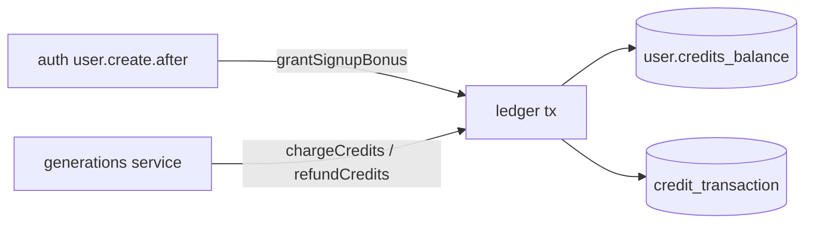

# ledger.ts — AI component doc

> AI-facing sidecar for `ledger.ts`. Created 2026-07-06. Keep this in sync with the code on every change.

## Purpose
Transactional credit ledger (plan Tasks 5–6). Every balance mutation happens inside the same synchronous better-sqlite3 transaction as its `credit_transaction` row, so the denormalized `user.creditsBalance` can never drift from ledger history. Implements the ADR's hold→settle/refund semantics as charge-at-submit + refund-on-failure.

## What it does (for an AI reader)
- Responsibilities: grant signup bonus; charge credits with balance check; refund a generation's charge exactly once.
- Public API / exports: `grantSignupBonus(db, userId, amount)`, `chargeCredits(db, userId, amount, generationId)`, `refundCredits(db, userId, generationId)`, `InsufficientCreditsError` (402 / `insufficient_credits`).
- Inputs → Outputs: `Db` + ids/amounts → mutated `user.creditsBalance` + inserted ledger row; `chargeCredits` throws `InsufficientCreditsError` (transaction rolls back, nothing changes).
- Side effects: db writes only, always transactional.

## Dependencies
- Imports / depends on: `node:crypto` (randomUUID), `drizzle-orm` (`and`, `eq`, `sql`), `db/client` (`Db`), `db/schema` (`user`, `creditTransaction`).
- Used by: `modules/auth/auth.ts` (signup hook), `modules/generations/service.ts` (charge/refund, Task 8+), tests `test/ledger.test.ts`.

## Diagram

## Key decisions / gotchas
- Invariants: balance never < 0 (checked inside the charge transaction); refund is idempotent — no charge row → no-op, existing refund row → no-op.
- `amount` is signed in the ledger: charge rows store negative, bonus/refund positive; refund amount is `-charge.amount`.
- better-sqlite3 transactions are synchronous — no `await` inside `db.transaction`.

## Commits
- 808e8e7 feat(api): better-auth (email+google) with signup bonus + /api/me
- (pending) feat(api): transactional credit ledger with charge/refund invariants — chargeCredits/refundCredits/InsufficientCreditsError added
