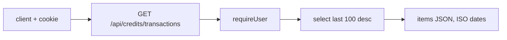

# routes.ts — AI component doc

> AI-facing sidecar for `routes.ts` (credits module). Created 2026-07-06. Keep this in sync with the code on every change.

## Purpose
`GET /api/credits/transactions` (plan Task 6): the signed-in user's last 100 ledger rows, newest first, in the contracts `creditTransactionListSchema` shape.

## What it does (for an AI reader)
- Responsibilities: `requireUser` → select `{ id, amount, kind, generationId, createdAt }` from `credit_transaction` for that user, `ORDER BY created_at DESC LIMIT 100`, serialize `createdAt` to ISO string.
- Public API / exports: `registerCreditRoutes(app, db)`.
- Inputs → Outputs: session cookie → `200 { items: CreditTransaction[] }`; no session → `401 unauthorized` envelope.
- Side effects: none (read-only).

## Dependencies
- Imports / depends on: `drizzle-orm` (`desc`, `eq`), `fastify` types, `db/client` (type), `db/schema` (`creditTransaction`).
- Used by: `app.ts` (registration); consumed by the SPA's Credits module (transactions view).

## Diagram

## Key decisions / gotchas
- The query shape matches `idx_credit_tx_user(user_id, created_at DESC)` so it's an index-backed scan.
- Amounts come out signed (charge negative, bonus/refund positive) — the UI renders the sign, the API does not reinterpret it.

## Commits
- f6f9734 feat(api): transactional credit ledger with charge/refund invariants
