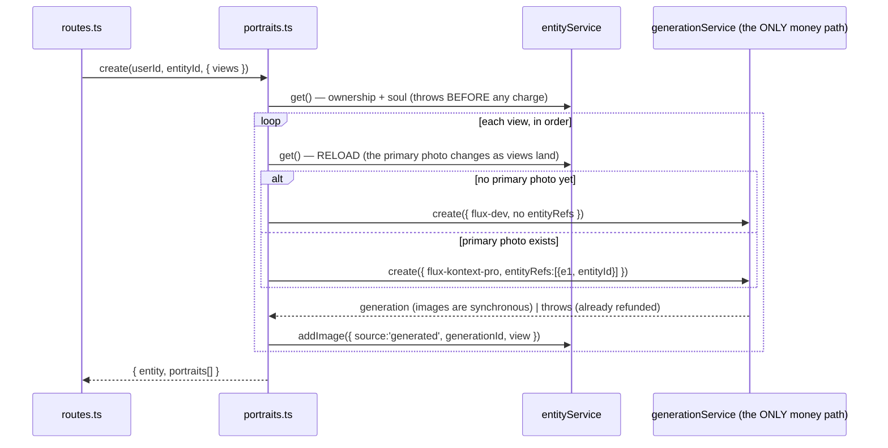

# portraits.ts — AI component doc

> AI-facing sidecar for `portraits.ts`. Created 2026-07-12. Keep this in sync with the code on every change.

## Purpose
Soul Studio's reference-sheet orchestrator: turns a stored `soul` into N portraits **of the same
character** by calling the existing generation service once per view. It owns no table, spends no
credits of its own and holds no state — it exists only to encode the two rules below in one place.

## What it does (for an AI reader)
- Responsibilities: load + authorize the entity, require a `soul`, and for each requested view
  (SEQUENTIALLY) pick the model, compose the prompt/preset/aspect, delegate to
  `generationService.create()`, then attach the resulting image back onto the entity.
- Public API / exports: `createPortraitService({ entities, generations })` → `{ create }`;
  `PortraitService` (type); `SoulRequiredError`.
- Inputs → Outputs: `create(userId, entityId, { views }, reqLog?)` → `PortraitsResponse`
  (`{ entity, portraits: [{ view, generationId | null, error | null }] }`).
- Side effects: **spends credits** — but only through `generationService.create()`, which owns the
  charge/refund/NSFW path. Writes entity images (via `entityService.addImage`). No direct DB access, no
  storage access, no provider calls of its own.

## Dependencies
- Imports / depends on: `@opencreate/contracts` (`composePortraitPrompt`, `soulPromptPreset`,
  `PORTRAIT_VIEWS`, `SOUL_HERO_MODEL_ID`, `SOUL_SHEET_MODEL_ID`), `./service` (`EntityService`),
  `../generations/service` (**type only**, narrowed to `Pick<GenerationService, 'create'>`),
  `../credits/ledger` (the `MoneyLog` type).
- Used by: `app.ts` (composition root) → `modules/entities/routes.ts`
  (`POST /api/entities/:id/portraits`).

## Diagram

## Key decisions / gotchas
- **THE MODEL RULE (ADR §3).** `flux-kontext-pro` is the only catalogue entry that accepts a reference
  image. So the first portrait (nothing to reference) renders on the cheap `flux-dev`, and every later
  one renders on kontext with the character referencing **itself** — pointing at the primary photo the
  hero shot just became. That self-reference is what keeps the face the same across the sheet. Without
  it a four-view sheet is four strangers, for 26 credits, with no error anywhere.
- **The loop must be SEQUENTIAL and must RELOAD.** The hero shot has to land *and become primary*
  before the next view is submitted. Rendering the four views concurrently would be faster and would
  produce four different people.
- **No `[[e1]]` in the prompt text**, even though a ref is declared. The ref exists to deliver the
  reference *image*; the soul text already describes the character, so substituting the placeholder
  would paste the description inside itself. `composePrompt` (mentions.ts) tolerates a declared ref with
  no token in the text — it only throws on the reverse (a token with no ref), which is the direction
  that actually poisons a render.
- **Zero ledger code.** Every portrait goes through `generationService.create()`: charge-at-submit,
  guarded fail+refund in one transaction, NSFW gate. If this file ever imports the ledger, the design
  has gone wrong — the `Pick<GenerationService, 'create'>` dependency type is the guard that says so.
- **A failed view does not abort the sheet.** It is recorded as `{ generationId: null, error }` and the
  loop continues: the generation service has already refunded that view, and collapsing N paid jobs into
  one error would hide which views the user actually received.
- **Attach happens in the same call**, deliberately: image generations are synchronous, so a
  client-side attach step would leave a window in which the user is charged for an orphaned portrait.
- **Acyclicity.** It depends on both services; neither depends on it. The generation service already
  depends on the entity service (to resolve `[[e1]]` mentions), so this logic could not live inside
  either one without closing a dependency cycle.

## Commits
- _no commit yet_
