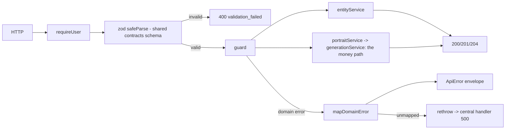

# routes.ts — AI component doc

> AI-facing sidecar for `routes.ts`. Created 2026-07-08. Keep this in sync with the code on every change.

## Purpose
HTTP layer for the entity library and Soul Studio's reference sheet — deliberately thin, mirroring
`modules/generations/routes.ts`: parse with the SHARED contracts schema, delegate to the service, map
domain errors to status codes. Every route requires a session.

## What it does (for an AI reader)
- Responsibilities: session gate (`app.requireUser`), zod parsing at the boundary, per-route rate
  limits, and the single `mapDomainError` funnel that turns domain errors into the `ApiError` envelope.
- Public API / endpoints:
  - `GET /api/entities` — the caller's library.
  - `POST /api/entities` — 201. Accepts an optional `soul` (→ kind forced to `character`, description
    derived server-side).
  - `GET /api/entities/:id` · `PATCH /api/entities/:id` · `DELETE /api/entities/:id` (204, soft delete).
  - `POST /api/entities/:id/images` — 201. Body is a **discriminated union**:
    `{ dataUri, source?: 'upload' | 'library' }` (source DEFAULTS, so the pre-Soul-Studio `{ dataUri }`
    call still parses unchanged) **or** `{ source: 'generated', generationId, view }`.
  - `POST /api/entities/:id/portraits` — **200**. `{ views: PortraitView[] }` →
    `{ entity, portraits: [{ view, generationId | null, error | null }] }`.
- Inputs → Outputs: HTTP JSON → contracts DTOs. Errors → `{ error: { code, message } }`.
- Side effects: none of its own — the services do the work (and, for portraits, spend credits through
  the generation service).

## Dependencies
- Imports / depends on: `fastify`, `@opencreate/contracts` (`createEntityInputSchema`,
  `updateEntityInputSchema`, `addEntityImageInputSchema`, `createPortraitsInputSchema`),
  `../../storage/dataUri` (`InvalidImageDataUriError`), `./service`, `./portraits`.
- Used by: `app.ts` → `registerEntityRoutes(app, entityService, portraitService)`.

## Diagram

## Key decisions / gotchas
- **Portraits answers 200, not 201/202.** The call is a *batch* of N paid jobs, some of which may have
  failed and been refunded, so there is no single created resource to point at; the per-view outcomes
  are in the body.
- **Portraits gets its own, much stricter rate bucket** (6/min, vs the uploads' 20/min and the global
  300/min). It is the most expensive call in the product — up to 26 credits and four provider
  round-trips *per request* — and the generation service's own 20/min bucket does not protect it,
  because one call there is one image while one call here is up to four.
- **The client asks for VIEWS — never a model, never a prompt.** Both are server-side rules
  (`portraits.ts`): a client that could choose the model could pick the 2-credit one for a view that
  needs the 8-credit one and receive a stranger, for a price, silently.
- **`GenerationNotAttachableError` → 400 with a message that says nothing** about *which* of its four
  checks failed (not yours / not finished / not an image / no asset). A response that distinguished them
  would confirm that a given generation id exists on another account.
- `SoulRequiredError` → 400: minting portraits for a soul-less entity is meaningless (the prompt *is*
  the composed soul), and falling back to the free-prose description would quietly charge 26 credits for
  a sheet of whatever that old prose implied.
- `EntityNotFoundError` → **404, never 403** — a 403 confirms the id exists.
- An **unmapped** error is rethrown to the central handler on purpose: flattening every bug into a
  friendly 400 would hide real faults.
- `InvalidImageDataUriError` → 400. It once fell through as a 500 (svg upload), caught by an integration
  test that had been written too loosely (`>= 400`).

## Commits
- _no commit yet_
